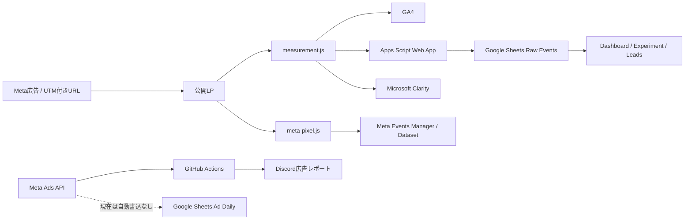

# AI顧問室｜計測・広告分析の運用ドキュメント

最終確認日: 2026-07-29

この文書は、AI顧問室のLP計測、Google Analytics 4、Meta Pixel、Microsoft Clarity、Google SheetsのイベントDB、Meta広告の日次レポートを後継者が引き継ぐための運用メモです。

## 先に結論

現在のデータは、1つのDBに統合されているわけではありません。用途ごとに次の5系統へ分かれています。

| 系統 | 主な保存先 | 役割 | 現在の状態 |
| --- | --- | --- | --- |
| LPイベント | Google Sheets `Raw Events` | UTM、流入、ページ、CTA、診断、予約クリック | 自動保存 |
| アクセス解析 | Google Analytics 4 | ページ・イベント・ユーザー行動の集計 | LPから送信 |
| 広告イベント | Meta Events Manager / Dataset | Meta広告の最適化・イベント計測 | Pixelから送信 |
| 画面行動 | Microsoft Clarity | ヒートマップ、スクロール、セッション録画 | Project ID設定後に送信 |
| 広告実績 | Meta Ads API → Discord | 消化、表示、クリック、広告別実績 | GitHub Actionsで日次通知 |

Google Sheetsには、ブラウザから送ったLPイベントが`Raw Events`へ入ります。GA4の集計データはApps Scriptの`syncGa4Report`で`GA4 Daily`へ取り込めます。Meta Ads APIの広告実績はDiscordレポーターが取得しますが、`Ad Daily`への自動書込はまだ別ジョブです。



## LP追加・更新チェックリスト

新しい広告LPを追加するときは、公開前にこの順番で確認する。ローカルの`file://`や`localhost`では本番イベントを送信しないため、タグが読み込めても実データ送信の確認にはならない。

### 実装

- [ ] `analytics-config.js`、`measurement-config.js`、`meta-pixel-config.js`を読み込む
- [ ] `meta-pixel.js`、`measurement.js`、`ga4-events.js`を読み込む
- [ ] `measurement.js`を必ず含める。`ga4-events.js`と`meta-pixel.js`だけの新規LPは作らない
- [ ] `measurement-config.js`の`clarityProjectId`が現行Clarityプロジェクトと一致する
- [ ] CTA、診断CTA、TimeRex予約リンクが`<a>`または`<button>`として存在する
- [ ] TimeRexリンクは既存の予約URLを使い、計測側がUTMと`ak_session_id`を引き継げる状態にする
- [ ] LPの主要区画に`data-analytics-section`を付ける（例: `hero`、`services`、`process`、`final_cta`）
- [ ] 広告用LPのメッセージ、CTA、計測用の`utm_content`命名が一致している

### 流入・イベント

- [ ] Meta広告のURLパラメータに`utm_source`、`utm_medium`、`utm_campaign`、`utm_content`を設定する
- [ ] `utm_content`はMeta広告名または固定のクリエイティブIDと一対一で対応させる
- [ ] `fbclid`だけの流入はMeta推定になり、キャンペーン名・クリエイティブ名は復元できないことを確認する
- [ ] 初回ページ表示、コンテンツ表示、CTAクリック、TimeRexクリックが送信対象になっている
- [ ] スクロール25/50/75/90%、区画表示、10秒エンゲージが送信対象になっている
- [ ] 診断LPなら診断開始・診断完了と結果レベルが送信対象になっている

### 公開前テスト

- [ ] 本番ホストにテストURL（UTM付き）を開く
- [ ] GA4リアルタイムまたはDebugViewで`page_view`、`view_content`、`cta_click`、`timerex_click`を確認する
- [ ] GA4で`scroll_depth`、`section_view`、`engagement_10s`を確認する
- [ ] Meta Events Managerのテストイベントで`PageView`、`ViewContent`、`CTA_Click`、`Schedule`を確認する
- [ ] Google Sheets `Raw Events`に同じ`session_id`、UTM、ページ、イベント時刻が保存されることを確認する
- [ ] Clarityで対象URLの録画、クリックマップ、スクロールマップ、UTMカスタムタグを確認する
- [ ] 入力欄、個人情報、予約情報がClarityでマスクされていることを確認する
- [ ] CTAを複数回押したとき、意図しない二重イベントが発生していないことを確認する
- [ ] 実予約完了はTimeRex側のWebhookまたは予約シートで別途確認する（予約ボタンクリックだけでは予約完了ではない）

### 今回の`pattern-04`の適用状況

基礎タグは既に設定済みだったため、今回のLPには追加で主要区画の識別子を設定した。共通計測へスクロール到達率、区画表示、10秒エンゲージを追加したため、今後この3つの指標は`measurement.js`を読み込むLPで自動計測される。なお、Sheets側の受信許可リストを更新した`Code.gs`はリポジトリ上で更新済みだが、Webアプリへ反映するまでは新3イベントはSheetsに保存されない。

現時点で残る未自動化項目は、GA4日次同期トリガーの運用確認、Meta広告実績の`Ad Daily`自動取込、TimeRex予約完了Webhook、Clarity Project IDの設定である。Clarityの読み込み・匿名セッションID・UTMカスタムタグ・カスタムイベント送信は実装済みで、Project IDが空の間だけ無効になる。

## 重要な識別子と設定場所

### LP計測

- 本番ホスト: `ai-komon.bivrost.co.jp`
- GA4 Measurement ID: `G-RSS02GXVRJ`
- Meta Dataset / Pixel ID: `1255260657664956`
- Apps Script Web App: `measurement-config.js` の `eventEndpoint`
- LP計測設定: [measurement-config.js](../measurement-config.js)
- ブラウザイベント処理: [measurement.js](../measurement.js)
- Meta Pixel処理: [meta-pixel.js](../meta-pixel.js)
- Meta ID設定: [meta-pixel-config.js](../meta-pixel-config.js)
- Clarity Project ID設定: [measurement-config.js](../measurement-config.js) の `clarityProjectId`
- Apps Script受信処理: [integrations/google-sheets-collector/Code.gs](../integrations/google-sheets-collector/Code.gs)

### Google Sheets

Apps Scriptの保存先は、[Code.gs](../integrations/google-sheets-collector/Code.gs) にある `SPREADSHEET_ID` と `SHEET_NAME` で決まります。

- Spreadsheet ID: `1LuibxdWft_uc8ACHQX1toXxN2_aJgsCJKYa1ro_maCA`
- シート名: `Raw Events`
- 直接開く: [AI顧問室の計測スプレッドシート](https://docs.google.com/spreadsheets/d/1LuibxdWft_uc8ACHQX1toXxN2_aJgsCJKYa1ro_maCA/edit)
- Web App URL: `measurement-config.js` の `eventEndpoint`
- Web Appの認証トークン: `measurement-config.js` とApps Script側で一致させる。値はこの文書には記載しない。

このSpreadsheetはGoogleアカウント側の資産です。リポジトリにあるExcelは分析テンプレート・スナップショットであり、Google Sheets本体の同期コピーではありません。

### Meta広告レポートBot

Bot本体はこのリポジトリではなく、別リポジトリです。

- GitHub: [onion-salad/meta-discord-reporter](https://github.com/onion-salad/meta-discord-reporter)
- レポート処理: `src/meta-report.js`
- 日次実行: `.github/workflows/daily-report.yml`
- 実行時刻: 毎日10:00 JST（GitHub Actionsの遅延はあり得る）
- 通知先: Discordのチャンネルまたはスレッド
- Metaアクセストークン: GitHub Secret `META_ACCESS_TOKEN`
- 既存アカウント: GitHub Secret `META_AD_ACCOUNT_ID`
- 追加アカウント: GitHub Variable `META_AD_ACCOUNTS`
- 現在の追加設定: `AI顧問` / `1569573134552571`
- 複数アカウント動作: `META_AD_ACCOUNTS_MODE=merge`
- クリエイティブ表示上限: `META_CREATIVE_LIMIT=0`（全件）

広告セットと広告は、Meta APIのページングを最後まで取得します。新しい広告セット・広告をコードへ固定追加する必要はありません。広告の実績がある広告と、配信中の広告を広告別詳細へ含めます。

GitHub設定画面:

- [Actions実行履歴](https://github.com/onion-salad/meta-discord-reporter/actions)
- [Actions Secrets](https://github.com/onion-salad/meta-discord-reporter/settings/secrets/actions)
- [Actions Variables](https://github.com/onion-salad/meta-discord-reporter/settings/variables/actions)

## イベントがどう流れるか

### 1. LPに到着したとき

`measurement.js` は本番ホストだけで動きます。`localhost`、`127.0.0.1`、その他のホストからはGoogle SheetsやGA4へ本番イベントを送信しません。

初回到着時に次の値をURLから読み取り、`sessionStorage`へ保持します。

- `utm_source`
- `utm_medium`
- `utm_campaign`
- `utm_content`
- `utm_term`
- `utm_id`
- `fbclid`
- `gclid`
- `from`

ページ遷移後も同じブラウザセッション内では値を引き継ぎます。現在のLP間の簡易的な流入識別には、`?from=lp-level` のような `from` パラメータも使っています。

### 2. Google Sheetsへ送るイベント

ブラウザからApps Scriptへ次のイベントを送信します。

| イベント | 発火場所・意味 |
| --- | --- |
| `page_view` | 公開LPのページ表示。GA4では自動`page_view`との二重送信を避けるため、主にSheets側へ保存 |
| `view_content` | LPのコンテンツ表示 |
| `cta_click` | 相談・診断などのCTAクリック |
| `diagnosis_start` | `diagnosis.html`で診断開始 |
| `diagnosis_complete` | 診断完了。診断レベルやスコアを付与 |
| `timerex_click` | Timerexの予約リンククリック |
| `lead` | 相談導線へ到達したリードイベント |
| `scroll_depth` | ページの25/50/75/90%到達。`value`に到達率を保存 |
| `section_view` | `data-analytics-section`を付けた区画の表示 |
| `engagement_10s` | ページを10秒以上見ている簡易エンゲージイベント |

送信には `navigator.sendBeacon` を優先し、利用できない場合は `fetch` を使います。ブラウザ側では送信完了を待たないため、通信遮断や離脱時に欠損する可能性があります。

Apps Script側では次を検証します。

1. クエリのトークン
2. `environment=production`
3. `hostname=ai-komon.bivrost.co.jp`
4. 許可イベント名
5. `event_id` と `session_id` の存在

検証に通ったイベントだけ、Apps Scriptの`Raw Events`へ`appendRow`されます。`LockService`で同時書き込みを直列化しています。

### 3. Raw Eventsの列

現在のシート列は次の順です。

| 列 | 内容 |
| --- | --- |
| `event_time` | ISO形式のイベント発生時刻 |
| `event_name` | 上記のイベント名 |
| `event_id` | イベント単位のUUID |
| `session_id` | ブラウザセッション単位のID |
| `utm_content` | クリエイティブ識別子として主に使用 |
| `utm_source` | 流入元 |
| `utm_medium` | 媒体・チャネル |
| `utm_campaign` | キャンペーン識別子 |
| `utm_term` | 検索語・広告条件 |
| `utm_id` | キャンペーンID |
| `fbclid` | Metaクリック識別子 |
| `gclid` | Googleクリック識別子 |
| `from` | LP間の経由識別子 |
| `attribution_status` | 明示値・Meta推定・不明の区別 |
| `page` | pathname |
| `url` | 発生時のURL |
| `referrer` | 直前ページ |
| `variant` | 現在は`utm_content`を基本値として格納 |
| `value` | 診断スコア等の値 |
| `level` | 診断レベル等 |
| `environment` | `production` |

現在は`utm_term`、`utm_id`、`gclid`、`from`、`url`、`referrer`、`attribution_status`も`Raw Events`へ保存します。既存シートはタイトル行が1行目、列見出しが3行目のため、Apps Scriptは見出し行を自動検出して拡張します。旧14列スキーマを検出した場合は、既存行を列名ベースで21列へ移行してからヘッダーを書き換えるため、`fbclid`や`page`の位置がずれません。未知のスキーマは黙って上書きせずエラーにして、手動確認を要求します。`fbclid`しか無い流入は、`utm_source=meta`と`utm_medium=paid_social`だけを推定し、キャンペーン名・クリエイティブ名は捏造しません。`attribution_status`は`explicit`、`inferred_meta`、`direct_or_unknown`のいずれかです。

## GA4で分かること

GA4には、`measurement.js`経由で次のイベントが送られます。

- `page_view`（GA4のconfigタグによる自動送信）
- `view_content`
- `cta_click`
- `timerex_click`
- `lead`
- `diagnosis_start`
- `diagnosis_complete`

診断LPとは別に、ツールページでは [analytics.js](../analytics.js) も読み込まれます。ツールページの初回表示で`tool_open`、送信操作で`tool_submit`をGA4へ送り、`tool_slug`でツールを識別します。これらはApps Scriptの`Raw Events`には送られず、GA4側だけで確認するイベントです。

診断イベントには`level`と`score`、CTAには`page`と`button_text`、流入にはUTM・`from`・`fbclid`・`gclid`等をイベントパラメータとして付けます。

GA4の確認場所:

- [Google Analytics](https://analytics.google.com/)
- リアルタイム: 直近のイベント確認
- DebugView: テスト時のイベント確認
- レポート > エンゲージメント > イベント: 蓄積後の集計
- 探索: `utm_content`、LP、イベント、日付を組み合わせたABテスト

GA4 Data APIの取込コードは[Code.gs](../integrations/google-sheets-collector/Code.gs)の`syncGa4Report`です。直近7日間について、日付、イベント名、セッションキャンペーン、セッション広告コンテンツ、ページパス、イベント数、ユーザー数、セッション数を`GA4 Daily`へ置き換え保存します。Apps Scriptの`AnalyticsData`高度なサービスを使用し、初回実行時の承認後は手動メニューまたは日次トリガーで更新できます。

GA4の現在の管理画面:

- [AI顧問室 GA4ホーム](https://analytics.google.com/analytics/web/#/a400691209p545222887/reports/intelligenthome)
- [データストリーム](https://analytics.google.com/analytics/web/#/a400691209p545222887/admin/streams/table)
- [イベント](https://analytics.google.com/analytics/web/#/a400691209p545222887/admin/events/hub)
- プロパティID: `545222887`
- 測定ID: `G-RSS02GXVRJ`

Apps Scriptの現行プロジェクト:

- [AI顧問室_広告分析](https://script.google.com/home/projects/15JgWT6PRlD5EiOh1R_BjXd4Y4h5mXwcBWVR_k1Ao0LH0ZL992ImN-AXQ/edit)
- [Google Analytics Data APIを有効化](https://console.cloud.google.com/apis/library/analyticsdata.googleapis.com)
- [計測スプレッドシート](https://docs.google.com/spreadsheets/d/1LuibxdWft_uc8ACHQX1toXxN2_aJgsCJKYa1ro_maCA/edit)

Apps Scriptへ反映する手順（既存イベントは反映済み。新しい計測イベントを追加したときは、必ずWebアプリを再デプロイする）:

1. `Code.gs`をローカルの最新版へ置き換える。
2. プロジェクトの設定で`appsscript.json`を表示し、同ファイルのOAuthスコープを反映する。
3. 上記のGoogle Cloudリンクで`Google Analytics Data API`を有効化する。
4. Apps Scriptエディタで`syncGa4Report`を一度実行し、Googleアカウントの承認を完了する。
5. スプレッドシートを再読み込みし、メニュー「AI顧問室 分析」>「GA4を直近7日分同期」を確認する。
6. 日次更新を有効にする場合は「GA4日次同期を設定」を一度実行する。現行設定はAsia/Tokyoの午前3時頃です。

GA4 APIでは欠損したMetaのUTMを復元できないため、Meta Ads Manager側のURLパラメータに次を設定する。

```text
utm_source=meta&utm_medium=paid_social&utm_campaign={{campaign.name}}&utm_content={{ad.name}}
```

LP側では、到着時に明示されたUTMをfirst-touchとして`sessionStorage`へ保存し、内部LPリンクとTimerex予約リンクへ未設定のパラメータを引き継ぐ。保存済み値がある場合は、`from`以外のキーで後着URLの値を採用しない。`from`だけはLP間の現在の引き渡しを優先する。`fbclid`だけの流入はMeta由来と推定してsource/mediumを補うが、creative単位の分析にはMeta側の`utm_content`設定が必須です。

旧LPには`ga4-events.js`や`meta-pixel.js`だけを読み込むページが残っています。これらには、`measurement.js`が存在しない場合だけ動くGA4・Metaのフォールバッククリック計測を残しています。`measurement.js`が読み込まれているページでは、フォールバックを停止して中央の計測処理だけを使うため、二重送信しません。

## Microsoft Clarityで分かること

Clarityは、GA4やMeta Pixelでは確認しづらい「ページ上のどこを押したか」「どこまでスクロールしたか」「どのような順番で操作したか」を、ヒートマップとセッション録画で確認する補完ツールです。無料で利用でき、クリック、スクロール、エリア、コンバージョン、注視の各ヒートマップを提供します。

- [Microsoft Clarity](https://clarity.microsoft.com/)
- [公式: Clarityについて](https://learn.microsoft.com/en-us/clarity/setup-and-installation/about-clarity)
- [公式: ヒートマップ概要](https://learn.microsoft.com/en-us/clarity/heatmaps/heatmaps-overview)
- [公式: セッション録画](https://learn.microsoft.com/en-us/clarity/session-recordings/recordings-overview)
- [公式: GA連携](https://learn.microsoft.com/en-us/clarity/ga-integration/)
- [公式: Consent Mode](https://learn.microsoft.com/en-us/clarity/setup-and-installation/consent-mode)

### 初回導入

1. [Clarity](https://clarity.microsoft.com/)へ、AI顧問室を管理するMicrosoftまたはGoogleアカウントでログインする。
2. プロジェクト名を`AI顧問室`、サイトURLを`https://ai-komon.bivrost.co.jp`としてプロジェクトを作成する。
3. Clarityの設定画面またはタグURLからProject IDを取得する。
4. [measurement-config.js](../measurement-config.js)の`clarityProjectId`へProject IDだけを設定する。
5. Clarity側のConsent Modeを有効にし、既定状態をCookieなしにする。現在のコードは`clarityConsentMode: 'cookieless'`でConsent API V2へ`denied`を送る。
6. 本番へ公開後、Clarityの設定画面でタグ検出を確認する。
7. 必要に応じてClarityの設定からGA4を連携する。ClarityとGA4の画面を往復して行動を確認しやすくなる。

Project IDが空文字の間、`measurement.js`はClarityの外部スクリプトを一切読み込みません。`file://`、`localhost`、プレビュー環境も既存の本番ホスト制限で送信対象外です。

### 自動で送る項目

Clarityへ個人名、メールアドレス、電話番号、予約内容、`fbclid`、`gclid`は送りません。次だけをカスタムタグとして送ります。

- `ak_session_id`: Google Sheets `Raw Events`と照合する匿名セッションID
- `page`: LPのpathname
- `utm_source` / `utm_medium` / `utm_campaign` / `utm_content` / `utm_term` / `utm_id`
- `from`
- `attribution_status`

`measurement.js`経由のイベントはClarityのカスタムイベントにも送ります。主な対象は`page_view`、`view_content`、`cta_click`、`timerex_click`、`diagnosis_start`、`diagnosis_complete`、`scroll_depth`、`section_view`、`engagement_10s`です。

### LP改善での見方

1. ページURLとデバイスを絞る。広告LPは最初にモバイルを確認する。
2. `utm_campaign`と`utm_content`で広告・クリエイティブを絞る。
3. スクロールマップでファーストビュー直後、実績、料金、FAQ、最終CTAまでの到達差を見る。
4. クリックマップでCTA以外の誤クリック、押されないCTA、リンクに見える非リンクを探す。
5. セッション録画で、急速な往復、連打、フォーム離脱、表示崩れを確認する。
6. `ak_session_id`が必要な場合だけ、ClarityのカスタムタグとSheetsの`session_id`をローカルで照合する。
7. 録画だけで仮説を断定せず、GA4・Sheetsのイベント率とMetaの広告実績を同期間で確認する。

### プライバシーと同意

Clarityは入力値などを既定でマスクしますが、公開後に実際の録画を見てマスク漏れがないか確認します。個人情報を表示する要素には`data-clarity-mask="true"`を追加します。Cookie同意UIを将来追加した場合は、同意・撤回時に`window.aiKomonSetClarityConsent(true/false)`を呼びます。広告用ストレージはこの関数でも常に`denied`です。

録画は通常30日保持され、お気に入りは最長9か月保持できます。必要な事例だけをお気に入りにし、個人情報を含む可能性がある録画をむやみに長期保存しません。

## TimeRex予約と流入経路の結び付け

TimeRexのGoogle Sheets連携は、予約完了やキャンセルの予定情報をシートへ反映するためのものです。この連携だけでは広告のUTMと予約行が自動結合されるとは限りません。

現在のLPは、予約ボタン押下時に次の情報を`Raw Events`へ保存し、同じ値をTimeRex URLのクエリに付けて遷移します。

- `utm_source` / `utm_medium` / `utm_campaign` / `utm_content` / `utm_term` / `utm_id`
- `fbclid` / `gclid` / `from`
- `ak_session_id`（LP内のセッション識別子）
- クリック時刻、ページ、ボタン文言、遷移先URL、referrer

予約完了との結合優先順位は次の通りです。

1. TimeRexのWebhookまたはCSVに`ak_session_id`やURLパラメータが返る場合は、その値で`timerex_click`と予約行を完全一致させる。
2. URLパラメータがTimeRex側で確認できない場合は、予約完了時刻から直前の`timerex_click`を同じカレンダーURLかつ一定時間内で突き合わせる。ただし同一ユーザーの複数クリックがあると推定になる。
3. メールアドレス等を予約情報から取得できる場合は、個人情報をGA4やMetaへ送らず、アクセス制限した`Leads`側で予約・商談情報と結合する。

TimeRex公式仕様では、日程調整URLに任意のURLパラメータを付与でき、Premiumではイベント詳細・CSV・Webhook・Scheduling APIレスポンスでその値を確認できます。確実な予約完了計測には、TimeRexのGoogle Sheets連携に加えてWebhookを使い、予約完了・キャンセルを別の予約Rawシートへ受けてから`ak_session_id`で結合します。

- [TimeRex公式: 日程調整カレンダーURLへのURLパラメータ付与](https://help.timerex.net/ja/articles/9919346-%E6%97%A5%E7%A8%8B%E8%AA%BF%E6%95%B4%E3%82%AB%E3%83%AC%E3%83%B3%E3%83%80%E3%83%BCurl%E3%81%AB%E6%B5%81%E5%85%A5%E5%85%83%E3%82%84%E4%BC%9A%E5%93%A1id%E3%81%AA%E3%81%A9%E3%81%AE%E6%83%85%E5%A0%B1%E3%82%92%E4%BB%98%E4%B8%8E%E3%81%99%E3%82%8B)
- [TimeRex公式開発者ポータル: Webhook](https://developers.timerex.net/webhook/)
- [TimeRex公式: フォームPOST](https://help.timerex.net/ja/articles/9969311-%E6%97%A5%E7%A8%8B%E8%AA%BF%E6%95%B4%E3%82%AB%E3%83%AC%E3%83%B3%E3%83%80%E3%83%BC%E3%81%AB%E3%83%95%E3%82%A9%E3%83%BC%E3%83%A0%E3%81%AEurl%E3%82%92%E8%A8%AD%E5%AE%9A%E3%81%99%E3%82%8B)

## Meta Pixelで分かること

Meta Pixel / Dataset IDは`1255260657664956`です。`meta-pixel.js`は本番LPでPixelを初期化し、次を送ります。

- `PageView`
- `ViewContent`
- `Schedule`
- Custom `CTA_Click`
- Custom `DiagnosisStart`
- Custom `DiagnosisComplete`
- `Lead`

Meta PixelのイベントはMeta Events Managerに送られ、広告の最適化・アトリビューション・カスタムコンバージョンの材料になります。Pixelイベントそのものは、現在Google Sheetsへは保存されません。

確認場所:

- [Meta Events Manager](https://www.facebook.com/events_manager2/)
- 対象データセット / Pixel: `1255260657664956`
- 「テストイベント」でLPを操作して到着確認
- 「概要」や「データ品質」で継続受信を確認

## Google Sheetsの分析ブック

ローカルには、分析用のExcelスナップショットがあります。

- [analytics-foundation](../outputs/analytics-foundation/)
- [Excelテンプレート](../outputs/analytics-foundation/ai-komon-analytics-foundation.xlsx)

シート構成:

| シート | 用途 |
| --- | --- |
| `Dashboard` | 重要イベント、診断完了、予約クリック、契約数、広告費の集計 |
| `Raw Events` | Apps Scriptから自動追加されるLPイベントの生ログ。UTM・URL・referrerまで保存 |
| `GA4 Daily` | `syncGa4Report`でGA4 Data APIから取得した直近7日間の集計 |
| `Ad Daily` | Meta広告の日次実績を広告・広告セット単位で置く表 |
| `Leads` | 予約、商談、契約、契約金額を人または別処理で管理 |
| `Experiment` | `creative_id`、LP、`utm_content`ごとのABテスト比較 |
| `Config` | ホスト、GA4 ID、Meta ID、保存先、ABテスト方針 |

`Experiment`シートは、`Raw Events`の`utm_content`とイベント名を`COUNTIFS`で集計します。Meta Ads Manager側の広告名・広告IDと、URLの`utm_content`を同じ命名規則にすることが重要です。

## ABテストの最低限の命名規則

広告を追加するときは、Meta Ads ManagerのURLパラメータに少なくとも次の形式を設定します。

```text
utm_source=meta
utm_medium=paid_social
utm_campaign={{campaign.name}}
utm_content={{ad.name}}
```

実際のMetaの動的パラメータ記法はAds ManagerのUIに合わせて確認してください。固定値を使う場合は、`creative_01`、`creative_02`のように`Experiment`シートと同じ値を使います。

最低限、次のキーで突合します。

```text
Meta広告名 / 広告ID
        ↓ 命名・URLパラメータ
utm_content
        ↓ ブラウザで保持
Raw Events.event_id / session_id / utm_content
        ↓ 集計
ExperimentのPageView・CTA・診断完了・予約クリック
```

## 現在できる分析と、まだ自動化されていない部分

### 現在できる

- どの`utm_content`からLPへ来たか
- どのLPでイベントが発生したか
- CTAクリック、診断開始、診断完了、予約リンククリックの数
- 同一セッション内のLP遷移と流入パラメータ
- GA4上のイベント・ページ・流入分析
- Meta Events Manager上のPixelイベント
- Meta Ads APIによる広告アカウント、広告セット、広告別の消化・表示・クリック・LPV等
- DiscordへのMeta広告日次通知
- `Raw Events`を基準にした簡易ABテスト比較
- Clarity Project ID設定後のクリック・スクロールヒートマップ、セッション録画、UTM別の画面行動分析

### まだ自動化されていない

- GA4 Data APIの定期トリガー登録
- Meta Ads APIからGoogle Sheets `Ad Daily`への日次取込
- Timerexの実予約・実面談・契約情報の自動取込
- ブラウザイベントとMeta広告の実績を完全な1行単位で自動統合
- ユーザー単位の個人特定。現在は匿名の`session_id`中心で、個人名・メールアドレスはLP計測に送っていません
- Clarityプロジェクトのアカウント作成とProject ID設定

## 障害時の確認手順

### Raw Eventsに入らない

1. URLが`ai-komon.bivrost.co.jp`か確認
2. `measurement-config.js`の`eventEndpoint`が現行Web App URLか確認
3. ブラウザのNetworkでApps ScriptへのPOSTを見る
4. URLのトークンとApps Scriptのトークンが一致しているか確認
5. Apps Scriptの実行ログと`Raw Events`の最終行を確認
6. `event_name`が許可リストにあるか確認

### GA4に入らない

1. GA4の測定IDが`G-RSS02GXVRJ`か確認
2. 本番ホストで操作しているか確認
3. GA4のリアルタイムまたはDebugViewを開いてから操作
4. 広告ブロッカー、Cookie制限、ブラウザの送信制限を確認

### Meta Pixelに入らない

1. Events Managerで対象Dataset / Pixel `1255260657664956`を選択
2. テストイベント画面を開く
3. 本番LPを操作
4. `PageView`、`ViewContent`、`CTA_Click`等の到着を確認
5. Pixelが別IDへ差し替わっていないか確認

### Clarityに入らない

1. `measurement-config.js`の`clarityProjectId`が空でないか確認
2. ClarityのプロジェクトURLが`https://ai-komon.bivrost.co.jp`か確認
3. 本番ホストで操作しているか確認
4. ブラウザのNetworkで`www.clarity.ms/tag/{Project ID}`を確認
5. Clarityの設定画面でタグ検出を再実行
6. 広告ブロッカー、Consent Mode、ブラウザの送信制限を確認
7. 入力欄や個人情報が録画に露出していないか確認

### Discord広告レポートに入らない

1. [GitHub Actions](https://github.com/onion-salad/meta-discord-reporter/actions)の最新実行を確認
2. `META_ACCESS_TOKEN`が対象広告アカウントへ`ads_read`を持つか確認
3. `META_AD_ACCOUNTS`のIDが正しいか確認
4. Meta Ads Managerで広告・広告セットのステータスを確認
5. Actionsログの`取得エラー`とDiscord投稿を確認

## 引き継ぎ時の注意

- `measurement-config.js`、Apps Script、Meta Events Manager、GA4、Clarity、Meta Ads Reporterは別々に変更されます。1か所の変更だけで全体が更新される構成ではありません。
- Google Sheetsの列を変更したら、Apps Scriptの`appendRow`、Dashboardの数式、Experimentの`COUNTIFS`を同時に確認します。
- Meta広告の名前を変える場合は、URLの`utm_content`やExperimentの対応行も確認します。
- Apps Scriptのトークン、Metaアクセストークン、Discord Bot Tokenは文書やチャットへ貼らないでください。
- Apps Scriptのトークンがリポジトリに露出している状態は技術的負債です。将来はScript Propertiesへ移し、公開URL側の認証方式も見直してください。
- 広告費と予約・契約を比較するときは、Metaのクリック・LPVとSheetsのイベント数が完全一致しない前提で、期間・タイムゾーン・アトリビューション窓を揃えて比較します。
