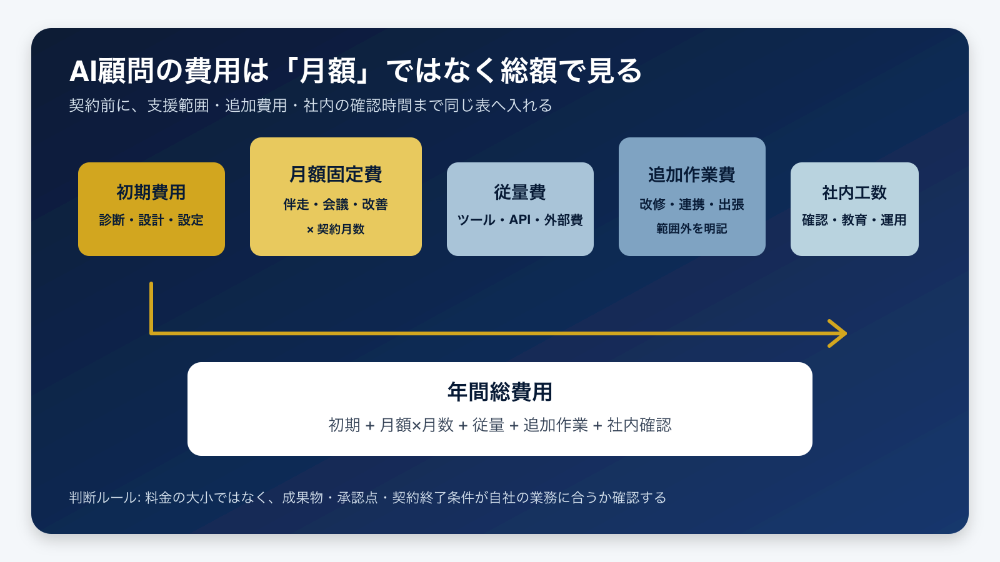

# AI顧問の費用はいくら？月額だけで決めない総額の見方 | AI顧問室

> この資料は、リポジトリ内の自社SEO記事を再利用できるように構造化した参照用転記です。競合ページの本文・画像・CSSは含めません。

## SEOメタデータ

- title: AI顧問の費用はいくら？月額だけで決めない総額の見方 | AI顧問室
- description: AI顧問の費用を初期・月額・従量・追加作業・社内工数に分解。公開料金の読み方、総額計算、契約前の質問を中小企業向けに解説します。
- canonical: `https://ai-komon.bivrost.co.jp/articles/ai-advisor-cost/`
- published: `2026-07-30`
- modified: `2026-07-30`
- source HTML: [`articles/ai-advisor-cost/index.html`](../../../../articles/ai-advisor-cost/index.html)
- source SHA-256: `3c74949e20a28c954a7adb60f3d1fc30b6fdad89d380b64289a8f4cbafec2fd7`

## ページ構造と計測用シグナル

- 日本語文字数（article本文）: `3067`
- H1: `1` / H2: `8` / H3: `6`
- table: `2` / details FAQ: `0`
- internal links: `5` / external links: `3`
- JSON-LD: `Article, BreadcrumbList, FAQPage`

### 見出し一覧

- H1: AI顧問の費用はいくら？月額だけで決めない総額の見方
- H2: 先に結論：AI顧問の費用は「総額」と「任せる範囲」で決まる
- H2: 公開ページの料金帯は「相場」ではなく前提付きの例として読む
- H2: 見積もりを五つの費用に分解する
- H2: 支援タイプ別に、費用の目的を合わせる
- H2: AI顧問室の料金をどう読むか
- H2: 費用対効果と契約前の確認は、削減時間ではなく意思決定まで測る
- H2: よくある質問
- H2: 次に読む・使う
- H3: AI顧問の費用は月額だけ見ればよいですか？
- H3: AI顧問とAIコンサルタントの料金は違いますか？
- H3: AI顧問室の月50万円は高いですか？
- H3: 見積もりの前に相談できますか？
- H3: 参照ページ
- H3: 自社のAI顧問費用を整理する

## ページクローム

- **header:** AI顧問室 中小企業のためのAI導入支援 無料相談
- **footer:** AI顧問室 / 記事一覧 / プライバシーポリシー
- **breadcrumb:** AI顧問室 / 記事 / AI顧問の費用

## 装飾・レイアウトの再利用台帳

| class | element count | purpose/sample |
| --- | ---: | --- |
| `answer` | `div`×1, `p`×1 | 結論： AI顧問の料金は「月額」ではなく、 年間総費用と任せる範囲 で比べます。初期・月額・従量・追加作業・社内確認工数を足し、成果物、承認点、契約終了条件が自社の業務に合うかを確認してください。 |
| `hero-badges` | `div`×1 | 初期費用 月額 従量費 社内工数 |
| `hero-kicker` | `span`×1 | AI KOMONSHITSU / AI ADVISOR COST |
| `hero-title` | `span`×1 | AI顧問の費用は、月額ではなく初期・従量・社内工数まで総額で見る。 |
| `hero-visual` | `div`×1 | AI KOMONSHITSU / AI ADVISOR COST AI顧問の費用は、月額ではなく初期・従量・社内工数まで総額で見る。 初期費用 月額 従量費 社内工数 |
| `key-points` | `div`×1 | この記事の要点 初期費用・月額・従量費・追加作業・社内確認工数を年間総額へ入れる 公開価格は市場平均と混同せず、支援範囲と契約期間の前提を確認する 月額が自社の対象業務と成果物に合わない場合は、研修や単発支援も比較する |
| `related` | `div`×1 | AI顧問の比較基準 支援範囲を同じ条件で比べる AI導入の費用対効果 削減時間と回収期間を見る AI導入の進め方 小さく試して定着させる |
| `service-cta` | `div`×1 | 自社のAI顧問費用を整理する 候補業務、支援範囲、人の確認点を整理し、契約前に比較できる状態を作ります。 AI顧問室の無料相談を見る |
| `source-list` | `ul`×1 | 37Design「AI顧問の費用比較」 （公開ページの料金整理例、2026-07-30取得） Dr.Wallet BPO「AI顧問の費用」 （支援範囲別の整理例、2026-07-30取得） clearAI「AIコンサルティング」 （PoC・本番導入とスコープ依存のFAQ、2026-07-30取得） AI顧問室 公式料金ページ （自社一次情報、2026-07-30取得） |
| `table-scroll` | `div`×2 | 費用 含まれる作業の例 契約前に聞くこと 初期費用 現状診断、業務選定、要件整理、初期設定 初月の成果物と、月額との重複は何か 月額固定費 定例会、チャット相談、改善提案、運用レビュー 回数、対応時間、担当者、対象業務の上限は何か 従量費 AIツール、API、外部サービス、データ保管 誰が契約し、上限通知と停止条件を持つか 追加作業費 個別連携、改修、出張、データ整備 追加になる条件と、事前承認の方法は何か 社内工数 データ準備、出力確 |
| `toc` | `div`×1 | この記事の目次 先に結論：AI顧問の費用は「総額」と「任せる範囲」で決まる 公開ページの料金帯は「相場」ではなく前提付きの例として読む 見積もりを五つの費用に分解する 支援タイプ別に、費用の目的を合わせる AI顧問室の料金をどう読むか 費用対効果と契約前の確認は、削減時間ではなく意思決定まで測る |

### Inline CSS（原文）

```css
:root{--navy:#082448;--gold:#d2a61f;--ink:#172033;--muted:#5c6678;--line:#dfe5ec;--soft:#f4f7fa}
    *{box-sizing:border-box}html{scroll-behavior:smooth}body{margin:0;color:var(--ink);background:#fff;font-family:-apple-system,BlinkMacSystemFont,"Noto Sans JP","Yu Gothic",sans-serif;line-height:1.9}
    header{border-bottom:1px solid var(--line);background:#fff}.bar{max-width:1100px;margin:auto;padding:18px 24px;display:flex;justify-content:space-between;align-items:center}.brand{font-family:"Noto Serif JP",serif;font-weight:800;color:var(--navy);font-size:22px}.bar a{color:var(--navy);text-decoration:none;font-weight:700}
    main{max-width:860px;margin:auto;padding:38px 24px 90px;min-width:0}.breadcrumb{font-size:13px;color:var(--muted);margin-bottom:30px}.breadcrumb a{color:var(--muted)}article{min-width:0}article p,article li,article a{overflow-wrap:anywhere;word-break:break-word}
    article>h1{font-size:clamp(30px,5vw,48px);line-height:1.35;color:var(--navy);letter-spacing:.01em;margin:0 0 24px}article>p:first-of-type{font-size:18px;color:#39455a;margin-bottom:24px}
    h2{font-size:clamp(24px,3.5vw,32px);line-height:1.45;color:var(--navy);margin:64px 0 20px;padding-top:8px;border-top:3px solid var(--gold)}h3{font-size:20px;line-height:1.5;color:var(--navy);margin:32px 0 10px}p{margin:0 0 20px}a{color:#1266a3;text-underline-offset:3px}
    .answer{margin:30px 0;padding:22px 24px;background:var(--soft);border-left:5px solid var(--gold);border-radius:0 12px 12px 0}.answer strong{color:var(--navy)}
    figure{margin:34px 0}figure img{width:100%;height:auto;border:1px solid var(--line);border-radius:14px;display:block}figcaption{font-size:13px;color:var(--muted);margin-top:10px}
    table{width:100%;border-collapse:collapse;margin:24px 0;font-size:14px}th,td{padding:13px 12px;border:1px solid var(--line);vertical-align:top;text-align:left}th{background:var(--navy);color:#fff}tbody tr:nth-child(even){background:var(--soft)}
    ol,ul{padding-left:1.45em}li{margin-bottom:8px}.source-list{font-size:14px}.service-cta{margin:54px 0 24px;padding:30px;background:var(--navy);color:#fff;border-radius:16px;text-align:center}.service-cta h2{color:#fff;border:0;margin:0 0 12px;padding:0}.service-cta a{display:inline-block;margin-top:8px;padding:12px 22px;background:var(--gold);color:#fff;font-weight:800;text-decoration:none;border-radius:8px}
    footer{border-top:1px solid var(--line);padding:30px 24px;text-align:center;color:var(--muted);font-size:13px}@media(max-width:640px){main{padding:28px 18px 70px}.bar{padding:14px 18px}.bar span{display:none}table{display:block;width:100%;max-width:100%;overflow-x:auto;white-space:nowrap}.table-scroll{width:100%;max-width:100%;overflow-x:auto}.table-scroll table{display:table;width:max-content;min-width:650px;overflow:visible}.answer{padding:18px}.service-cta{padding:24px 18px}}
```

### 外部 stylesheet

- `../../assets/articles/article.css?v=20260730-refresh`


## 図解・画像

### AI顧問の費用を初期費用、月額固定費、従量費、追加作業費、社内工数に分解し年間総費用へ足し上げる図



- source: `ai-advisor-cost-diagram.png`
- dimensions: `1600×900`
- caption: 月額に含まれる支援範囲と、契約後に増えやすい費用を同じ表へ入れてから判断します。
- sha256: `aeb952198f7e77a0e28c8a600da1d3cc221b58214763804b3ac3d6c283e983d8`

## 構造化データ（JSON-LD原文）

```json
[
  {
    "@type": "Article",
    "headline": "AI顧問の費用はいくら？月額だけで決めない総額の見方",
    "description": "AI顧問の費用を初期・月額・従量・追加作業・社内工数に分解し、契約前に比較する方法を解説します。",
    "image": "https://ai-komon.bivrost.co.jp/articles/ai-advisor-cost/ai-advisor-cost-diagram.png",
    "datePublished": "2026-07-30",
    "dateModified": "2026-07-30",
    "author": {
      "@type": "Organization",
      "name": "AI顧問室 編集部"
    },
    "publisher": {
      "@type": "Organization",
      "name": "AI顧問室"
    },
    "mainEntityOfPage": "https://ai-komon.bivrost.co.jp/articles/ai-advisor-cost/",
    "inLanguage": "ja"
  },
  {
    "@type": "BreadcrumbList",
    "itemListElement": [
      {
        "@type": "ListItem",
        "position": 1,
        "name": "AI顧問室",
        "item": "https://ai-komon.bivrost.co.jp/"
      },
      {
        "@type": "ListItem",
        "position": 2,
        "name": "記事",
        "item": "https://ai-komon.bivrost.co.jp/articles/"
      },
      {
        "@type": "ListItem",
        "position": 3,
        "name": "AI顧問の費用",
        "item": "https://ai-komon.bivrost.co.jp/articles/ai-advisor-cost/"
      }
    ]
  },
  {
    "@type": "FAQPage",
    "mainEntity": [
      {
        "@type": "Question",
        "name": "AI顧問の費用は月額だけ見ればよいですか？",
        "acceptedAnswer": {
          "@type": "Answer",
          "text": "いいえ。初期費用、月額固定費、従量費、追加作業費、社内確認工数を合計し、契約期間と成果物をそろえて比べます。"
        }
      },
      {
        "@type": "Question",
        "name": "AI顧問とAIコンサルタントの料金は違いますか？",
        "acceptedAnswer": {
          "@type": "Answer",
          "text": "呼称だけでは判断できません。助言、研修、実装、保守、継続改善のどこまで含むかを確認し、同じ成果物の条件で比較します。"
        }
      },
      {
        "@type": "Question",
        "name": "AI顧問室の月50万円は高いですか？",
        "acceptedAnswer": {
          "@type": "Answer",
          "text": "月額に含まれる支援範囲、契約期間、社内工数、実装・研修・改善の成果物を確認し、自社に毎月任せる業務があるかで判断します。"
        }
      },
      {
        "@type": "Question",
        "name": "見積もりの前に相談できますか？",
        "acceptedAnswer": {
          "@type": "Answer",
          "text": "はい。候補業務、期待する効果、人の確認点を整理するために、AI顧問室の無料相談を利用できます。"
        }
      }
    ]
  }
]
```

## 全文の文字起こし（装飾付き可読版）

# AI顧問の費用はいくら？月額だけで決めない総額の見方

AI顧問の費用を比べるとき、月額の数字だけでは判断できません。初期費用、月額固定費、ツールやAPIなどの従量費、追加作業費、社内の確認・教育・運用工数を同じ表に入れ、契約期間と成果物までそろえて比較します。

公開日: 2026年7月30日　|　AI顧問室 編集部

AI KOMONSHITSU / AI ADVISOR COSTAI顧問の費用は、月額ではなく初期・従量・社内工数まで総額で見る。

初期費用月額従量費社内工数

**結論：**AI顧問の料金は「月額」ではなく、**年間総費用と任せる範囲**で比べます。初期・月額・従量・追加作業・社内確認工数を足し、成果物、承認点、契約終了条件が自社の業務に合うかを確認してください。

**この記事の要点**

- 初期費用・月額・従量費・追加作業・社内確認工数を年間総額へ入れる
- 公開価格は市場平均と混同せず、支援範囲と契約期間の前提を確認する
- 月額が自社の対象業務と成果物に合わない場合は、研修や単発支援も比較する


月額に含まれる支援範囲と、契約後に増えやすい費用を同じ表へ入れてから判断します。

**この記事の目次**

1. [先に結論：AI顧問の費用は「総額」と「任せる範囲」で決まる](#refresh-section-1)
2. [公開ページの料金帯は「相場」ではなく前提付きの例として読む](#refresh-section-2)
3. [見積もりを五つの費用に分解する](#refresh-section-3)
4. [支援タイプ別に、費用の目的を合わせる](#refresh-section-4)
5. [AI顧問室の料金をどう読むか](#refresh-section-5)
6. [費用対効果と契約前の確認は、削減時間ではなく意思決定まで測る](#refresh-section-6)

## 先に結論：AI顧問の費用は「総額」と「任せる範囲」で決まる

見積もりを受け取ったら、次の式へ分解してください。

**年間総費用 = 初期費用 + (月額固定費 × 契約月数) + 従量費 + 追加作業費 + 社内確認工数**

大切なのは、数字を埋めることより空欄を残さないことです。月額に何が含まれるか、どこからが追加か、誰が毎週確認するか、契約を終了したときにデータと手順が残るかを確認します。AI顧問の料金比較は、安い順ではなく、対象業務の完了条件を満たす総額の順に行うのが安全です。

## 公開ページの料金帯は「相場」ではなく前提付きの例として読む

検索結果には、AI顧問、AIコンサルティング、導入支援をまとめた料金解説と、各社の料金ページが並びます。支援範囲が相談だけなのか、実装・研修・継続改善まで含むのかで、価格の意味が変わるためです。

[37Designの料金解説](https://37design.co.jp/blog/ai-advisor-fee-comparison-2026/)は、料金帯、隠れコスト、年額試算、ROIを分けて整理しています。[Dr.Wallet BPOの解説](https://bpo.drwallet.jp/articles/ai-advisory/ai-advisory-cost/)は、相談、導入支援、戦略、実装という支援タイプごとに初期費用と月額を分けています。これらは公開ページの整理例であり、日本のAI顧問全体の平均価格を示す統計ではありません。数字を引用するときは、対象範囲、契約期間、含まれる成果物を必ず一緒に記録してください。[clearAIのFAQ](https://clearai.jp/ai-consulting)のように、PoCと本番導入で期間・費用の前提が変わるサービスもあります。

## 見積もりを五つの費用に分解する

| 費用 | 含まれる作業の例 | 契約前に聞くこと |
| --- | --- | --- |
| 初期費用 | 現状診断、業務選定、要件整理、初期設定 | 初月の成果物と、月額との重複は何か |
| 月額固定費 | 定例会、チャット相談、改善提案、運用レビュー | 回数、対応時間、担当者、対象業務の上限は何か |
| 従量費 | AIツール、API、外部サービス、データ保管 | 誰が契約し、上限通知と停止条件を持つか |
| 追加作業費 | 個別連携、改修、出張、データ整備 | 追加になる条件と、事前承認の方法は何か |
| 社内工数 | データ準備、出力確認、教育、例外対応 | 毎週誰が何分確認し、代替担当は誰か |

「実装込み」と書いてあっても、対象システム、データ整形、テスト、権限設定、保守まで含むとは限りません。見積書の作業名を、入力、処理、出力、承認、保存、障害時の停止に分けて書き直すと、追加費用と社内工数を見つけやすくなります。

## 支援タイプ別に、費用の目的を合わせる

| 支援タイプ | 向く状態 | 主な成果物 | 費用の注意点 |
| --- | --- | --- | --- |
| AIツール | 担当者が設定・運用できる | アカウント、テンプレート | 設定・教育・運用時間が別に必要 |
| AI研修 | 社員の基礎理解をそろえたい | 教材、演習、社内ルール | 研修後の質問と個別実装は別範囲になりやすい |
| スポット相談 | 優先順位と試行範囲を決めたい | 診断、ロードマップ | 実装と定着を誰が担当するか確認 |
| 個別開発 | 対象業務と要件が固まっている | 試作、本番システム、手順書 | 保守、データ更新、追加改修を分ける |
| AI顧問 | 複数業務を順に改善したい | 優先順位、実装、研修、改善記録 | 月ごとの成果物、稼働範囲、終了条件を明記 |

全社員へ使い方を広げることが目的なら研修、見積工程など一つの業務を動かすことが目的なら個別開発、業務選定から実装・定着まで毎月進めたいならAI顧問が候補です。候補業務が一つで、毎月の支援内容を説明できないなら、継続契約が過剰な可能性もあります。

## AI顧問室の料金をどう読むか

AI顧問室の公式料金ページでは、顧問契約を月50万円から、税別、最低契約期間3ヶ月と案内しています。訪問回数、実装、社員研修などの支援範囲によって費用が変わるため、公開価格は「相談だけの定額」ではなく、診断後に範囲を設計するための基準として読みます。出典は[公式の料金ページ](https://ai-komon.bivrost.co.jp/#pricing)です。

この料金が向くのは、経営者がAI活用の優先順位を決めたい、複数業務を順に試したい、実装後に社員へ引き継ぎたい会社です。一方、導入ツールと担当者が決まっていて自社だけで運用できる会社、一業務の要件が固まっていて納品条件が明確な会社には、研修や単発の導入支援の方が合うことがあります。自社に合わない条件を先に確認することも、費用判断の一部です。

## 費用対効果と契約前の確認は、削減時間ではなく意思決定まで測る

AI導入の費用対効果を出すときは、削減できそうな時間だけを売上へ置き換えません。作業時間、確認時間、修正件数、停止回数、担当者の引き継ぎ時間を分けて記録します。まずは[AI導入の費用対効果ガイド](/articles/ai-roi/)で、標準ケース、保守ケース、停止ケースを別々に試算してください。

次に、対象業務の完了条件を一文で決めます。たとえば「問い合わせを分類し、回答案を作り、担当者が根拠を確認してから送信し、履歴を保存する」のように、AIの出力だけでなく人の承認と記録まで含めます。月額が高くても確認や引き継ぎが減る場合があり、月額が低くても社内工数と追加改修が膨らむ場合があります。

1. 最初の一業務と、初月に残る成果物は何か。
2. 月額に含まれない作業、ツール、API、保守は何か。
3. 追加作業になる条件と、着手前の承認方法は何か。
4. 顧客への送信、契約・請求の確定、権限変更を誰が承認するか。
5. 入力データの保存先、アクセス権、削除方法は何か。
6. 担当者が休んだとき、社内で止められるか、代替担当は誰か。
7. 契約を終了したとき、手順書、設定、ログ、データを何の形式で返すか。
8. 効果が出ない場合のレビュー日、縮小条件、停止条件は何か。

回答が口頭だけなら、提案書の同じ欄へ転記してもらいます。未回答を推測で埋めず、金額、担当、期限、承認点、終了条件を「未定」として残す方が、契約後の追加請求や期待違いを防げます。比較の軸をさらに整理したい場合は、[AI顧問を比較する5つの基準](/articles/ai-advisor-comparison/)も参照してください。

## よくある質問

### AI顧問の費用は月額だけ見ればよいですか？

いいえ。初期費用、月額固定費、従量費、追加作業費、社内確認工数を合計し、契約期間と成果物をそろえて比べます。

### AI顧問とAIコンサルタントの料金は違いますか？

呼称だけでは判断できません。助言、研修、実装、保守、継続改善のどこまで含むかを確認し、同じ成果物の条件で比較します。

### AI顧問室の月50万円は高いですか？

高い・安いを先に決めず、月額に含まれる支援範囲、契約期間、社内工数、実装・研修・改善の成果物を確認します。自社に毎月任せる業務が説明できない場合は、別の支援形態も比較してください。

### 見積もりの前に相談できますか？

はい。候補業務、期待する効果、人の確認点を整理するために、[AI顧問室の無料相談](/#contact)を利用できます。相談時点で契約を決める必要はありません。

### 参照ページ

- [37Design「AI顧問の費用比較」](https://37design.co.jp/blog/ai-advisor-fee-comparison-2026/)（公開ページの料金整理例、2026-07-30取得）
- [Dr.Wallet BPO「AI顧問の費用」](https://bpo.drwallet.jp/articles/ai-advisory/ai-advisory-cost/)（支援範囲別の整理例、2026-07-30取得）
- [clearAI「AIコンサルティング」](https://clearai.jp/ai-consulting)（PoC・本番導入とスコープ依存のFAQ、2026-07-30取得）
- [AI顧問室 公式料金ページ](https://ai-komon.bivrost.co.jp/#pricing)（自社一次情報、2026-07-30取得）

## 次に読む・使う

[**AI顧問の比較基準**支援範囲を同じ条件で比べる](/articles/ai-advisor-comparison/)[**AI導入の費用対効果**削減時間と回収期間を見る](/articles/ai-roi/)[**AI導入の進め方**小さく試して定着させる](/articles/ai-introduction-roadmap/)

### 自社のAI顧問費用を整理する

候補業務、支援範囲、人の確認点を整理し、契約前に比較できる状態を作ります。

[AI顧問室の無料相談を見る](/#contact)

## 参照用リンク一覧

- #refresh-section-1
- #refresh-section-2
- #refresh-section-3
- #refresh-section-4
- #refresh-section-5
- #refresh-section-6
- /#contact
- /articles/ai-advisor-comparison/
- /articles/ai-introduction-roadmap/
- /articles/ai-roi/
- https://37design.co.jp/blog/ai-advisor-fee-comparison-2026/
- https://ai-komon.bivrost.co.jp/#pricing
- https://bpo.drwallet.jp/articles/ai-advisory/ai-advisory-cost/
- https://clearai.jp/ai-consulting
