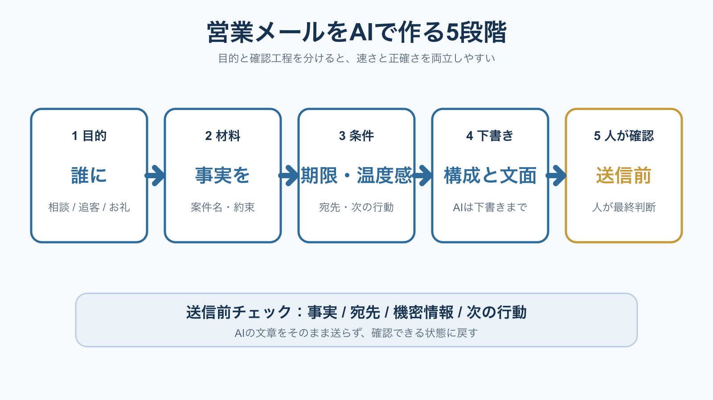

# 営業メールをAIで作成する方法｜目的・材料・確認を5段階で整える | AI顧問室

> この資料は、リポジトリ内の自社SEO記事を再利用できるように構造化した参照用転記です。競合ページの本文・画像・CSSは含めません。

## SEOメタデータ

- title: 営業メールをAIで作成する方法｜目的・材料・確認を5段階で整える | AI顧問室
- description: 営業メールをAIで作成する方法を、目的・材料・条件・下書き・人の確認の5段階で解説。速さだけでなく、誤送信と情報漏えいを防ぐ手順を整理します。
- canonical: `https://ai-komon.bivrost.co.jp/articles/ai-email-writing/`
- published: `2026-07-26`
- modified: `2026-07-26`
- source HTML: [`articles/ai-email-writing/index.html`](../../../../articles/ai-email-writing/index.html)
- source SHA-256: `780b9c6fdabeaf4225002b2a81c8cb385bbaa1bcf114ae4f8bc918d56bb4c747`

## ページ構造と計測用シグナル

- 日本語文字数（article本文）: `2329`
- H1: `1` / H2: `8` / H3: `5`
- table: `1` / details FAQ: `3`
- internal links: `4` / external links: `3`
- JSON-LD: `Article, BreadcrumbList`

### 見出し一覧

- H1: 営業メールをAIで作成する方法｜目的・材料・確認を5段階で整える
- H2: 営業メールのAI化は、下書きと整理から始める
- H2: 5段階で作ると、AIの出力を確認しやすい
- H2: プロンプトには「事実・条件・出力形式」を入れる
- H2: 送信前は4項目を人が確認する
- H2: 最初は1種類のメールで効果を測る
- H2: AI導入の相談はサービスから
- H2: よくある質問
- H2: 次に読む・使う
- H3: 目的
- H3: 材料
- H3: 条件
- H3: 下書き
- H3: 確認

## ページクローム

- **footer:** AI顧問室｜業務に合わせたAI活用と定着を支援します。
- **breadcrumb:** AI顧問室 / 営業効率化 / 営業メールをAIで作成する方法

## 装飾・レイアウトの再利用台帳

| class | element count | purpose/sample |
| --- | ---: | --- |
| `answer` | `div`×1 | 先に結論： 営業メールのAI作成は、①誰に何を伝えるか、②根拠となる事実、③宛先・期限・トーン、④下書き、⑤人の確認の順に進めます。顧客への約束、金額、納期、個人情報を含む内容は、AIの出力をそのまま送信しません。 |
| `button` | `a`×1 | AI顧問室のサービスを見る |
| `dek` | `p`×1 | 営業メールをAIに丸ごと書かせると、早く見えても事実と約束が混ざります。目的、材料、条件、下書き、送信前確認に分けると、営業担当者が判断しやすい文面を短時間で作れます。 |
| `eyebrow` | `p`×1 | SALES OPERATIONS / AI EMAIL |
| `key-points` | `div`×1 | この記事の要点 AIは送信者ではなく、確認しやすい下書き担当に置く。 プロンプトには目的、事実、禁止事項、次の行動を入れる。 送信前は事実・宛先・機密情報・約束を人が確認する。 |
| `meta` | `p`×1 | 公開日: 2026年7月26日 \| AI顧問室 編集部 |
| `note` | `div`×1, `p`×2 | 独自の見方： 営業メールの時短効果は、文字を生成する速度より、商談メモから「次に誰が何をするか」を抜き出す時間で決まります。まずはメール作成そのものではなく、要点整理と下書きの差し戻し回数を測ります。 |
| `related` | `div`×1 | 営業効率化の方法 見積・提案・追客を分ける 提案書をAIで作成する方法 下書きと確認を分ける AI導入のリスク 入力・出力・権限を確認する |
| `service-cta` | `div`×1 | AI導入の相談はサービスから AIに任せる業務の選定から、実装、社内ルール、現場への定着までを一気通貫で支援します。自社でどこから始めるか、サービス内容を確認してください。 AI顧問室のサービスを見る |
| `sources` | `div`×1 | 出典・確認日 IPA「AIの利活用、AIによるDXの推進」 、2026年7月26日確認。 経済産業省「AI事業者ガイドライン（第1.2版）」 、2026年7月26日確認。 個人情報保護委員会「生成AIサービスの利用に関する注意喚起等について」 、2026年7月26日確認。 |
| `step` | `div`×5 | 01 目的 お礼、確認、追客、日程調整のどれかに絞る。 |
| `steps` | `div`×1 | 01 目的 お礼、確認、追客、日程調整のどれかに絞る。 02 材料 商談で確認した事実と未確定事項を分ける。 03 条件 宛先、期限、文体、禁止表現を指定する。 04 下書き 件名、本文、次の行動を別々に出す。 05 確認 事実と約束を原資料へ戻して照合する。 |
| `table-scroll` | `div`×1 | 確認項目 見る内容 止める条件 事実 会社名、案件名、相手の発言、添付 根拠が見つからない 約束 金額、納期、対応範囲、次回日時 社内承認がない 宛先 To / Cc / 添付ファイル 共有範囲が不明 情報 個人情報、機密、未公開の条件 入力・送信ルールに違反 |
| `toc` | `div`×1 | この記事の目次 営業メールにAIを使う範囲 5段階の作成手順 そのまま使える指示の型 送信前に確認する項目 小さく試して測る方法 |
| `tool-cta` | `div`×1 | AI導入の相談はサービスから AIに任せる業務の選定から、実装、社内ルール、現場への定着までを一気通貫で支援します。自社でどこから始めるか、サービス内容を確認してください。 AI顧問室のサービスを見る |

### 外部 stylesheet

- `../../assets/articles/article.css?v=20260726-seo`


## 図解・画像

### 営業メールをAIで作成する流れを目的、材料、条件、下書き、人が確認の5段階で示した図解



- source: `../../assets/articles/diagrams/ai-email-writing-diagram.png`
- dimensions: `1600×900`
- caption: 営業メールのAI活用は、下書きの前に目的と確認条件を決め、送信前に人へ戻す。
- sha256: `f08eafd2ce2f86b880730ce350ab3cda595cf5179c64daa037bd31ef95f6205d`

## 構造化データ（JSON-LD原文）

```json
[
  {
    "@context": "https://schema.org",
    "@type": "Article",
    "headline": "営業メールをAIで作成する方法｜目的・材料・確認を5段階で整える",
    "description": "営業メールをAIで作成するときの目的設定、材料、条件、下書き、送信前確認を実務順に解説します。",
    "image": "https://ai-komon.bivrost.co.jp/assets/ogp.png",
    "datePublished": "2026-07-26",
    "dateModified": "2026-07-26",
    "author": {
      "@type": "Organization",
      "name": "AI顧問室"
    },
    "publisher": {
      "@type": "Organization",
      "name": "AI顧問室"
    },
    "mainEntityOfPage": "https://ai-komon.bivrost.co.jp/articles/ai-email-writing/"
  },
  {
    "@context": "https://schema.org",
    "@type": "BreadcrumbList",
    "itemListElement": [
      {
        "@type": "ListItem",
        "position": 1,
        "name": "AI顧問室",
        "item": "https://ai-komon.bivrost.co.jp/"
      },
      {
        "@type": "ListItem",
        "position": 2,
        "name": "営業効率化",
        "item": "https://ai-komon.bivrost.co.jp/articles/sales-efficiency/"
      },
      {
        "@type": "ListItem",
        "position": 3,
        "name": "営業メールをAIで作成する方法",
        "item": "https://ai-komon.bivrost.co.jp/articles/ai-email-writing/"
      }
    ]
  }
]
```

## 全文の文字起こし（装飾付き可読版）

SALES OPERATIONS / AI EMAIL

# 営業メールをAIで作成する方法｜目的・材料・確認を5段階で整える

営業メールをAIに丸ごと書かせると、早く見えても事実と約束が混ざります。目的、材料、条件、下書き、送信前確認に分けると、営業担当者が判断しやすい文面を短時間で作れます。

公開日: 2026年7月26日　|　AI顧問室 編集部


営業メールのAI活用は、下書きの前に目的と確認条件を決め、送信前に人へ戻す。

**先に結論：**営業メールのAI作成は、①誰に何を伝えるか、②根拠となる事実、③宛先・期限・トーン、④下書き、⑤人の確認の順に進めます。顧客への約束、金額、納期、個人情報を含む内容は、AIの出力をそのまま送信しません。

**この記事の要点**

- AIは送信者ではなく、確認しやすい下書き担当に置く。
- プロンプトには目的、事実、禁止事項、次の行動を入れる。
- 送信前は事実・宛先・機密情報・約束を人が確認する。

**この記事の目次**

1. [営業メールにAIを使う範囲](#why)
2. [5段階の作成手順](#steps)
3. [そのまま使える指示の型](#prompt)
4. [送信前に確認する項目](#check)
5. [小さく試して測る方法](#small)

## 営業メールのAI化は、下書きと整理から始める

IPA「AIの利活用、AIによるDXの推進」は、AIの活用例として文書作成・確認や問い合わせ対応を挙げています。営業メールも、商談メモの整理、要点の抽出、文章の下書きに分ければ、最終判断を人に残したまま補助できます。

反対に、顧客への最終回答、値引きの承認、契約条件の提示を一度に自動化すると、誤った約束が送信される可能性があります。AI導入のリスクはサービス名だけでなく、入力、出力、権限、確認者、切り戻しで分けて考えます。

**独自の見方：**営業メールの時短効果は、文字を生成する速度より、商談メモから「次に誰が何をするか」を抜き出す時間で決まります。まずはメール作成そのものではなく、要点整理と下書きの差し戻し回数を測ります。

## 5段階で作ると、AIの出力を確認しやすい

5段階の順番にすると、営業メールの作成条件が後から追えるようになります。最初から自然な文章を求めるのではなく、目的と事実を先に固定し、最後に表現を整えることがポイントです。

**01**

### 目的

お礼、確認、追客、日程調整のどれかに絞る。

**02**

### 材料

商談で確認した事実と未確定事項を分ける。

**03**

### 条件

宛先、期限、文体、禁止表現を指定する。

**04**

### 下書き

件名、本文、次の行動を別々に出す。

**05**

### 確認

事実と約束を原資料へ戻して照合する。

この順番は、[提案書をAIで作成する方法](/articles/proposal-ai/)にも応用できます。入力を整理し、構成を作り、下書きと最終提出を分けると、AIの便利さと担当者の責任範囲を両立できます。

## プロンプトには「事実・条件・出力形式」を入れる

良い営業メールの指示は、長い呪文ではありません。AIが推測してはいけない事実と、担当者が確認すべき欄を分けます。次の型を使い、顧客名や未公開情報は社内ルールとサービス条件を確認してから入力します。

**指示の型：**「目的：商談後のお礼。事実：相手が話した課題は〇〇。未確定：導入時期。条件：200字以内、断定しない、値引きを約束しない。出力：件名・本文・確認が必要な箇所を分ける。」

出力には、本文だけでなく「確認が必要な箇所」を付けさせます。たとえば、日付、金額、担当者名、添付ファイル、相手の発言として扱った文が候補になります。AIの文章力を評価するより、確認の入口が見えることを優先します。

個人情報保護委員会は、生成AIサービスへ個人データを入力する場合、利用規約やプライバシーポリシーを確認するよう注意喚起しています。顧客名や連絡先を匿名化できるなら先に置き換え、不要な情報は入力しません。

## 送信前は4項目を人が確認する

送信前の確認は、文章の自然さだけでは足りません。経済産業省の「AI事業者ガイドライン（第1.2版）」でも、AIの出力に含まれるリスク要因を確認して利用する考え方が示されています。営業メールでは、次の4項目を必ず原資料へ戻します。

| 確認項目 | 見る内容 | 止める条件 |
| --- | --- | --- |
| 事実 | 会社名、案件名、相手の発言、添付 | 根拠が見つからない |
| 約束 | 金額、納期、対応範囲、次回日時 | 社内承認がない |
| 宛先 | To / Cc / 添付ファイル | 共有範囲が不明 |
| 情報 | 個人情報、機密、未公開の条件 | 入力・送信ルールに違反 |

特に危険なのは、AIが文脈を整えるために、未確定の情報を確定事項のように書くことです。確認できない箇所を「要確認」と表示させ、担当者がチェックした記録を残すと、差し戻しの原因も追いやすくなります。

## 最初は1種類のメールで効果を測る

いきなり全営業メールをAI化する必要はありません。最初は商談後のお礼や日程確認など、目的と出力が比較的決まった1種類に限定します。IPAの導入・運用ガイドラインも、組織導入では利用目的、運用、リスク管理を分けて考える構成です。

測定するのは生成時間だけではありません。作成開始から初稿までの時間、修正回数、確認にかかった時間、送信後の訂正、担当者の利用率を記録します。AIで速く書けても、確認と訂正が増えるなら対象業務を見直します。

**実務での観察：**メールの型を増やす前に、確認漏れが起きた文面を3〜5件集めると、禁止事項とチェック欄が具体化します。成功例だけでプロンプトを作らず、差し戻し例を先に教材へ戻すのが安全です。

## AI導入の相談はサービスから

AIに任せる業務の選定から、実装、社内ルール、現場への定着までを一気通貫で支援します。自社でどこから始めるか、サービス内容を確認してください。

[AI顧問室のサービスを見る](../../#service)

## よくある質問

営業メールをAIに自動送信させてもよいですか？

まずは下書きと確認に限定します。顧客への約束、値引き、契約条件、個人情報が含まれる場合は、人の承認と送信範囲の確認を残します。

無料のAIで営業メールを作れますか？

下書きは可能ですが、入力情報の保存・学習利用・共有範囲はサービスごとに確認が必要です。顧客情報は必要最小限にし、社内ルールに従います。

営業メールのAI化は何で評価しますか？

生成時間だけでなく、修正回数、確認時間、訂正送信、返信率などを業務目的に合わせて測ります。最初から成果を保証せず、現行手順と比較します。

## 次に読む・使う

[**営業効率化の方法**見積・提案・追客を分ける](/articles/sales-efficiency/)[**提案書をAIで作成する方法**下書きと確認を分ける](/articles/proposal-ai/)[**AI導入のリスク**入力・出力・権限を確認する](/articles/ai-introduction-risk/)

**出典・確認日**

- [IPA「AIの利活用、AIによるDXの推進」](https://www.ipa.go.jp/digital/ai/transformation.html)、2026年7月26日確認。
- [経済産業省「AI事業者ガイドライン（第1.2版）」](https://www.meti.go.jp/shingikai/mono_info_service/ai_shakai_jisso/20260331_report.html)、2026年7月26日確認。
- [個人情報保護委員会「生成AIサービスの利用に関する注意喚起等について」](https://www.ppc.go.jp/news/careful_information/230602_AI_utilize_alert/)、2026年7月26日確認。

## 参照用リンク一覧

- #check
- #prompt
- #small
- #steps
- #why
- ../../#service
- /articles/ai-introduction-risk/
- /articles/proposal-ai/
- /articles/sales-efficiency/
- https://www.ipa.go.jp/digital/ai/transformation.html
- https://www.meti.go.jp/shingikai/mono_info_service/ai_shakai_jisso/20260331_report.html
- https://www.ppc.go.jp/news/careful_information/230602_AI_utilize_alert/
