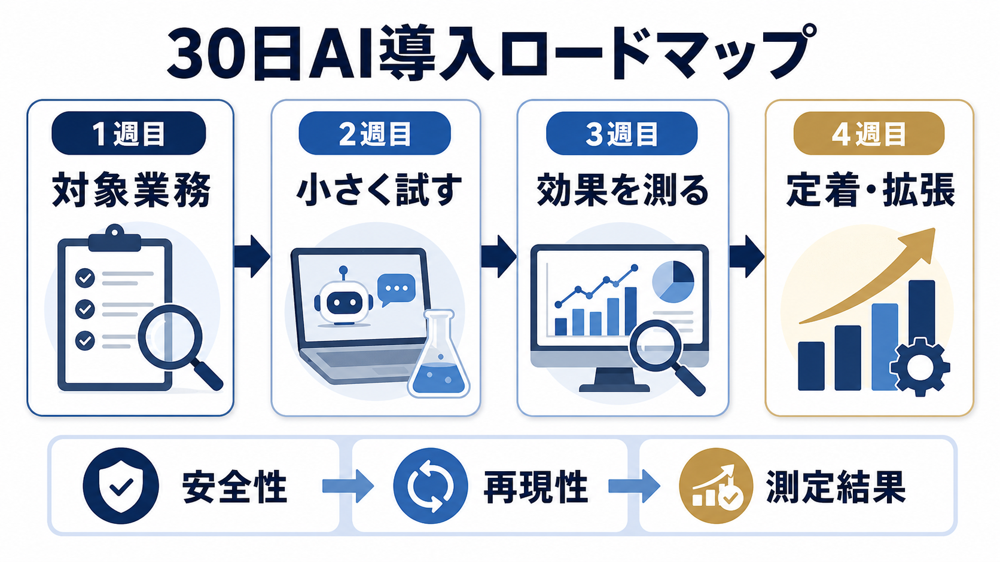

# 中小企業のAI導入の進め方｜いきなり全社展開しない30日ロードマップ | AI顧問室

> この資料は、リポジトリ内の自社SEO記事を再利用できるように構造化した参照用転記です。競合ページの本文・画像・CSSは含めません。

## SEOメタデータ

- title: 中小企業のAI導入の進め方｜いきなり全社展開しない30日ロードマップ | AI顧問室
- description: 中小企業のAI導入の進め方を30日ロードマップで解説。対象業務、確認者、効果測定、社内ルール、失敗時の戻し方まで実務順に整理します。
- canonical: `https://ai-komon.bivrost.co.jp/articles/ai-introduction-roadmap/`
- published: `2026-07-12`
- modified: `2026-07-13`
- source HTML: [`articles/ai-introduction-roadmap/index.html`](../../../../articles/ai-introduction-roadmap/index.html)
- source SHA-256: `2c6ffb7be8b1ae19dd5d899b7017fc22bb30670d80723bdda509d7f9d31db0dc`

## ページ構造と計測用シグナル

- 日本語文字数（article本文）: `3275`
- H1: `1` / H2: `12` / H3: `5`
- table: `4` / details FAQ: `4`
- internal links: `6` / external links: `3`
- JSON-LD: `Article, FAQPage`

### 見出し一覧

- H1: 中小企業のAI導入の進め方｜いきなり全社展開しない30日ロードマップ
- H2: AI導入前に「対象・責任者・測定」を決める
- H2: 中小企業向け30日ロードマップ
- H2: 効果は「時間」だけでなく品質と確認負担で測る
- H2: 定着・拡張は「再現できるか」で判断する
- H2: 最初のテーマは「確認しやすい定型業務」から選ぶ
- H2: 失敗したときに戻れる設計を先に置く
- H2: 30日試行で残すべき記録
- H2: 全社展開前に3つのゲートを通す
- H2: 継続・停止・再設計の条件を決める
- H2: AI導入の相談はサービスから
- H2: よくある質問
- H2: 次に読む・使う
- H3: 1つの業務
- H3: 1人の確認者
- H3: 導入前の数字
- H3: 30日試行の役割を先に割り当てる
- H3: 週次レビューで試行を修正する

## ページクローム

- **footer:** AI顧問室 / 無料ツール / プライバシーポリシー
- **breadcrumb:** AI顧問室 / 業務効率化のアイデア / AI導入の進め方

## 装飾・レイアウトの再利用台帳

| class | element count | purpose/sample |
| --- | ---: | --- |
| `answer` | `div`×1 | 先に結論： 中小企業のAI導入は、1週目に対象業務を決め、2週目に安全な条件で試し、3週目に時間と品質を測り、4週目にルールと次の範囲を決めます。全社展開や高額な開発は、試行結果が出てから判断します。 |
| `button` | `a`×1 | AI顧問室のサービスを見る |
| `dek` | `p`×1 | AI導入は、ツールを契約した日から始まるわけではありません。対象業務、確認者、測定方法を決め、小さな試行で自社に合う使い方を見つけるプロセスです。 |
| `eyebrow` | `p`×1 | AI IMPLEMENTATION / 30-DAY ROADMAP |
| `hero-badges` | `div`×1 | 選ぶ 試す 測る 定着 |
| `hero-kicker` | `span`×1 | AI KOMONSHITSU / IMPLEMENTATION GUIDE |
| `hero-title` | `span`×1 | 30日で「使えるか」を確かめてから、広げる。 |
| `hero-visual` | `div`×1 | AI KOMONSHITSU / IMPLEMENTATION GUIDE 30日で「使えるか」を確かめてから、広げる。 選ぶ 試す 測る 定着 |
| `key-points` | `div`×1 | この記事の要点 導入の初手はツール選びではなく、対象業務・確認者・測定方法の決定です。 最初の30日は、使えるかを判断する試行期間。全社展開の完了を目指しません。 安全性・再現性・測定結果の3つがそろった範囲だけ、次の部署や業務へ広げます。 |
| `meta` | `p`×1 | 公開日: 2026年7月12日 更新日: 2026年7月13日 \| AI顧問室 編集部 |
| `related` | `div`×1 | AI導入のリスク 入力・出力・権限を先に確認 AI導入の費用対効果 削減時間を金額に換算 AI活用レベル診断 導入前の現在地を確認 |
| `service-cta` | `div`×1 | AI導入の相談はサービスから AIに任せる業務の選定から、実装、社内ルール、現場への定着までを一気通貫で支援します。自社でどこから始めるか、サービス内容を確認してください。 AI顧問室のサービスを見る |
| `sources` | `div`×1 | 導入設計の参考資料 中小企業基盤整備機構「中小企業のAI等の利活用に係る実態調査」 （2026年3月公表・2026年7月13日確認） 経済産業省 AI事業者ガイドライン検討会 IPA AIの利活用、AIによるDXの推進 |
| `step` | `div`×3 | 01 / 対象 1つの業務 定型で、入力と出力が確認できる業務を選ぶ。 |
| `steps` | `div`×1 | 01 / 対象 1つの業務 定型で、入力と出力が確認できる業務を選ぶ。 02 / 責任 1人の確認者 公開・送信・登録前に見る担当者を置く。 03 / 指標 導入前の数字 時間、回数、ミス、再作業を測る。 |
| `table-scroll` | `div`×4 | 期間 やること 成果物 1〜7日 業務の棚卸し、目的、対象データ、確認者を決める 試行シート・リスク確認 8〜14日 安全なサンプルで試し、出力と修正を記録する 手順の初稿・事例 15〜21日 現行方法と比較し、時間・品質・再作業を測る 効果測定表 22〜30日 利用ルール、対象範囲、次の改善を決める 運用ルール・継続判断 |
| `toc` | `div`×1 | この記事の目次 導入前に決める3つ 30日ロードマップ 効果測定の方法 定着・拡張の条件 最初に選ぶ業務の例 失敗時に戻る設計 |
| `tool-cta` | `div`×1 | AI導入の相談はサービスから AIに任せる業務の選定から、実装、社内ルール、現場への定着までを一気通貫で支援します。自社でどこから始めるか、サービス内容を確認してください。 AI顧問室のサービスを見る |

### 外部 stylesheet

- `../../assets/articles/article.css?v=20260713-responsive`


## 図解・画像

### 対象業務の選定、小さな試行、効果測定、定着と拡張を4段階で進めるロードマップ図解



- source: `../../assets/articles/diagrams/ai-introduction-roadmap-diagram.png`
- dimensions: `1672×941`
- caption: AI導入は、対象を選び、試し、測り、再現できてから広げる。
- sha256: `128b10d91b55fafb79f0ce3ed63267e723c5603a020605799cb8c4c61eed2684`

## 構造化データ（JSON-LD原文）

```json
[
  {
    "@context": "https://schema.org",
    "@type": "Article",
    "headline": "中小企業のAI導入の進め方｜いきなり全社展開しない30日ロードマップ",
    "description": "AI導入を小さく試して、効果測定と社内ルールにつなげる30日ロードマップです。",
    "image": "https://ai-komon.bivrost.co.jp/assets/ogp.png",
    "datePublished": "2026-07-12",
    "dateModified": "2026-07-13",
    "author": {
      "@type": "Organization",
      "name": "AI顧問室"
    },
    "publisher": {
      "@type": "Organization",
      "name": "AI顧問室"
    },
    "mainEntityOfPage": "https://ai-komon.bivrost.co.jp/articles/ai-introduction-roadmap/"
  },
  {
    "@context": "https://schema.org",
    "@type": "FAQPage",
    "mainEntity": [
      {
        "@type": "Question",
        "name": "AI導入は何から始めるべきですか？",
        "acceptedAnswer": {
          "@type": "Answer",
          "text": "全社導入ではなく、入力と出力が決まっていて、人が確認できる業務を1つ選びます。現状の時間、回数、ミスを測ってから30日間試すと判断しやすくなります。"
        }
      },
      {
        "@type": "Question",
        "name": "AI導入の効果はどう測定しますか？",
        "acceptedAnswer": {
          "@type": "Answer",
          "text": "削減時間だけでなく、再作業、確認時間、品質、利用率を導入前後で比べます。期待値ではなく、同じ業務を同じ条件で複数回測ることが重要です。"
        }
      }
    ]
  }
]
```

## 全文の文字起こし（装飾付き可読版）

AI IMPLEMENTATION / 30-DAY ROADMAP

# 中小企業のAI導入の進め方｜いきなり全社展開しない30日ロードマップ

AI導入は、ツールを契約した日から始まるわけではありません。対象業務、確認者、測定方法を決め、小さな試行で自社に合う使い方を見つけるプロセスです。

公開日: 2026年7月12日　更新日: 2026年7月13日　|　AI顧問室 編集部

AI KOMONSHITSU / IMPLEMENTATION GUIDE30日で「使えるか」を確かめてから、広げる。

選ぶ試す測る定着

**先に結論：**中小企業のAI導入は、1週目に対象業務を決め、2週目に安全な条件で試し、3週目に時間と品質を測り、4週目にルールと次の範囲を決めます。全社展開や高額な開発は、試行結果が出てから判断します。

**この記事の要点**

- 導入の初手はツール選びではなく、対象業務・確認者・測定方法の決定です。
- 最初の30日は、使えるかを判断する試行期間。全社展開の完了を目指しません。
- 安全性・再現性・測定結果の3つがそろった範囲だけ、次の部署や業務へ広げます。


AI導入は、対象を選び、試し、測り、再現できてから広げる。

**この記事の目次**

1. [導入前に決める3つ](#before)
2. [30日ロードマップ](#roadmap)
3. [効果測定の方法](#measure)
4. [定着・拡張の条件](#expand)
5. [最初に選ぶ業務の例](#example)
6. [失敗時に戻る設計](#failure)

## AI導入前に「対象・責任者・測定」を決める

AI導入が止まる原因は、ツールの性能だけではありません。何に使うか、誰が確認するか、成功をどう測るかが曖昧なまま始めると、便利さの感想だけが残ります。中小企業基盤整備機構の2026年3月調査でも、AI導入の阻害要因として高コスト46.9％、社内ノウハウ不足42.0％が挙げられています。最初に次の3つを一枚に書きます。

**01 / 対象**

### 1つの業務

定型で、入力と出力が確認できる業務を選ぶ。

**02 / 責任**

### 1人の確認者

公開・送信・登録前に見る担当者を置く。

**03 / 指標**

### 導入前の数字

時間、回数、ミス、再作業を測る。

候補を探すときは[業務効率化のアイデア](/articles/business-efficiency-ideas/)の3条件も使えます。最初から複雑な判断業務を選ばないことが、導入のスピードを上げます。

## 中小企業向け30日ロードマップ

| 期間 | やること | 成果物 |
| --- | --- | --- |
| 1〜7日 | 業務の棚卸し、目的、対象データ、確認者を決める | 試行シート・リスク確認 |
| 8〜14日 | 安全なサンプルで試し、出力と修正を記録する | 手順の初稿・事例 |
| 15〜21日 | 現行方法と比較し、時間・品質・再作業を測る | 効果測定表 |
| 22〜30日 | 利用ルール、対象範囲、次の改善を決める | 運用ルール・継続判断 |

この順番なら、試行中に見つかった誤回答や入力禁止情報を、[社内利用ルール](/articles/generative-ai-internal-rules/)へ反映できます。

## 効果は「時間」だけでなく品質と確認負担で測る

AI導入の効果は、作成時間が短くなったかだけで判断しません。出力を確認・修正する時間、差し戻し、顧客への誤送信、利用者が手順を守れたかも含めます。現行方法とAI補助後で、同じ形式の仕事を比較してください。

1. 1件あたりの作業時間
2. 確認・修正にかかった時間
3. 差し戻しや再作業の回数
4. 担当者が使い続けられた割合
5. 入力禁止情報や例外が発生した回数

金額換算や回収期間まで見たい場合は、[AI導入の費用対効果](/articles/ai-roi/)で計算方法を分けて確認します。

## 定着・拡張は「再現できるか」で判断する

試行がうまくいっても、担当者の経験だけで成立しているなら、全社展開には早すぎます。入力例、プロンプトや手順、確認項目、困ったときの連絡先を残し、別の人でも同じ品質で使えるかを確認します。

拡張するときは、似た業務を1つずつ追加します。部署を一度に増やすのではなく、同じ確認ルールが使える範囲から始めると、教育と監査の負担を抑えられます。

## 最初のテーマは「確認しやすい定型業務」から選ぶ

最初の試行には、入力と出力が比較的決まっていて、担当者が結果を確認できる業務が向きます。文章の下書き、問い合わせの分類、議事録の整理、社内FAQの検索などは、現行方法とAI補助後を比べやすいテーマです。顧客との最終交渉や採用判断のように、人の判断が中心の業務は、補助範囲を小さく切ります。

| 候補 | 最初に任せる範囲 | 人が確定する範囲 |
| --- | --- | --- |
| 議事録 | 文字起こしの整理、決定事項の候補抽出 | 発言者、決定内容、期限、担当者 |
| 問い合わせ | 質問の分類、FAQ候補の提示 | 回答の正しさ、個別事情、返信送信 |
| 提案書 | 構成案、過去資料の整理、下書き | 価格、契約条件、顧客向け表現 |

この切り分けを先に決めると、「AIに任せるか、任せないか」という二択ではなく、工程ごとの確認責任を設計できます。

## 失敗したときに戻れる設計を先に置く

AI導入の試行では、誤回答や確認工数の増加が起こります。失敗を隠して継続するのではなく、停止条件と戻し方を決めておくことが重要です。たとえば、誤送信につながる出力、入力禁止情報の混入、現行より確認時間が長い状態が続いた場合は、対象を狭めて手順を修正します。

1. **止める：**自動送信・自動登録を解除し、人の承認を必須にする。
2. **分ける：**入力、指示、出力、確認のどこで問題が起きたか記録する。
3. **戻す：**現行手順へ戻し、修正版を少数のサンプルで再試行する。
4. **残す：**失敗例と修正理由を手順書・社内ルールへ反映する。

試行を止めることは導入失敗ではありません。原因を特定し、同じ条件で再測定できる状態へ戻せれば、次の判断に使えるデータになります。

## 30日試行で残すべき記録

試行の成果物は、成功談ではなく、次の人が再現できる作業シートです。対象業務、入力できる情報、使った手順、確認項目、修正例、現行方法との時間差、例外時の戻し先を一枚にまとめます。

| 週 | 残す記録 | 判断に使う問い |
| --- | --- | --- |
| 1週目 | 対象業務と現状工数 | 本当に繰り返しが多いか |
| 2週目 | 入力例と誤り・修正例 | 誰が確認すれば安全か |
| 3週目 | 時間、品質、差し戻し | 現行方法より良くなったか |
| 4週目 | ルールと再現手順 | 別の担当者でも使えるか |

## 全社展開前に3つのゲートを通す

全社展開は、効果が出たという感想だけで決めません。安全性、再現性、経済性を順に確認します。どれか一つでも未確認なら、対象を広げず、試行範囲の修正へ戻します。

[AI導入のリスク](/articles/ai-introduction-risk/)で入力・権限・停止条件を確認し、[費用対効果](/articles/ai-roi/)で実測値を更新してから、次の部署や業務へ進めます。

### 30日試行の役割を先に割り当てる

小さな試行でも、業務責任者、利用者、確認者、情報管理の相談先を分けます。1人が全部を持つと、便利さと安全性の判断が混ざり、問題が起きたときに止めにくくなります。

| 役割 | 担当すること | 残すもの |
| --- | --- | --- |
| 業務責任者 | 対象業務と成功条件を決める | 業務シート |
| 利用者 | 現行とAI補助を比べる | 修正例・例外 |
| 確認者 | 公開・送信・登録を承認する | チェック結果 |
| 相談先 | 情報・契約・事故を確認する | ルール改訂 |

## 継続・停止・再設計の条件を決める

試行の最後に、続ける条件だけでなく、停止や再設計の条件も決めます。確認時間が削減時間を上回る、入力禁止情報が混ざる、利用者が手順を守れない場合は、対象を広げずに業務やルールを見直します。

AI導入は一度の成功で完了しません。[社内利用ルール](/articles/generative-ai-internal-rules/)と[リスク確認](/articles/ai-introduction-risk/)を更新し、次の試行へ学びを渡せることが、30日ロードマップの成果です。

**導入設計の参考資料**

- [中小企業基盤整備機構「中小企業のAI等の利活用に係る実態調査」](https://www.smrj.go.jp/research_case/questionnaire/fbrion0000002pjw-att/202603_AI_report.pdf)（2026年3月公表・2026年7月13日確認）
- [経済産業省 AI事業者ガイドライン検討会](https://www.meti.go.jp/shingikai/mono_info_service/ai_shakai_jisso/)
- [IPA AIの利活用、AIによるDXの推進](https://www.ipa.go.jp/digital/ai/transformation.html)

### 週次レビューで試行を修正する

30日間を最後に一度だけ評価すると、どの週で詰まったか分かりません。毎週、作業時間、修正、例外、利用者の困りごとを確認し、翌週の手順へ反映します。

- 第1週は対象と入力範囲
- 第2週は出力と修正箇所
- 第3週は時間と品質
- 第4週は再現性と継続条件

試行の途中で課題が見つかることは失敗ではありません。原因が入力、手順、確認者、ツールのどこにあるかを分け、同じ条件で再度測れる状態に戻すことが大切です。

## AI導入の相談はサービスから

AIに任せる業務の選定から、実装、社内ルール、現場への定着までを一気通貫で支援します。自社でどこから始めるか、サービス内容を確認してください。

[AI顧問室のサービスを見る](../../#service)

## よくある質問

AI導入に専門部署は必要ですか？

最初の試行に大きな専門部署は必須ではありません。ただし、業務責任者、情報管理の相談先、出力確認者は必要です。外部支援を使う場合も、社内の最終責任者を置きます。

30日で導入完了できますか？

30日で全社展開するのではなく、使えるかを判断する試行を完了させる想定です。業務・契約・データの確認に時間がかかる場合は、期間を延ばして安全性を優先します。

AI導入の対象業務はどう選びますか？

繰り返しが多く、入力と出力が比較的決まっていて、人が結果を確認できる業務から選びます。顧客への最終回答や採用判断など、責任判断が重い業務は、分類や下書きなど補助工程に限定します。

効果が出ないときはどうしますか？

導入を続ける前に、入力、指示、出力、確認のどこで時間や品質が悪化したかを分けます。現行手順へ戻れる状態を保ち、対象範囲を狭めて再測定します。停止条件を決めておくと、感覚で継続せずに済みます。

## 次に読む・使う

[**AI導入のリスク**入力・出力・権限を先に確認](/articles/ai-introduction-risk/)[**AI導入の費用対効果**削減時間を金額に換算](/articles/ai-roi/)[**AI活用レベル診断**導入前の現在地を確認](/diagnosis.html)

## 参照用リンク一覧

- #before
- #example
- #expand
- #failure
- #measure
- #roadmap
- ../../#service
- /articles/ai-introduction-risk/
- /articles/ai-roi/
- /articles/business-efficiency-ideas/
- /articles/generative-ai-internal-rules/
- /diagnosis.html
- https://www.ipa.go.jp/digital/ai/transformation.html
- https://www.meti.go.jp/shingikai/mono_info_service/ai_shakai_jisso/
- https://www.smrj.go.jp/research_case/questionnaire/fbrion0000002pjw-att/202603_AI_report.pdf
