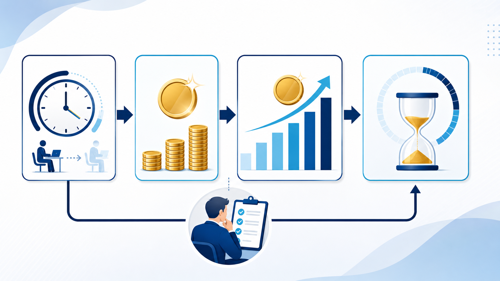

# AI導入の費用対効果｜削減時間・人件費・回収期間の試算方法 | AI顧問室

> この資料は、リポジトリ内の自社SEO記事を再利用できるように構造化した参照用転記です。競合ページの本文・画像・CSSは含めません。

## SEOメタデータ

- title: AI導入の費用対効果｜削減時間・人件費・回収期間の試算方法 | AI顧問室
- description: AI導入の費用対効果を、削減時間・時間単価・導入費用・回収期間に分けて試算。悲観・標準・楽観の3ケースと、確認工数を含めた判断方法を解説します。
- canonical: `https://ai-komon.bivrost.co.jp/articles/ai-roi/`
- published: `2026-07-12`
- modified: `2026-07-12`
- source HTML: [`articles/ai-roi/index.html`](../../../../articles/ai-roi/index.html)
- source SHA-256: `daaf33fecefe667e19f6d9cf140dd5a5f2c21422ed276e7c8a4b17309cb590bf`

## ページ構造と計測用シグナル

- 日本語文字数（article本文）: `2327`
- H1: `1` / H2: `12` / H3: `3`
- table: `3` / details FAQ: `2`
- internal links: `6` / external links: `2`
- JSON-LD: `Article, FAQPage`

### 見出し一覧

- H1: AI導入の費用対効果｜削減時間・人件費・回収期間の試算方法
- H2: AI導入の費用対効果は4つの数字で考える
- H2: 試算には「確認工数」と「使わない案件」も入れる
- H2: 悲観・標準・楽観の3ケースで判断する
- H2: 公開後・導入後は実測で試算を更新する
- H2: ROIの仮説に含めるもの、含めないもの
- H2: 回収期間だけで投資を決めない
- H2: 条件を1つずつ変えて感度を見る
- H2: 金額にしにくい効果を別指標で残す
- H2: 試算表を経営会議で使う
- H2: AI導入の相談はサービスから
- H2: よくある質問
- H2: 次に読む・使う
- H3: 削減時間
- H3: 時間単価
- H3: 導入・運用費

## ページクローム

- **footer:** AI顧問室 / 無料ツール / プライバシーポリシー
- **breadcrumb:** AI顧問室 / 費用対効果 / AI導入の費用対効果

## 装飾・レイアウトの再利用台帳

| class | element count | purpose/sample |
| --- | ---: | --- |
| `answer` | `div`×1 | 先に結論： AI導入の費用対効果は「月間削減時間 × 時間単価 − 月間運用費用」で基本額を出し、確認・教育・例外対応を加味します。悲観・標準・楽観の3ケースを作り、実測値で更新することが大切です。 |
| `button` | `a`×1 | AI顧問室のサービスを見る |
| `dek` | `p`×1 | AI導入のROIは、期待する売上だけで決めると不確実になります。まず削減時間と確認工数を測り、導入費用と並べて、複数のケースで回収期間を試算します。 |
| `eyebrow` | `p`×1 | AI INVESTMENT / ROI |
| `hero-badges` | `div`×1 | 削減時間 時間単価 費用 回収期間 |
| `hero-kicker` | `span`×1 | AI KOMONSHITSU / ROI GUIDE |
| `hero-title` | `span`×1 | 期待値ではなく、削減できた時間から計算する。 |
| `hero-visual` | `div`×1 | AI KOMONSHITSU / ROI GUIDE 期待値ではなく、削減できた時間から計算する。 削減時間 時間単価 費用 回収期間 |
| `meta` | `p`×1 | 公開日: 2026年7月12日 \| AI顧問室 編集部 |
| `note` | `div`×1 | 判断のポイント： 削減時間が小さくても、対応漏れが減る、引き継ぎが早くなる、担当者が顧客対応へ戻れるなどの効果があります。金額にしにくい効果は、別の指標として残します。 |
| `related` | `div`×1 | AI導入の進め方 30日で試行と測定を行う 見積書作成の時間を減らす 工数の分解から始める 工数シミュレーター 営業・見積を数字で確認 |
| `service-cta` | `div`×1 | AI導入の相談はサービスから AIに任せる業務の選定から、実装、社内ルール、現場への定着までを一気通貫で支援します。自社でどこから始めるか、サービス内容を確認してください。 AI顧問室のサービスを見る |
| `sources` | `div`×1 | AI導入の判断に使う資料 IPA AIの利活用、AIによるDXの推進 経済産業省 AI事業者ガイドライン検討会 |
| `step` | `div`×3 | 01 / TIME 削減時間 1件の差分 × 月間件数で出す。 |
| `steps` | `div`×1 | 01 / TIME 削減時間 1件の差分 × 月間件数で出す。 02 / VALUE 時間単価 担当者の人件費や社内基準を使う。 03 / COST 導入・運用費 契約、教育、確認工数も含める。 |
| `table-scroll` | `div`×3 | 項目 入力例 注意点 月間件数 見積・議事録・問い合わせの件数 繁忙期と通常月を分ける 現状時間 受付から完了まで 確認・差し戻しを含める 改善後時間 AI処理と人の確認 例外案件は別計算 単価 担当者の時間単価 社内基準を明記する 費用 初期・月額・教育 契約更新条件を確認する |
| `toc` | `div`×1 | この記事の目次 基本の計算式 試算に必要な数字 3ケースで見る 実測で更新する |
| `tool-cta` | `div`×1 | AI導入の相談はサービスから AIに任せる業務の選定から、実装、社内ルール、現場への定着までを一気通貫で支援します。自社でどこから始めるか、サービス内容を確認してください。 AI顧問室のサービスを見る |

### 外部 stylesheet

- `../../assets/articles/article.css?v=20260713-responsive`


## 図解・画像

### 削減時間を金額へ換算し、月間効果とAI導入の回収期間を試算する図解



- source: `../../assets/articles/diagrams/ai-roi-diagram.png`
- dimensions: `1672×941`
- caption: ROIは、削減時間を金額へ換算し、費用と回収期間まで順番に見る。
- sha256: `405a7718e24a04f661e2d259b1ac292f6200dd175c431dfe9f8c3a4ab794b273`

## 構造化データ（JSON-LD原文）

```json
[
  {
    "@context": "https://schema.org",
    "@type": "Article",
    "headline": "AI導入の費用対効果｜削減時間・人件費・回収期間の試算方法",
    "description": "AI導入のROIを、削減時間と確認工数を含めて試算する方法です。",
    "image": "https://ai-komon.bivrost.co.jp/assets/ogp.png",
    "datePublished": "2026-07-12",
    "dateModified": "2026-07-12",
    "author": {
      "@type": "Organization",
      "name": "AI顧問室"
    },
    "publisher": {
      "@type": "Organization",
      "name": "AI顧問室"
    },
    "mainEntityOfPage": "https://ai-komon.bivrost.co.jp/articles/ai-roi/"
  },
  {
    "@context": "https://schema.org",
    "@type": "FAQPage",
    "mainEntity": [
      {
        "@type": "Question",
        "name": "AI導入の費用対効果はどう計算しますか？",
        "acceptedAnswer": {
          "@type": "Answer",
          "text": "月間削減時間に時間単価を掛け、月間の導入・運用費用を引いて試算します。確認工数、教育、例外対応を含め、悲観・標準・楽観の3ケースで見ます。"
        }
      },
      {
        "@type": "Question",
        "name": "AI導入のROIは何か月で回収できればよいですか？",
        "acceptedAnswer": {
          "@type": "Answer",
          "text": "一律の基準はありません。業務の重要度、契約期間、改善の確実性を合わせて判断します。短期回収だけでなく、品質や対応速度への影響も記録します。"
        }
      }
    ]
  }
]
```

## 全文の文字起こし（装飾付き可読版）

AI INVESTMENT / ROI

# AI導入の費用対効果｜削減時間・人件費・回収期間の試算方法

AI導入のROIは、期待する売上だけで決めると不確実になります。まず削減時間と確認工数を測り、導入費用と並べて、複数のケースで回収期間を試算します。

公開日: 2026年7月12日　|　AI顧問室 編集部

AI KOMONSHITSU / ROI GUIDE期待値ではなく、削減できた時間から計算する。

削減時間時間単価費用回収期間

**先に結論：**AI導入の費用対効果は「月間削減時間 × 時間単価 − 月間運用費用」で基本額を出し、確認・教育・例外対応を加味します。悲観・標準・楽観の3ケースを作り、実測値で更新することが大切です。


ROIは、削減時間を金額へ換算し、費用と回収期間まで順番に見る。

**この記事の目次**

1. [基本の計算式](#formula)
2. [試算に必要な数字](#inputs)
3. [3ケースで見る](#cases)
4. [実測で更新する](#actual)

## AI導入の費用対効果は4つの数字で考える

費用対効果の試算は、複雑な財務モデルから始めなくて大丈夫です。まず、どれだけ時間を減らせるか、その時間にどの単価を置くか、導入と運用にいくらかかるかを分けます。

**01 / TIME**

### 削減時間

1件の差分 × 月間件数で出す。

**02 / VALUE**

### 時間単価

担当者の人件費や社内基準を使う。

**03 / COST**

### 導入・運用費

契約、教育、確認工数も含める。

**月間効果額 = 月間削減時間 × 時間単価 − 月間運用費用**、**単純回収期間 = 初期費用 ÷ 月間効果額**と置くと、会話の出発点になります。

## 試算には「確認工数」と「使わない案件」も入れる

AI導入の効果を大きく見せる落とし穴は、AIが作った時間だけを削減とすることです。出力を確認し、修正し、例外案件を手作業に戻す時間を差し引きます。利用率が100%にならない場合も、実際の件数で計算してください。

| 項目 | 入力例 | 注意点 |
| --- | --- | --- |
| 月間件数 | 見積・議事録・問い合わせの件数 | 繁忙期と通常月を分ける |
| 現状時間 | 受付から完了まで | 確認・差し戻しを含める |
| 改善後時間 | AI処理と人の確認 | 例外案件は別計算 |
| 単価 | 担当者の時間単価 | 社内基準を明記する |
| 費用 | 初期・月額・教育 | 契約更新条件を確認する |

## 悲観・標準・楽観の3ケースで判断する

AI導入直後は利用率や削減率が安定しません。標準ケースだけで投資判断をせず、悲観ケースでも許容できるかを見ます。たとえば、利用率が低い、確認時間が長い、例外が多い条件を置き、どこまでなら事業上意味があるかを決めます。

営業や見積の具体的な数字を入れたい場合は[工数シミュレーター](/tools/sales-estimate-roi/)を使い、サービス導入全体の考え方は[費用対効果の案内](/lp-roi.html)と合わせて確認してください。

## 公開後・導入後は実測で試算を更新する

試算は意思決定の前提であり、結果ではありません。導入後は、実際の件数、作業時間、確認時間、差し戻し、利用率を月次で記録し、見積と比べます。数字が悪いときは、AIの性能だけでなく、対象業務や入力の型が合っているかを見直します。

**判断のポイント：**削減時間が小さくても、対応漏れが減る、引き継ぎが早くなる、担当者が顧客対応へ戻れるなどの効果があります。金額にしにくい効果は、別の指標として残します。

## ROIの仮説に含めるもの、含めないもの

試算の最初に、効果へ含める範囲を決めます。月間削減時間だけでなく、AIの出力を確認する時間、ルールを作る時間、教育費、例外案件の手作業を費用側へ入れると、過大な期待を抑えられます。

| 項目 | 効果側に置く | 費用・リスク側に置く |
| --- | --- | --- |
| 作業時間 | 転記・要約・検索の削減 | 確認・修正・再作業 |
| 導入準備 | 再利用できる手順 | 教育・ルール作成 |
| 品質 | 漏れ・対応遅れの減少 | 誤回答・停止時の対応 |

## 回収期間だけで投資を決めない

回収期間が短くても、情報管理や顧客対応のリスクが高い業務は、別の承認が必要です。反対に、金額効果が小さくても、属人化の解消や引き継ぎの改善が大きければ、継続する価値があります。

悲観・標準・楽観の3ケースを作り、導入後は実績で更新します。[AI導入の進め方](/articles/ai-introduction-roadmap/)で試行を設計し、[工数シミュレーター](/tools/sales-estimate-roi/)で条件を変えて確認してください。

## 条件を1つずつ変えて感度を見る

ROIの試算では、改善率、利用率、確認時間、月間件数を同時に変えないことが大切です。どの条件が結果を大きく動かすかを確認し、実測すべき数字を絞ります。改善率だけを高く置いた試算は、意思決定の根拠になりません。

| 変える条件 | 悲観ケース | 標準ケース | 確認すること |
| --- | --- | --- | --- |
| 利用率 | 一部の担当者のみ | 対象業務の大半 | 使い続けられるか |
| 確認時間 | 修正が多い | チェックリストで安定 | 品質と速度の両立 |
| 件数 | 閑散期 | 通常月 | 繁忙期の耐性 |

## 金額にしにくい効果を別指標で残す

引き継ぎが早くなる、問い合わせの漏れが減る、担当者が顧客対応へ戻れるといった効果は、単純な人件費だけでは表しにくいものです。金額換算を無理にせず、対応時間、再作業、属人化、利用率などの指標を別に管理します。

導入の判断は、[試行の記録](/articles/ai-introduction-roadmap/)と[リスクの許容度](/articles/ai-introduction-risk/)を合わせて行います。数字が良くても、確認者がいない業務はそのまま拡張しません。

**AI導入の判断に使う資料**

- [IPA AIの利活用、AIによるDXの推進](https://www.ipa.go.jp/digital/ai/transformation.html)
- [経済産業省 AI事業者ガイドライン検討会](https://www.meti.go.jp/shingikai/mono_info_service/ai_shakai_jisso/)

## 試算表を経営会議で使う

ROIの数字だけを提示すると、前提が変わったときに判断をやり直せません。試算表には、結果と一緒に次の条件を残し、実測値が増えるたびに更新します。

- 対象業務、対象期間、処理件数が明記されているか
- 改善率を一つに固定せず、悲観・標準・楽観の3ケースを置いたか
- 月額費用、初期設定、教育、連携、確認工数を含めたか
- 削減時間を別業務へ振り替える場合の使い道を決めたか
- 実測値への更新日と、次に見直す責任者が決まっているか

## AI導入の相談はサービスから

AIに任せる業務の選定から、実装、社内ルール、現場への定着までを一気通貫で支援します。自社でどこから始めるか、サービス内容を確認してください。

[AI顧問室のサービスを見る](../../#service)

## よくある質問

人件費を削減しない会社でもROIを計算できますか？

できます。削減時間を顧客対応、品質確認、教育、営業活動へ振り替える価値として整理します。人員削減だけを効果にしない方が、導入後の使い道を決めやすくなります。

AI導入の費用に含めるべきものは？

初期設定、月額料金、連携開発、教育、ルール作成、確認工数、運用担当者の時間を含めます。契約更新や利用量で変わる費用も、条件として残します。

## 次に読む・使う

[**AI導入の進め方**30日で試行と測定を行う](/articles/ai-introduction-roadmap/)[**見積書作成の時間を減らす**工数の分解から始める](/articles/estimate-time-reduction/)[**工数シミュレーター**営業・見積を数字で確認](/tools/sales-estimate-roi/)

## 参照用リンク一覧

- #actual
- #cases
- #formula
- #inputs
- ../../#service
- /articles/ai-introduction-risk/
- /articles/ai-introduction-roadmap/
- /articles/estimate-time-reduction/
- /lp-roi.html
- /tools/sales-estimate-roi/
- https://www.ipa.go.jp/digital/ai/transformation.html
- https://www.meti.go.jp/shingikai/mono_info_service/ai_shakai_jisso/
