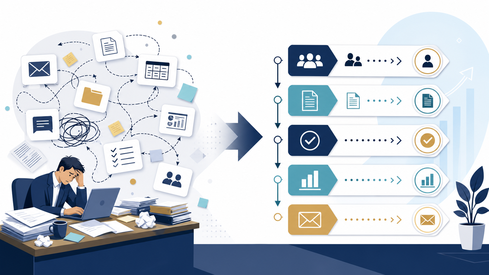

# 業務効率化のアイデア｜中小企業が最初に見直す定型業務10選 | AI顧問室

> この資料は、リポジトリ内の自社SEO記事を再利用できるように構造化した参照用転記です。競合ページの本文・画像・CSSは含めません。

## SEOメタデータ

- title: 業務効率化のアイデア｜中小企業が最初に見直す定型業務10選 | AI顧問室
- description: 業務効率化のアイデアを、入力が決まっている・繰り返しが多い・確認ルールがある業務から整理。中小企業が最初に見直しやすい10例と進め方を紹介します。
- canonical: `https://ai-komon.bivrost.co.jp/articles/business-efficiency-ideas/`
- published: `2026-07-12`
- modified: `2026-07-12`
- source HTML: [`articles/business-efficiency-ideas/index.html`](../../../../articles/business-efficiency-ideas/index.html)
- source SHA-256: `279f96dd1d238abbbf83f7c7e37d63375b4c2640f27b962aca6a9fd4d1b45fda`

## ページ構造と計測用シグナル

- 日本語文字数（article本文）: `2430`
- H1: `1` / H2: `11` / H3: `3`
- table: `2` / details FAQ: `2`
- internal links: `7` / external links: `2`
- JSON-LD: `Article, FAQPage`

### 見出し一覧

- H1: 業務効率化のアイデア｜中小企業が最初に見直す定型業務10選
- H2: 業務効率化しやすいのは「定型・反復・確認可能」な仕事
- H2: 中小企業が最初に見直しやすい業務効率化のアイデア10選
- H2: 優先順位は「時間×回数×標準化しやすさ」で決める
- H2: 業務効率化を小さく試す4ステップ
- H2: 業務効率化のアイデアを実行に変える
- H2: 効率化しない方がよい業務もある
- H2: 担当者へ聞くべき5つの質問
- H2: 改善後のチェックリスト
- H2: AI導入の相談はサービスから
- H2: よくある質問
- H2: 次に読む・使う
- H3: 入力が決まる
- H3: 回数が多い
- H3: 人が判定できる

## ページクローム

- **footer:** AI顧問室 / 無料ツール / プライバシーポリシー
- **breadcrumb:** AI顧問室 / 無料ツール / 業務効率化のアイデア

## 装飾・レイアウトの再利用台帳

| class | element count | purpose/sample |
| --- | ---: | --- |
| `answer` | `div`×1 | 先に結論： 最初の候補は、①入力が決まっている、②週に何度も繰り返す、③完了条件を人が確認できる業務です。議事録、問い合わせ整理、見積の下書き、定型メールなどを、作業時間と回数で並べると優先順位を付けやすくなります。 |
| `button` | `a`×1 | AI顧問室のサービスを見る |
| `dek` | `p`×1 | 業務効率化は、いきなり新しいツールを増やすことではありません。毎週くり返す作業を見つけ、入力・判断・確認のどこを短くするか決めることから始まります。 |
| `eyebrow` | `p`×1 | BUSINESS IMPROVEMENT / IDEAS |
| `hero-badges` | `div`×1 | 定型業務 工数計測 小さく改善 |
| `hero-kicker` | `span`×1 | AI KOMONSHITSU / PRACTICAL GUIDE |
| `hero-title` | `span`×1 | 先に「作業」を見直す。ツールはそのあと。 |
| `hero-visual` | `div`×1 | AI KOMONSHITSU / PRACTICAL GUIDE 先に「作業」を見直す。ツールはそのあと。 定型業務 工数計測 小さく改善 |
| `key-points` | `div`×1 | この記事の要点 業務名ではなく、繰り返し・転記・確認・待ち時間の多い工程から探す AIに任せる部分と、人が承認する部分を工程ごとに分ける 一つの業務で時間・修正・停止を測ってから、対象範囲を広げる |
| `meta` | `p`×1 | 公開日: 2026年7月12日 \| AI顧問室 編集部 |
| `related` | `div`×1 | AI導入の進め方 小さく試す30日ロードマップ 営業効率化の方法 見積・提案・追客を分けて考える AI活用レベル診断 自社の詰まりを整理する |
| `service-cta` | `div`×1 | AI導入の相談はサービスから AIに任せる業務の選定から、実装、社内ルール、現場への定着までを一気通貫で支援します。自社でどこから始めるか、サービス内容を確認してください。 AI顧問室のサービスを見る |
| `sources` | `div`×1 | 業務改善の背景を確認する資料 IPA AIの利活用、AIによるDXの推進 経済産業省 AI事業者ガイドライン検討会 |
| `step` | `div`×3 | 01 / 定型 入力が決まる 必要な項目や資料が毎回ほぼ同じである。 |
| `steps` | `div`×1 | 01 / 定型 入力が決まる 必要な項目や資料が毎回ほぼ同じである。 02 / 反復 回数が多い 毎日・毎週発生し、合計時間が積み上がる。 03 / 確認 人が判定できる 正しい状態をチェックリストにできる。 |
| `table-scroll` | `div`×2 | 業務 最初に整えること 効率化の方向 議事録 決定事項・ToDoの書式 テンプレート やAI下書き 問い合わせ 質問と回答の分類 一次回答の下書き 見積書 商品・単価・条件の一覧 転記と計算の補助 定型メール 宛先別の文面ルール 返信案の作成 営業報告 入力項目と提出時刻 要約と未入力確認 採用連絡 候補者ステータス 日程調整文の作成 資料探し ファイル名と保管場所 検索・要約 SNS投稿 商品情報と禁止表現 媒体別の下書き 請求前確認 |
| `toc` | `div`×1 | この記事の目次 効率化しやすい業務の条件 最初に見直す10のアイデア 優先順位の付け方 小さく試す手順 |
| `tool-cta` | `div`×1 | AI導入の相談はサービスから AIに任せる業務の選定から、実装、社内ルール、現場への定着までを一気通貫で支援します。自社でどこから始めるか、サービス内容を確認してください。 AI顧問室のサービスを見る |

### 外部 stylesheet

- `../../assets/articles/article.css?v=20260713-responsive`


## 図解・画像

### 散らかった定型業務を整理し、確認可能な改善フローへ変える図解



- source: `../../assets/articles/diagrams/business-efficiency-ideas-diagram.png`
- dimensions: `1672×941`
- caption: 業務効率化は、散らかった作業を整理し、確認できる工程から小さく変える。
- sha256: `0e3a39475142c33381db2719f6db0759fa86bd08b08d6e93f3224975afe7663f`

## 構造化データ（JSON-LD原文）

```json
[
  {
    "@context": "https://schema.org",
    "@type": "Article",
    "headline": "業務効率化のアイデア｜中小企業が最初に見直す定型業務10選",
    "description": "業務効率化のアイデアを、定型業務から具体化する方法を解説します。",
    "image": "https://ai-komon.bivrost.co.jp/assets/ogp.png",
    "datePublished": "2026-07-12",
    "dateModified": "2026-07-12",
    "author": {
      "@type": "Organization",
      "name": "AI顧問室"
    },
    "publisher": {
      "@type": "Organization",
      "name": "AI顧問室"
    },
    "mainEntityOfPage": "https://ai-komon.bivrost.co.jp/articles/business-efficiency-ideas/"
  },
  {
    "@context": "https://schema.org",
    "@type": "FAQPage",
    "mainEntity": [
      {
        "@type": "Question",
        "name": "業務効率化は何から始めるべきですか？",
        "acceptedAnswer": {
          "@type": "Answer",
          "text": "毎週繰り返し、入力項目が決まり、完了条件を確認できる業務から始めます。まず作業時間と回数を1週間測り、効果と例外を見て小さく試します。"
        }
      },
      {
        "@type": "Question",
        "name": "AIならすべての業務を効率化できますか？",
        "acceptedAnswer": {
          "@type": "Answer",
          "text": "すべてではありません。判断責任が重い業務、例外が多い業務、入力データの品質が低い業務は、AIより先に手順や権限を整える必要があります。"
        }
      }
    ]
  }
]
```

## 全文の文字起こし（装飾付き可読版）

BUSINESS IMPROVEMENT / IDEAS

# 業務効率化のアイデア｜中小企業が最初に見直す定型業務10選

業務効率化は、いきなり新しいツールを増やすことではありません。毎週くり返す作業を見つけ、入力・判断・確認のどこを短くするか決めることから始まります。

公開日: 2026年7月12日　|　AI顧問室 編集部

AI KOMONSHITSU / PRACTICAL GUIDE先に「作業」を見直す。ツールはそのあと。

定型業務工数計測小さく改善

**先に結論：**最初の候補は、①入力が決まっている、②週に何度も繰り返す、③完了条件を人が確認できる業務です。議事録、問い合わせ整理、見積の下書き、定型メールなどを、作業時間と回数で並べると優先順位を付けやすくなります。

**この記事の要点**

- 業務名ではなく、繰り返し・転記・確認・待ち時間の多い工程から探す
- AIに任せる部分と、人が承認する部分を工程ごとに分ける
- 一つの業務で時間・修正・停止を測ってから、対象範囲を広げる


業務効率化は、散らかった作業を整理し、確認できる工程から小さく変える。

**この記事の目次**

1. [効率化しやすい業務の条件](#criteria)
2. [最初に見直す10のアイデア](#ideas)
3. [優先順位の付け方](#priority)
4. [小さく試す手順](#start)

## 業務効率化しやすいのは「定型・反復・確認可能」な仕事

業務効率化のアイデアを探すときは、「面倒そう」だけで選ばないことが大切です。手順が毎回変わる仕事は、ツールを入れても例外処理が増えます。逆に、入力と出力がある程度決まる仕事は、テンプレートやAIの補助を試しやすくなります。

**01 / 定型**

### 入力が決まる

必要な項目や資料が毎回ほぼ同じである。

**02 / 反復**

### 回数が多い

毎日・毎週発生し、合計時間が積み上がる。

**03 / 確認**

### 人が判定できる

正しい状態をチェックリストにできる。

## 中小企業が最初に見直しやすい業務効率化のアイデア10選

| 業務 | 最初に整えること | 効率化の方向 |
| --- | --- | --- |
| 議事録 | 決定事項・ToDoの書式 | [テンプレート](/articles/gijiroku-template/)やAI下書き |
| 問い合わせ | 質問と回答の分類 | 一次回答の下書き |
| 見積書 | 商品・単価・条件の一覧 | 転記と計算の補助 |
| 定型メール | 宛先別の文面ルール | 返信案の作成 |
| 営業報告 | 入力項目と提出時刻 | 要約と未入力確認 |
| 採用連絡 | 候補者ステータス | 日程調整文の作成 |
| 資料探し | ファイル名と保管場所 | 検索・要約 |
| SNS投稿 | 商品情報と禁止表現 | 媒体別の下書き |
| 請求前確認 | 漏れのチェック項目 | 確認リストの自動化 |
| 社内FAQ | 回答の最新版 | 質問の振り分け |

## 優先順位は「時間×回数×標準化しやすさ」で決める

候補を並べるときは、作業時間だけでなく発生回数を掛けます。1回10分でも週30回なら、月の負担は大きくなります。そこへ標準化しやすさを加え、例外が少ないものから試すと、失敗したときの影響を抑えられます。

ただし、削減時間だけを成果にしないでください。確認ミス、引き継ぎのしやすさ、担当者の心理的負担も記録します。[AI導入のメリット](/articles/ai-introduction-benefits/)を検討するときも、売上の期待より先に「何が楽になったか」を測ると判断がぶれません。

## 業務効率化を小さく試す4ステップ

1. **1週間測る：**作業名、回数、1回の時間、差し戻しを記録します。
2. **対象を1つに絞る：**入力と出力が明確な業務だけを選びます。
3. **人の確認を残す：**自動化後も、誰が何を確認するか決めます。
4. **結果を比べる：**時間だけでなく、ミスや再作業も前後で比較します。

## 業務効率化のアイデアを実行に変える

候補を選んだら、いきなりツールを契約せず、現行の作業を一度そのまま記録します。誰が、何を見て、どの順で処理し、どこで差し戻されるかを書き出すと、AIではなく書式や承認の問題が見つかることがあります。

| 候補 | 最初に残す記録 | 改善後の確認 |
| --- | --- | --- |
| 問い合わせ | 質問の種類、回答までの時間 | 回答の正確さと最新版 |
| 見積 | 転記回数、差し戻し理由 | 金額・条件・宛先 |
| 議事録 | 整理にかかった時間 | 決定事項と担当者 |

改善後は「何分短くなったか」だけでなく、誰が確認し、例外時にどこへ戻すかを手順書へ残します。担当者が休んでも再現できる状態になって初めて、個人の工夫ではなく業務改善になります。

## 効率化しない方がよい業務もある

判断基準が曖昧な業務、例外が多い業務、失敗すると顧客や従業員へ大きな影響が出る業務は、先に標準化と承認経路を整えます。個人情報や機密情報を扱う場合は、[AI導入のリスク](/articles/ai-introduction-risk/)を確認してから試してください。

業務効率化は、作業を速くすることだけが目的ではありません。削減した時間を顧客対応、品質確認、教育のどこへ戻すかを決めることで、改善の効果を社内で説明しやすくなります。

## 担当者へ聞くべき5つの質問

業務効率化の候補は、経営者だけで決めると実態からずれます。担当者へ「何が入力として必要か」「どこで待つか」「何が差し戻されるか」「例外は何か」「改善した時間を何に使いたいか」を聞き、作業の見えない負担まで拾います。

1. 作業は月に何回起きるか
2. 前工程から何を受け取るか
3. 誰の確認で止まるか
4. 間違えると何が起きるか
5. 減らした時間をどこへ戻すか

この回答をもとに、現状の手順と改善後の手順を同じ紙に並べます。改善後に入力や承認が増えているなら、ツール導入ではなく業務設計をやり直すサインです。

**業務改善の背景を確認する資料**

- [IPA AIの利活用、AIによるDXの推進](https://www.ipa.go.jp/digital/ai/transformation.html)
- [経済産業省 AI事業者ガイドライン検討会](https://www.meti.go.jp/shingikai/mono_info_service/ai_shakai_jisso/)

## 改善後のチェックリスト

業務効率化を定着させるには、導入したかではなく、現場で同じ手順を繰り返せるかを確認します。次の項目を担当者と一緒に見直します。

- 入力項目が前より増えていない
- 確認者と承認のタイミングが決まっている
- 例外案件を手作業へ戻せる
- 削減した時間の使い道が決まっている
- 担当者が変わっても同じ品質で使える

一つでも曖昧なら、ツールを増やす前に手順を整えます。改善は一度で完成させず、月次で差し戻しや相談内容を見て更新します。

## AI導入の相談はサービスから

AIに任せる業務の選定から、実装、社内ルール、現場への定着までを一気通貫で支援します。自社でどこから始めるか、サービス内容を確認してください。

[AI顧問室のサービスを見る](../../#service)

## よくある質問

業務効率化は担当者の仕事を減らすことですか？

必ずしも仕事そのものを減らす話ではありません。転記や探す時間を減らし、確認や顧客対応に時間を戻す考え方です。削減した時間の使い道まで決めると、改善が定着します。

AI導入と業務効率化は同じですか？

同じではありません。まず手順・入力・判断基準を整え、その一部にAIや自動化を使います。順序を逆にすると、曖昧な業務を速く処理するだけになり、確認負担が増えることがあります。

## 次に読む・使う

[**AI導入の進め方**小さく試す30日ロードマップ](/articles/ai-introduction-roadmap/)[**営業効率化の方法**見積・提案・追客を分けて考える](/articles/sales-efficiency/)[**AI活用レベル診断**自社の詰まりを整理する](/diagnosis.html)

## 参照用リンク一覧

- #criteria
- #ideas
- #priority
- #start
- ../../#service
- /articles/ai-introduction-benefits/
- /articles/ai-introduction-risk/
- /articles/ai-introduction-roadmap/
- /articles/gijiroku-template/
- /articles/sales-efficiency/
- /diagnosis.html
- https://www.ipa.go.jp/digital/ai/transformation.html
- https://www.meti.go.jp/shingikai/mono_info_service/ai_shakai_jisso/
