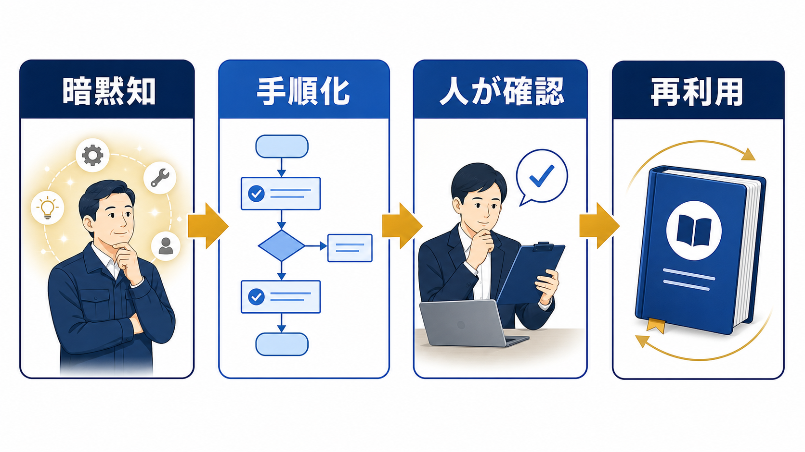

# 業務マニュアルの作り方｜属人化を減らし、使われ続ける手順書にする | AI顧問室

> この資料は、リポジトリ内の自社SEO記事を再利用できるように構造化した参照用転記です。競合ページの本文・画像・CSSは含めません。

## SEOメタデータ

- title: 業務マニュアルの作り方｜属人化を減らし、使われ続ける手順書にする | AI顧問室
- description: 業務マニュアルの作り方を、対象業務の選定、手順の分解、AIでの下書き、人の確認、更新運用まで実務順に解説します。
- canonical: `https://ai-komon.bivrost.co.jp/articles/business-manual-howto/`
- published: `2026-07-13`
- modified: `2026-07-13`
- source HTML: [`articles/business-manual-howto/index.html`](../../../../articles/business-manual-howto/index.html)
- source SHA-256: `0a64aa700b1a6626bbd00b86fcd4d20c1aaf72a712bb9daf15f46da4e9c3dac9`

## ページ構造と計測用シグナル

- 日本語文字数（article本文）: `2029`
- H1: `1` / H2: `9` / H3: `3`
- table: `2` / details FAQ: `3`
- internal links: `5` / external links: `2`
- JSON-LD: `Article, FAQPage`

### 見出し一覧

- H1: 業務マニュアルの作り方｜属人化を減らし、使われ続ける手順書にする
- H2: 業務マニュアルは、止まると困る業務から作る
- H2: 手順書は「作業」ではなく「判断」まで書く
- H2: AIは下書きに使い、正しさの確定は人が行う
- H2: 後任者が一人で再現できるか確認する
- H2: 業務変更と問い合わせを更新トリガーにする
- H2: 公開前に確認するチェックリスト
- H2: AI導入の相談はサービスから
- H2: よくある質問
- H2: 次に読む・使う
- H3: 目的
- H3: 手順
- H3: 例外

## ページクローム

- **footer:** AI顧問室 / 無料ツール / プライバシーポリシー
- **breadcrumb:** AI顧問室 / 業務効率化 / 業務マニュアルの作り方

## 装飾・レイアウトの再利用台帳

| class | element count | purpose/sample |
| --- | ---: | --- |
| `answer` | `div`×1 | 先に結論： 業務マニュアルは「目的 → 前提 → 手順 → 判断基準 → 例外 → 完了条件」の順に作ると、後任者が迷いにくくなります。最初から全業務を網羅せず、属人化の影響が大きく、繰り返し使う業務を1つ選んでください。 |
| `button` | `a`×1 | AI顧問室のサービスを見る |
| `dek` | `p`×1 | 業務マニュアルは、文章を長く書けば使われるものではありません。対象業務を絞り、読む人の判断が分かる順番へ分解し、AIは下書きに、人は現場確認に使い分けます。 |
| `eyebrow` | `p`×1 | OPERATIONS / MANUAL DESIGN |
| `hero-badges` | `div`×1 | 対象選定 手順分解 確認 更新 |
| `hero-kicker` | `span`×1 | AI KOMONSHITSU / MANUAL DESIGN |
| `hero-title` | `span`×1 | 暗黙知を、次の人が使える手順へ。 |
| `hero-visual` | `div`×1 | AI KOMONSHITSU / MANUAL DESIGN 暗黙知を、次の人が使える手順へ。 対象選定 手順分解 確認 更新 |
| `meta` | `p`×1 | 公開日: 2026年7月13日 \| AI顧問室 編集部 |
| `related` | `div`×1 | 社内FAQの作り方 手順書を質問への答えに変える AI導入のリスク 入力情報と確認者を決める AI導入の進め方 小さく試して定着させる |
| `service-cta` | `div`×1 | AI導入の相談はサービスから AIに任せる業務の選定から、実装、社内ルール、現場への定着までを一気通貫で支援します。自社でどこから始めるか、サービス内容を確認してください。 AI顧問室のサービスを見る |
| `sources` | `div`×1 | 確認した一次情報 中小企業大学校「業務マニュアルの作り方・活かし方」 （2026-07-13確認） IPA「AIの利活用、AIによるDXの推進」 （2026-07-13確認） |
| `step` | `div`×3 | 01 / PURPOSE 目的 誰のために、何を完了させるか。 |
| `steps` | `div`×1 | 01 / PURPOSE 目的 誰のために、何を完了させるか。 02 / ACTION 手順 入力から処理、確認までの順番。 03 / EXCEPTION 例外 迷った場合の相談先と戻し方。 |
| `table-scroll` | `div`×2 | 候補業務 作成を優先する理由 最初に残すもの 見積作成 条件確認と承認が複数人にまたがる 入力項目・計算・承認者 問い合わせ対応 同じ質問への回答が属人化する 分類・回答・エスカレーション 月次報告 締切と確認項目が固定されている データ取得・集計・提出 入社手続き 漏れが後工程へ影響する 期限・担当・完了条件 |
| `toc` | `div`×1 | この記事の目次 最初に作る業務の選び方 読まれる手順書の構成 AIを使う範囲と使わない範囲 現場で確認する方法 更新される仕組み |
| `tool-cta` | `div`×1 | AI導入の相談はサービスから AIに任せる業務の選定から、実装、社内ルール、現場への定着までを一気通貫で支援します。自社でどこから始めるか、サービス内容を確認してください。 AI顧問室のサービスを見る |

### 外部 stylesheet

- `../../assets/articles/article.css?v=20260713-responsive`


## 図解・画像

### 担当者の暗黙知を業務マニュアルへ整理し、後任者が確認しながら実行する作成フローの図解



- source: `../../assets/articles/diagrams/business-manual-howto-diagram.png`
- dimensions: `1672×941`
- caption: 業務マニュアルは、担当者の経験を手順・判断基準・例外へ分解して共有する。
- sha256: `a62000c1b53c58dd6067108eb686ae83521c8423e7e4577a00eda6152f7cb78f`

## 構造化データ（JSON-LD原文）

```json
[
  {
    "@context": "https://schema.org",
    "@type": "Article",
    "headline": "業務マニュアルの作り方｜属人化を減らし、使われ続ける手順書にする",
    "description": "業務マニュアルを、対象業務の選定、手順分解、AI下書き、確認、更新運用まで解説します。",
    "image": "https://ai-komon.bivrost.co.jp/assets/ogp.png",
    "datePublished": "2026-07-13",
    "dateModified": "2026-07-13",
    "author": {
      "@type": "Organization",
      "name": "AI顧問室"
    },
    "publisher": {
      "@type": "Organization",
      "name": "AI顧問室"
    },
    "mainEntityOfPage": "https://ai-komon.bivrost.co.jp/articles/business-manual-howto/"
  },
  {
    "@context": "https://schema.org",
    "@type": "FAQPage",
    "mainEntity": [
      {
        "@type": "Question",
        "name": "業務マニュアルは何から作ればよいですか？",
        "acceptedAnswer": {
          "@type": "Answer",
          "text": "担当者が休むと止まる、手順が繰り返される、確認基準が決まっている業務から始めます。全社分を一度に作らず、1業務を完成させて使い勝手を確認します。"
        }
      },
      {
        "@type": "Question",
        "name": "業務マニュアル作成にAIを使えますか？",
        "acceptedAnswer": {
          "@type": "Answer",
          "text": "使えます。既存のメモやヒアリング内容を手順の下書きへ整える用途に向きます。ただし、現場の例外、社内用語、責任者の確認は人が行います。"
        }
      },
      {
        "@type": "Question",
        "name": "作ったマニュアルを更新する方法は？",
        "acceptedAnswer": {
          "@type": "Answer",
          "text": "業務変更の担当者、更新日、版、変更理由を記録します。問い合わせやミスが起きたときに見直し、月次や四半期などの定期確認も設定します。"
        }
      }
    ]
  }
]
```

## 全文の文字起こし（装飾付き可読版）

OPERATIONS / MANUAL DESIGN

# 業務マニュアルの作り方｜属人化を減らし、使われ続ける手順書にする

業務マニュアルは、文章を長く書けば使われるものではありません。対象業務を絞り、読む人の判断が分かる順番へ分解し、AIは下書きに、人は現場確認に使い分けます。

公開日: 2026年7月13日　|　AI顧問室 編集部

AI KOMONSHITSU / MANUAL DESIGN暗黙知を、次の人が使える手順へ。

対象選定手順分解確認更新

**先に結論：**業務マニュアルは「目的 → 前提 → 手順 → 判断基準 → 例外 → 完了条件」の順に作ると、後任者が迷いにくくなります。最初から全業務を網羅せず、属人化の影響が大きく、繰り返し使う業務を1つ選んでください。


業務マニュアルは、担当者の経験を手順・判断基準・例外へ分解して共有する。

**この記事の目次**

1. [最初に作る業務の選び方](#choose)
2. [読まれる手順書の構成](#structure)
3. [AIを使う範囲と使わない範囲](#ai)
4. [現場で確認する方法](#review)
5. [更新される仕組み](#operate)

## 業務マニュアルは、止まると困る業務から作る

最初の対象は、担当者が不在だと止まる、同じ手順を繰り返す、ミスの確認方法が決まっている業務です。中小企業大学校も、属人化したノウハウの見える化と、作成後の管理・運用を重要な論点として扱っています。全社の手順を一度に書くより、使われる1本を完成させます。

| 候補業務 | 作成を優先する理由 | 最初に残すもの |
| --- | --- | --- |
| 見積作成 | 条件確認と承認が複数人にまたがる | 入力項目・計算・承認者 |
| 問い合わせ対応 | 同じ質問への回答が属人化する | 分類・回答・エスカレーション |
| 月次報告 | 締切と確認項目が固定されている | データ取得・集計・提出 |
| 入社手続き | 漏れが後工程へ影響する | 期限・担当・完了条件 |

## 手順書は「作業」ではなく「判断」まで書く

初心者が迷うのは、クリック手順より「どの状態なら次へ進めるか」が書かれていないときです。各手順に、入力、操作、確認、次の分岐を添えます。画面が変わっても使えるよう、ボタン名だけでなく目的と完了条件を残します。

**01 / PURPOSE**

### 目的

誰のために、何を完了させるか。

**02 / ACTION**

### 手順

入力から処理、確認までの順番。

**03 / EXCEPTION**

### 例外

迷った場合の相談先と戻し方。

## AIは下書きに使い、正しさの確定は人が行う

既存のメモ、録音からの文字起こし、担当者へのヒアリングをAIに渡し、見出しや箇条書きへ整理する使い方は有効です。一方で、社内固有の判断、例外処理、権限、個人情報を含む原稿は、そのまま公開しません。入力データの分類は[生成AIの社内利用ルール](/articles/generative-ai-internal-rules/)と照合します。

AIへの指示は「新人が読む」「前提を明記する」「判断が必要な箇所に確認マークを付ける」と具体化します。出力を完成品として扱わず、現場担当者が実際の案件で手順を再現してから公開版にします。

## 後任者が一人で再現できるか確認する

作成者が読んで分かるだけでは、マニュアルとして不十分です。担当外の人に手順を渡し、質問が出た場所、戻った場所、判断できなかった言葉を記録します。確認者は誤字だけでなく、前提条件、例外、完了条件を見ます。

1. **説明なしで実行する：**作成者は口頭で補足せず、読者の動きを観察する。
2. **迷いを記録する：**質問、戻り、探した資料をそのまま残す。
3. **修正後に再実行する：**同じ人か別の人で、手順が再現できるか確認する。
4. **公開範囲を決める：**全員向けか、担当者限定か、権限を分ける。

## 業務変更と問い合わせを更新トリガーにする

業務マニュアルは公開日を付けて終わりではありません。料金、担当、システム、社内ルールが変わったときに更新し、問い合わせやミスが出た箇所も見直します。更新者、確認者、更新日、変更理由を1行で残すと、古い手順が混ざりにくくなります。

| 項目 | 記録する内容 | 更新のきっかけ |
| --- | --- | --- |
| 版 | v1.0、v1.1など | 大きな変更・小さな修正 |
| 責任者 | 業務オーナーと確認者 | 担当変更・組織変更 |
| 変更理由 | 何が変わったか | 制度・ツール・顧客条件 |
| 次回確認 | 見直す日や条件 | 月次・四半期・事故後 |

## 公開前に確認するチェックリスト

マニュアルを公開する前に、作業の説明だけでなく、読者が判断できるかを確認します。次の項目が空欄なら、作成者の頭の中に手順が残っています。

- 対象者と前提知識が明記されているか
- 開始条件、入力、完了条件が分かるか
- 例外時の相談先と停止条件があるか
- 機密情報や個人情報の扱いが書かれているか
- 更新者、版、更新日が残っているか

## AI導入の相談はサービスから

AIに任せる業務の選定から、実装、社内ルール、現場への定着までを一気通貫で支援します。自社でどこから始めるか、サービス内容を確認してください。

[AI顧問室のサービスを見る](../../#service)

**確認した一次情報**

- [中小企業大学校「業務マニュアルの作り方・活かし方」](https://www.smrj.go.jp/institute/kansai/training/sme/2026/KA266000.html)（2026-07-13確認）
- [IPA「AIの利活用、AIによるDXの推進」](https://www.ipa.go.jp/digital/ai/transformation.html)（2026-07-13確認）

## よくある質問

WordやExcelだけで作れますか？

作れます。重要なのは形式より、目的、手順、判断基準、例外、更新者が残っていることです。最初は使い慣れた形式で作り、検索性や権限が必要になったら保管場所を見直します。

動画マニュアルと文章はどちらがよいですか？

画面操作や身体の動きを伝えるなら動画、判断基準や更新履歴を残すなら文章が向きます。両方を使う場合も、文章側に目的と完了条件を置き、動画だけに重要情報を閉じ込めないようにします。

AIに業務の録音を入力してもよいですか？

録音に個人情報や機密情報が含まれる場合は、サービス条件と社内ルールを先に確認します。入力範囲を絞り、匿名化や人の確認を行い、AIの出力をそのまま公開しないことが基本です。

## 次に読む・使う

[**社内FAQの作り方**手順書を質問への答えに変える](/articles/internal-faq-howto/)[**AI導入のリスク**入力情報と確認者を決める](/articles/ai-introduction-risk/)[**AI導入の進め方**小さく試して定着させる](/articles/ai-introduction-roadmap/)

## 参照用リンク一覧

- #ai
- #choose
- #operate
- #review
- #structure
- ../../#service
- /articles/ai-introduction-risk/
- /articles/ai-introduction-roadmap/
- /articles/generative-ai-internal-rules/
- /articles/internal-faq-howto/
- https://www.ipa.go.jp/digital/ai/transformation.html
- https://www.smrj.go.jp/institute/kansai/training/sme/2026/KA266000.html
