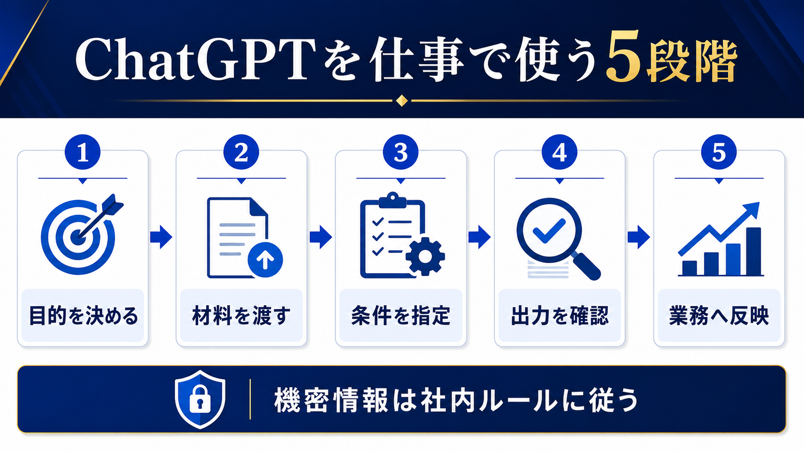

# ChatGPTを仕事で使う方法｜中小企業の最初の5業務と安全な進め方 | AI顧問室

> この資料は、リポジトリ内の自社SEO記事を再利用できるように構造化した参照用転記です。競合ページの本文・画像・CSSは含めません。

## SEOメタデータ

- title: ChatGPTを仕事で使う方法｜中小企業の最初の5業務と安全な進め方 | AI顧問室
- description: ChatGPTを仕事で使う方法を、目的設定、材料の渡し方、条件指定、出力確認、業務への反映の5段階で解説。中小企業が最初に試しやすい業務と注意点を紹介します。
- canonical: `https://ai-komon.bivrost.co.jp/articles/chatgpt-work-guide/`
- published: `2026-07-13`
- modified: `2026-07-13`
- source HTML: [`articles/chatgpt-work-guide/index.html`](../../../../articles/chatgpt-work-guide/index.html)
- source SHA-256: `af6b6b29c030e1a9002c822f0bceacd3f7779d9e575a93b98199622b5d2413ee`

## ページ構造と計測用シグナル

- 日本語文字数（article本文）: `2367`
- H1: `1` / H2: `9` / H3: `3`
- table: `3` / details FAQ: `3`
- internal links: `5` / external links: `3`
- JSON-LD: `Article`

### 見出し一覧

- H1: ChatGPTを仕事で使う方法｜中小企業の最初の5業務と安全な進め方
- H2: 最初は「結果を確認しやすい」5業務から試す
- H2: 指示は「目的・材料・条件・出力形式」で作る
- H2: 出力は事実・条件・使い道の3点で確認する
- H2: 個人の使い方を、チームの手順へ変える
- H2: 入力情報は社内ルールとサービス条件を先に確認する
- H2: 依頼文は「役割・目的・材料・条件・確認」で残す
- H2: AI導入の相談はサービスから
- H2: よくある質問
- H2: 次に読む・使う
- H3: 目的
- H3: 材料
- H3: 条件

## ページクローム

- **footer:** AI顧問室 / 無料ツール / プライバシーポリシー
- **breadcrumb:** AI顧問室 / AI活用事例 / ChatGPTを仕事で使う

## 装飾・レイアウトの再利用台帳

| class | element count | purpose/sample |
| --- | ---: | --- |
| `answer` | `div`×1 | 先に結論： ChatGPTを仕事で使うときは、「目的を決める → 材料を渡す → 条件を指定する → 出力を確認する → 業務へ反映する」の5段階に分けます。最初はメール・議事録・提案書の下書きなど、結果を人が確認しやすい定型業務から始めてください。 |
| `button` | `a`×1 | AI顧問室のサービスを見る |
| `dek` | `p`×1 | ChatGPTは質問に答えるだけでなく、文章の下書き、情報整理、比較、会議準備などの補助に使えます。ただし、良い結果を得るには目的・材料・条件を揃え、出力を確認して業務へ戻す手順が必要です。 |
| `eyebrow` | `p`×1 | WORKFLOW / CHATGPT FOR BUSINESS |
| `hero-badges` | `div`×1 | 目的 材料 条件 確認 |
| `hero-kicker` | `span`×1 | AI KOMONSHITSU / CHATGPT WORKFLOW |
| `hero-title` | `span`×1 | 聞くだけで終わらせず、仕事の工程へ戻す。 |
| `hero-visual` | `div`×1 | AI KOMONSHITSU / CHATGPT WORKFLOW 聞くだけで終わらせず、仕事の工程へ戻す。 目的 材料 条件 確認 |
| `key-points` | `div`×1 | この記事の要点 ChatGPTはゼロから任せるより、材料を整理して下書きを作る用途で始める 出力の事実、数字、宛先、社内ルールを人が確認する プロンプトを個人技にせず、良い例・確認項目・保存場所を共有する |
| `meta` | `p`×1 | 公開日: 2026年7月13日 \| AI顧問室 編集部 |
| `note` | `div`×1 | AIの出力をそのまま送らない： 顧客向けメール、契約・請求に関わる文書、採用判断、個人情報を含む文章は、担当者が原資料と社内ルールを確認してから使います。 |
| `related` | `div`×1 | AI活用事例 営業・議事録・問い合わせの例 生成AIの社内利用ルール 入力可否を分類する 業務マニュアルの作り方 使い方を手順へ残す |
| `service-cta` | `div`×1 | AI導入の相談はサービスから AIに任せる業務の選定から、実装、社内ルール、現場への定着までを一気通貫で支援します。自社でどこから始めるか、サービス内容を確認してください。 AI顧問室のサービスを見る |
| `sources` | `div`×1 | 確認した一次情報 OpenAI「小規模チーム向けChatGPT活用ガイド」 （2026-07-13確認） 中小企業大学校「はじめて学ぶ生成AI活用の基本」 （2026-07-13確認） 個人情報保護委員会「生成AIサービスの利用に関する注意喚起」 （2026-07-13確認） |
| `step` | `div`×3 | 01 / GOAL 目的 誰が何に使う成果物か。 |
| `steps` | `div`×1 | 01 / GOAL 目的 誰が何に使う成果物か。 02 / CONTEXT 材料 根拠にする情報と前提。 03 / FORMAT 条件 長さ、口調、表、禁止事項。 |
| `table-scroll` | `div`×3 | 業務 ChatGPTに頼むこと 人が確認すること メール 要点から返信の下書き 事実、温度感、宛先、約束 会議準備 論点、質問、決定事項の整理 前提、参加者、優先順位 提案書 顧客情報から構成案と初稿 実績、価格、固有名詞、表現 社内文書 長文の要約と箇条書き 抜け落ちた条件と最新版 アイデア整理 選択肢、比較軸、質問案 実行可能性と自社事情 |
| `toc` | `div`×1 | この記事の目次 最初に試しやすい5業務 指示を安定させる型 出力を確認する方法 社内で使い続ける仕組み 入力してはいけない情報 そのまま使える依頼の型 |
| `tool-cta` | `div`×1 | AI導入の相談はサービスから AIに任せる業務の選定から、実装、社内ルール、現場への定着までを一気通貫で支援します。自社でどこから始めるか、サービス内容を確認してください。 AI顧問室のサービスを見る |

### 外部 stylesheet

- `../../assets/articles/article.css?v=20260713-responsive`


## 図解・画像

### ChatGPTを仕事で使う流れを目的設定、材料、条件指定、出力確認、業務反映の5段階で示す図解



- source: `../../assets/articles/diagrams/chatgpt-work-diagram.png`
- dimensions: `1672×941`
- caption: ChatGPTの出力は完成品ではなく、確認を経て業務へ戻す中間成果物として扱う。
- sha256: `1f8b5fca7557cd09c8d1f91eb1c76628e11d9230748ee3813e12480a8e5a0df0`

## 構造化データ（JSON-LD原文）

```json
[
  {
    "@context": "https://schema.org",
    "@type": "Article",
    "headline": "ChatGPTを仕事で使う方法｜中小企業の最初の5業務と安全な進め方",
    "description": "ChatGPTを目的設定、材料、条件、確認、業務反映の5段階で使う方法を解説します。",
    "image": "https://ai-komon.bivrost.co.jp/assets/ogp.png",
    "datePublished": "2026-07-13",
    "dateModified": "2026-07-13",
    "author": {
      "@type": "Organization",
      "name": "AI顧問室"
    },
    "publisher": {
      "@type": "Organization",
      "name": "AI顧問室"
    },
    "mainEntityOfPage": "https://ai-komon.bivrost.co.jp/articles/chatgpt-work-guide/"
  }
]
```

## 全文の文字起こし（装飾付き可読版）

WORKFLOW / CHATGPT FOR BUSINESS

# ChatGPTを仕事で使う方法｜中小企業の最初の5業務と安全な進め方

ChatGPTは質問に答えるだけでなく、文章の下書き、情報整理、比較、会議準備などの補助に使えます。ただし、良い結果を得るには目的・材料・条件を揃え、出力を確認して業務へ戻す手順が必要です。

公開日: 2026年7月13日　|　AI顧問室 編集部

AI KOMONSHITSU / CHATGPT WORKFLOW聞くだけで終わらせず、仕事の工程へ戻す。

目的材料条件確認

**先に結論：**ChatGPTを仕事で使うときは、「目的を決める → 材料を渡す → 条件を指定する → 出力を確認する → 業務へ反映する」の5段階に分けます。最初はメール・議事録・提案書の下書きなど、結果を人が確認しやすい定型業務から始めてください。


ChatGPTの出力は完成品ではなく、確認を経て業務へ戻す中間成果物として扱う。

**この記事の要点**

- ChatGPTはゼロから任せるより、材料を整理して下書きを作る用途で始める
- 出力の事実、数字、宛先、社内ルールを人が確認する
- プロンプトを個人技にせず、良い例・確認項目・保存場所を共有する

**この記事の目次**

1. [最初に試しやすい5業務](#jobs)
2. [指示を安定させる型](#prompt)
3. [出力を確認する方法](#check)
4. [社内で使い続ける仕組み](#share)
5. [入力してはいけない情報](#data)
6. [そのまま使える依頼の型](#example)

## 最初は「結果を確認しやすい」5業務から試す

ChatGPTの活用テーマは、業務の頻度が高く、入力と出力の形がある程度決まり、担当者が結果を確認できるものを選びます。OpenAIの小規模チーム向けガイドでも、文章作成、分析、ツール連携など、既存業務に沿った使い方が紹介されています。

| 業務 | ChatGPTに頼むこと | 人が確認すること |
| --- | --- | --- |
| メール | 要点から返信の下書き | 事実、温度感、宛先、約束 |
| 会議準備 | 論点、質問、決定事項の整理 | 前提、参加者、優先順位 |
| 提案書 | 顧客情報から構成案と初稿 | 実績、価格、固有名詞、表現 |
| 社内文書 | 長文の要約と箇条書き | 抜け落ちた条件と最新版 |
| アイデア整理 | 選択肢、比較軸、質問案 | 実行可能性と自社事情 |

## 指示は「目的・材料・条件・出力形式」で作る

「いい感じにまとめて」だけでは、出力の良し悪しを判断できません。何に使う文章か、どの材料を根拠にするか、含める条件と除外する条件、出力の形式を指定します。機密情報を入力しないため、固有名詞や数値を匿名化したサンプルで型を作る方法もあります。

**01 / GOAL**

### 目的

誰が何に使う成果物か。

**02 / CONTEXT**

### 材料

根拠にする情報と前提。

**03 / FORMAT**

### 条件

長さ、口調、表、禁止事項。

出力形式に「不明な点は不明と書く」「根拠がない数字を足さない」「確認が必要な箇所に印を付ける」を含めると、確認作業がしやすくなります。プロンプトは完成品ではなく、使った入力と修正内容と一緒に改善します。

## 出力は事実・条件・使い道の3点で確認する

ChatGPTの文章が自然でも、内容が正しいとは限りません。確認者は誤字だけでなく、元資料にない事実が追加されていないか、期限・金額・社内ルールが合っているか、読む相手に誤解を与えないかを見ます。

1. **事実：**原資料や公式ページと照合する。
2. **条件：**金額、期限、対象者、権限、禁止事項を見る。
3. **用途：**社外送付か社内下書きかを区別する。
4. **承認：**必要な担当者が確認した記録を残す。

**AIの出力をそのまま送らない：**顧客向けメール、契約・請求に関わる文書、採用判断、個人情報を含む文章は、担当者が原資料と社内ルールを確認してから使います。

## 個人の使い方を、チームの手順へ変える

一人だけが上手に使えても、異動や退職でノウハウが消えると業務改善は続きません。よく使う用途ごとに、入力例、指示の型、出力の確認項目、保存場所、更新者をまとめます。良い出力だけでなく、失敗例と修正方法を残すと、使い始める人が判断しやすくなります。

| 共有するもの | 内容 | 更新のきっかけ |
| --- | --- | --- |
| プロンプト例 | 目的・材料・条件・出力形式 | 使いにくい出力が出たとき |
| 確認表 | 事実・数字・宛先・権限 | ミスや差し戻しが起きたとき |
| 利用ルール | 入力可・要確認・禁止 | サービスや社内方針の変更 |
| 効果記録 | 時間、修正、確認漏れ | 月次の振り返り |

[生成AIの社内利用ルール](/articles/generative-ai-internal-rules/)や[30日ロードマップ](/articles/ai-introduction-roadmap/)とつなぎ、個人の試行をチームの運用へ広げます。

## 入力情報は社内ルールとサービス条件を先に確認する

顧客名、個人情報、未公開の価格、契約条件、認証情報などを入力する前に、会社の情報分類と利用サービスのデータ取扱いを確認します。入力を匿名化し、必要最小限にできない場合は、社内環境や別の処理方法を検討します。迷ったときの相談先を決めておくことも、利用を止めないための安全策です。

## 依頼文は「役割・目的・材料・条件・確認」で残す

チームで再利用する依頼文には、AIに演じさせる役割を増やしすぎず、成果物の用途を明記します。たとえば「営業担当の下書き補助として、以下の商談メモから社内確認用の提案構成を作る。根拠のない数字は追加せず、不明点を箇条書きにする。出力は見出し、要点、確認事項の順にする」といった形です。

| 項目 | 書くこと | 確認すること |
| --- | --- | --- |
| 役割 | 下書き補助、整理役など | 最終判断者をAIにしない |
| 目的 | 社内共有、顧客向け準備など | 用途に合った表現か |
| 材料 | 根拠にするメモや資料 | 最新版か、入力可否は問題ないか |
| 条件 | 長さ、形式、禁止事項 | 不明点を推測させないか |

この型を保存しても、業務やサービスが変われば見直します。使った入力、修正、採用理由を短く残すと、個人の経験をチームの手順へ変えられます。

## AI導入の相談はサービスから

AIに任せる業務の選定から、実装、社内ルール、現場への定着までを一気通貫で支援します。自社でどこから始めるか、サービス内容を確認してください。

[AI顧問室のサービスを見る](../../#service)

**確認した一次情報**

- [OpenAI「小規模チーム向けChatGPT活用ガイド」](https://openai.com/ja-JP/business/guides-and-resources/chatgpt-business-smb-guide/)（2026-07-13確認）
- [中小企業大学校「はじめて学ぶ生成AI活用の基本」](https://www.smrj.go.jp/institute/kansai/training/sme/2026/KA262100.html)（2026-07-13確認）
- [個人情報保護委員会「生成AIサービスの利用に関する注意喚起」](https://www.ppc.go.jp/news/careful_information/230602_AI_utilize_alert/)（2026-07-13確認）

## よくある質問

ChatGPTは無料版でも仕事に使えますか？

機能やデータの取扱い、利用制限はサービスとプランで異なります。業務情報を入力する前に、会社のルールとサービスの最新条件を確認してください。

プロンプトは長いほど良いですか？

長さより、目的、材料、条件、出力形式が明確であることが重要です。不要な情報を減らし、確認しやすい形式を指定します。

ChatGPTの回答を顧客へそのまま送れますか？

そのまま送らず、事実、金額、期限、表現、個人情報を担当者が確認します。外部送付の承認が必要な会社では、通常の手順に戻します。

## 次に読む・使う

[**AI活用事例**営業・議事録・問い合わせの例](/articles/ai-business-cases/)[**生成AIの社内利用ルール**入力可否を分類する](/articles/generative-ai-internal-rules/)[**業務マニュアルの作り方**使い方を手順へ残す](/articles/business-manual-howto/)

## 参照用リンク一覧

- #check
- #data
- #example
- #jobs
- #prompt
- #share
- ../../#service
- /articles/ai-business-cases/
- /articles/ai-introduction-roadmap/
- /articles/business-manual-howto/
- /articles/generative-ai-internal-rules/
- https://openai.com/ja-JP/business/guides-and-resources/chatgpt-business-smb-guide/
- https://www.ppc.go.jp/news/careful_information/230602_AI_utilize_alert/
- https://www.smrj.go.jp/institute/kansai/training/sme/2026/KA262100.html
