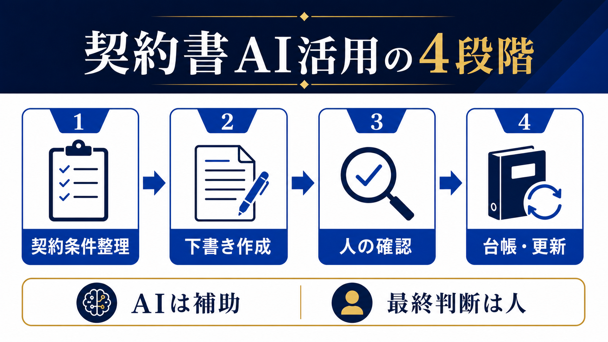

# 契約書をAIで効率化する方法｜下書き・確認・管理を分けて安全に進める | AI顧問室

> この資料は、リポジトリ内の自社SEO記事を再利用できるように構造化した参照用転記です。競合ページの本文・画像・CSSは含めません。

## SEOメタデータ

- title: 契約書をAIで効率化する方法｜下書き・確認・管理を分けて安全に進める | AI顧問室
- description: 契約書をAIで効率化する方法を、条件整理、下書き、条項確認、契約台帳・更新管理に分けて解説。AIに任せる範囲と人が最終確認するポイントを整理します。
- canonical: `https://ai-komon.bivrost.co.jp/articles/contract-ai/`
- published: `2026-07-13`
- modified: `2026-07-13`
- source HTML: [`articles/contract-ai/index.html`](../../../../articles/contract-ai/index.html)
- source SHA-256: `dd6d8afd5ac2e263b5f6b572ca3ae68ec3f38a219574ca62e828e4474a4a5ecc`

## ページ構造と計測用シグナル

- 日本語文字数（article本文）: `2377`
- H1: `1` / H2: `9` / H3: `3`
- table: `1` / details FAQ: `3`
- internal links: `4` / external links: `3`
- JSON-LD: `Article`

### 見出し一覧

- H1: 契約書をAIで効率化する方法｜下書き・確認・管理を分けて安全に進める
- H2: 契約書AIは「整理・下書き・比較」から始める
- H2: 金額・期間・解除・責任範囲は人が確認する
- H2: 最初の1か月は1種類の契約だけで試す
- H2: 契約後は台帳と更新日へ戻す
- H2: AIを使わず専門家へ相談するケースもある
- H2: 試行前に「元へ戻れるか」を確認する
- H2: AI導入の相談はサービスから
- H2: よくある質問
- H2: 次に読む・使う
- H3: 条件を揃える
- H3: 下書きを作る
- H3: 承認する

## ページクローム

- **footer:** AI顧問室 / 無料ツール / プライバシーポリシー
- **breadcrumb:** AI顧問室 / AI導入のリスク / 契約書とAI

## 装飾・レイアウトの再利用台帳

| class | element count | purpose/sample |
| --- | ---: | --- |
| `answer` | `div`×1 | 先に結論： 契約書AIの安全な使い方は、①契約条件の整理、②下書きや比較表の作成、③人による条項・権限・相手先条件の確認、④契約台帳と更新日の管理に分けることです。AIの出力をそのまま締結文書にせず、確認者と承認記録を残してください。 |
| `button` | `a`×1 | AI顧問室のサービスを見る |
| `dek` | `p`×1 | 契約書へのAI活用は、法的な最終判断を任せることではありません。条件の整理、下書き、比較、台帳入力など、確認しやすい作業から切り分けると、リスクを増やさず工数を減らせます。 |
| `eyebrow` | `p`×1 | LEGAL OPERATIONS / CONTRACT AI |
| `hero-badges` | `div`×1 | 条件整理 下書き 人の確認 更新管理 |
| `hero-kicker` | `span`×1 | AI KOMONSHITSU / CONTRACT OPERATIONS |
| `hero-title` | `span`×1 | 契約書を、作成・確認・管理に分ける。 |
| `hero-visual` | `div`×1 | AI KOMONSHITSU / CONTRACT OPERATIONS 契約書を、作成・確認・管理に分ける。 条件整理 下書き 人の確認 更新管理 |
| `key-points` | `div`×1 | この記事の要点 AIに任せやすいのは整理・下書き・差分抽出で、締結判断ではない 金額、期間、解除、責任範囲、個人情報の扱いは人が確認する 契約後の更新日・相手先・版を台帳へ戻して初めて業務改善になる |
| `meta` | `p`×1 | 公開日: 2026年7月13日 \| AI顧問室 編集部 |
| `note` | `div`×1 | 入力情報の注意： 顧客名、個人情報、未公開の料金、交渉中の条件を外部AIへ入力する場合は、サービスのデータ利用条件と社内ルールを確認します。迷う情報は匿名化するか、入力前に責任者へ確認します。 |
| `related` | `div`×1 | AI導入のリスク 入力・出力・権限を確認する AI導入の進め方 小さく試して効果を測る 業務マニュアルの作り方 確認手順を共有可能にする |
| `service-cta` | `div`×1 | AI導入の相談はサービスから AIに任せる業務の選定から、実装、社内ルール、現場への定着までを一気通貫で支援します。自社でどこから始めるか、サービス内容を確認してください。 AI顧問室のサービスを見る |
| `sources` | `div`×1 | 確認した一次情報 経済産業省「AI事業者ガイドライン」 （2026-07-13確認） 個人情報保護委員会「生成AIサービスの利用に関する注意喚起」 （2026-07-13確認） IPA「AIの利活用、AIによるDXの推進」 （2026-07-13確認） |
| `step` | `div`×3 | 01 / INPUT 条件を揃える ひな型、案件条件、確認者を決める。 |
| `steps` | `div`×1 | 01 / INPUT 条件を揃える ひな型、案件条件、確認者を決める。 02 / DRAFT 下書きを作る AIで整理・初稿・差分表を作る。 03 / APPROVE 承認する 原文と照合し、採用版を確定する。 |
| `table-scroll` | `div`×1 | 業務 AIに任せる補助 人が残す判断 条件整理 金額、期間、相手先、納品条件の項目化 条件の正しさと抜け漏れ 下書き 社内ひな型へ情報を入れた初稿 自社の方針と交渉余地 比較 旧版と新版の差分一覧 差分が与える実務・法務上の影響 台帳 契約日、更新日、相手先の抽出 原本との照合と登録完了 |
| `toc` | `div`×1 | この記事の目次 AIに任せやすい契約書業務 人が確認する条項 導入の進め方 契約後の管理 使わない方がよいケース 試行前のチェック |
| `tool-cta` | `div`×1 | AI導入の相談はサービスから AIに任せる業務の選定から、実装、社内ルール、現場への定着までを一気通貫で支援します。自社でどこから始めるか、サービス内容を確認してください。 AI顧問室のサービスを見る |

### 外部 stylesheet

- `../../assets/articles/article.css?v=20260713-responsive`


## 図解・画像

### 契約書業務を契約条件整理、下書き作成、人の確認、台帳と更新の4段階に分けた図解



- source: `../../assets/articles/diagrams/contract-ai-diagram.png`
- dimensions: `1672×941`
- caption: 契約書AIは作成を丸投げするのではなく、条件整理と下書きを補助し、最終判断を人に戻す。
- sha256: `13e5fd5c0277a318eabae2ba5087992b5d29b9ece2cc35d8e0ae6c99c2714df0`

## 構造化データ（JSON-LD原文）

```json
[
  {
    "@context": "https://schema.org",
    "@type": "Article",
    "headline": "契約書をAIで効率化する方法｜下書き・確認・管理を分けて安全に進める",
    "description": "契約書業務を条件整理、下書き、確認、管理に分け、AIに任せる範囲と人の確認点を解説します。",
    "image": "https://ai-komon.bivrost.co.jp/articles/contract-ai/contract-ai-thumbnail.svg",
    "datePublished": "2026-07-13",
    "dateModified": "2026-07-13",
    "author": {
      "@type": "Organization",
      "name": "AI顧問室"
    },
    "publisher": {
      "@type": "Organization",
      "name": "AI顧問室"
    },
    "mainEntityOfPage": "https://ai-komon.bivrost.co.jp/articles/contract-ai/"
  }
]
```

## 全文の文字起こし（装飾付き可読版）

LEGAL OPERATIONS / CONTRACT AI

# 契約書をAIで効率化する方法｜下書き・確認・管理を分けて安全に進める

契約書へのAI活用は、法的な最終判断を任せることではありません。条件の整理、下書き、比較、台帳入力など、確認しやすい作業から切り分けると、リスクを増やさず工数を減らせます。

公開日: 2026年7月13日　|　AI顧問室 編集部

AI KOMONSHITSU / CONTRACT OPERATIONS契約書を、作成・確認・管理に分ける。

条件整理下書き人の確認更新管理

**先に結論：**契約書AIの安全な使い方は、①契約条件の整理、②下書きや比較表の作成、③人による条項・権限・相手先条件の確認、④契約台帳と更新日の管理に分けることです。AIの出力をそのまま締結文書にせず、確認者と承認記録を残してください。


契約書AIは作成を丸投げするのではなく、条件整理と下書きを補助し、最終判断を人に戻す。

**この記事の要点**

- AIに任せやすいのは整理・下書き・差分抽出で、締結判断ではない
- 金額、期間、解除、責任範囲、個人情報の扱いは人が確認する
- 契約後の更新日・相手先・版を台帳へ戻して初めて業務改善になる

**この記事の目次**

1. [AIに任せやすい契約書業務](#scope)
2. [人が確認する条項](#check)
3. [導入の進め方](#flow)
4. [契約後の管理](#manage)
5. [使わない方がよいケース](#stop)
6. [試行前のチェック](#trial)

## 契約書AIは「整理・下書き・比較」から始める

契約書業務で時間がかかるのは、ゼロから文章を書くことだけではありません。相手先の情報を転記し、過去のひな型を探し、変更箇所を比較し、契約台帳へ登録する作業も含まれます。AIはこのような入力と出力の形が決まりやすい作業の補助に向きます。

| 業務 | AIに任せる補助 | 人が残す判断 |
| --- | --- | --- |
| 条件整理 | 金額、期間、相手先、納品条件の項目化 | 条件の正しさと抜け漏れ |
| 下書き | 社内ひな型へ情報を入れた初稿 | 自社の方針と交渉余地 |
| 比較 | 旧版と新版の差分一覧 | 差分が与える実務・法務上の影響 |
| 台帳 | 契約日、更新日、相手先の抽出 | 原本との照合と登録完了 |

## 金額・期間・解除・責任範囲は人が確認する

AIはもっともらしい文章を返しても、個別契約の背景や交渉経緯を完全には理解しません。特に、金額、支払条件、契約期間、自動更新、解除、損害賠償、秘密保持、個人情報、知的財産の帰属は、業務責任者や法務・専門家が原文と照合します。AIの「問題なし」という回答を承認の根拠にしないことが重要です。

1. **事実を確認：**相手先名、金額、日付、対象サービスを原資料と照合する。
2. **差分を見る：**ひな型から変更された条項と、変更理由を確認する。
3. **影響を判断：**自社の責任、費用、納期、解約条件に影響するかを見る。
4. **承認を記録：**確認者、確認日、採用版を台帳へ残す。

## 最初の1か月は1種類の契約だけで試す

契約書の種類を一度に広げると、ひな型や確認基準の違いが混ざります。まずは秘密保持契約や業務委託契約など、件数があり、社内の確認者が決まっている1種類を選びます。入力する情報を最小限にし、出力は社内の確認用草稿として扱います。

**01 / INPUT**

### 条件を揃える

ひな型、案件条件、確認者を決める。

**02 / DRAFT**

### 下書きを作る

AIで整理・初稿・差分表を作る。

**03 / APPROVE**

### 承認する

原文と照合し、採用版を確定する。

測るのは「作成時間」だけではありません。確認にかかった時間、修正件数、差し戻し理由、台帳登録までの時間を記録します。速くなっても修正や確認が増えていれば、工程全体では改善していない可能性があります。

## 契約後は台帳と更新日へ戻す

契約書を作成して終わりにすると、更新期限や自動更新の見落としが起きます。契約日、相手先、契約期間、更新条件、解約通知期限、原本の場所、担当者を台帳へ登録し、期限前に確認する担当を決めます。AIは原文から候補項目を抽出できますが、台帳への登録完了は人が照合してください。

**入力情報の注意：**顧客名、個人情報、未公開の料金、交渉中の条件を外部AIへ入力する場合は、サービスのデータ利用条件と社内ルールを確認します。迷う情報は匿名化するか、入力前に責任者へ確認します。

## AIを使わず専門家へ相談するケースもある

訴訟、重大な責任制限、複雑な知的財産、個人情報の大規模な取扱い、海外法が関係する契約などは、AIで作業を速くする前に専門家の確認体制を整えます。AIは論点の洗い出しや質問の整理に使えても、法的適合性を保証するものではありません。最終承認者が不在のまま自動化を進めないでください。

## 試行前に「元へ戻れるか」を確認する

契約書AIの試行は、既存のひな型や管理台帳を置き換えることから始めません。まずコピーしたサンプルで下書きと差分抽出を試し、原本を残したまま人が確認します。誤った条項が出た場合に、どの時点で手作業へ戻すか、入力した資料をどう削除するかも決めておきます。

- 現行ひな型とAI出力を別ファイルで保存する
- 確認者が条項ごとに採用・修正・不採用を記録する
- AIを使わない場合の所要時間も同じ条件で測る
- 試行で得たプロンプトや質問を社内共有用に整理する
- 本番の契約締結へ移す条件を責任者が決める

この手順なら、作成時間が短くなっても確認負担や修正件数が増えた場合に、範囲を縮小できます。成果は「AIを使った件数」ではなく、契約業務全体の安全性と再現性で判断してください。既存の承認フローを残したまま、補助作業だけを置き換えることが最初の基準です。原本の保存場所と閲覧権限も、試行前に決めておきます。

## AI導入の相談はサービスから

AIに任せる業務の選定から、実装、社内ルール、現場への定着までを一気通貫で支援します。自社でどこから始めるか、サービス内容を確認してください。

[AI顧問室のサービスを見る](../../#service)

**確認した一次情報**

- [経済産業省「AI事業者ガイドライン」](https://www.meti.go.jp/shingikai/mono_info_service/ai_shakai_jisso/)（2026-07-13確認）
- [個人情報保護委員会「生成AIサービスの利用に関する注意喚起」](https://www.ppc.go.jp/news/careful_information/230602_AI_utilize_alert/)（2026-07-13確認）
- [IPA「AIの利活用、AIによるDXの推進」](https://www.ipa.go.jp/digital/ai/transformation.html)（2026-07-13確認）

## よくある質問

AIに契約書を読ませれば、問題点を判断できますか？

問題点の候補や比較表を作る補助には使えますが、問題がないことの証明にはなりません。重要条項は原文と照合し、責任者や専門家が最終判断します。

契約書の個人情報をAIへ入力してもよいですか？

サービスの利用条件、社内ルール、個人情報保護方針を確認します。必要性がなければ匿名化し、入力範囲を絞ります。迷う場合は入力しません。

契約書AIの効果は何で測りますか？

作成時間、確認時間、修正件数、差し戻し、台帳登録の完了時間を、導入前後で同じ条件にして比べます。

## 次に読む・使う

[**AI導入のリスク**入力・出力・権限を確認する](/articles/ai-introduction-risk/)[**AI導入の進め方**小さく試して効果を測る](/articles/ai-introduction-roadmap/)[**業務マニュアルの作り方**確認手順を共有可能にする](/articles/business-manual-howto/)

## 参照用リンク一覧

- #check
- #flow
- #manage
- #scope
- #stop
- #trial
- ../../#service
- /articles/ai-introduction-risk/
- /articles/ai-introduction-roadmap/
- /articles/business-manual-howto/
- https://www.ipa.go.jp/digital/ai/transformation.html
- https://www.meti.go.jp/shingikai/mono_info_service/ai_shakai_jisso/
- https://www.ppc.go.jp/news/careful_information/230602_AI_utilize_alert/
