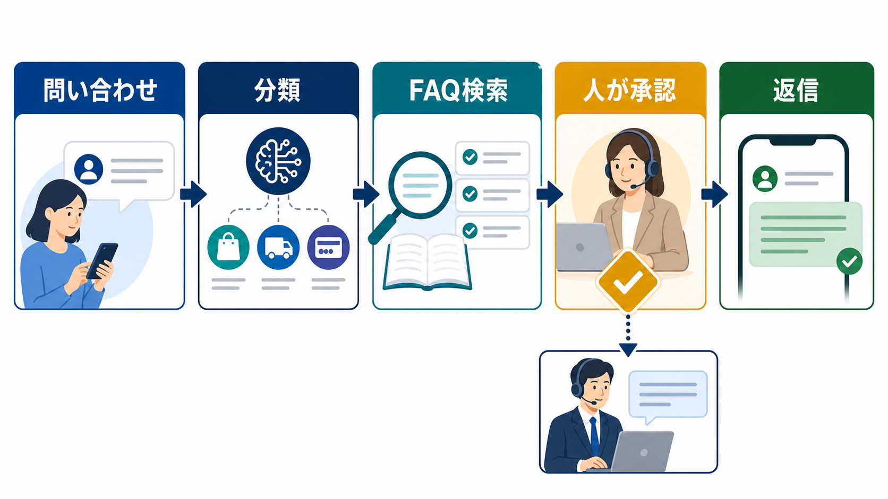

# カスタマーサポートのAI活用｜問い合わせ対応を安全に効率化する | AI顧問室

> この資料は、リポジトリ内の自社SEO記事を再利用できるように構造化した参照用転記です。競合ページの本文・画像・CSSは含めません。

## SEOメタデータ

- title: カスタマーサポートのAI活用｜問い合わせ対応を安全に効率化する | AI顧問室
- description: カスタマーサポートのAI活用を、問い合わせ分類、回答案、FAQ検索、エスカレーションに分けて解説。顧客対応で任せる範囲と確認点を整理します。
- canonical: `https://ai-komon.bivrost.co.jp/articles/customer-support-ai/`
- published: `2026-07-13`
- modified: `2026-07-13`
- source HTML: [`articles/customer-support-ai/index.html`](../../../../articles/customer-support-ai/index.html)
- source SHA-256: `84b8627fd5be7a60365d135b7180d4ffacc23541daa0df72043e661a496d3aba`

## ページ構造と計測用シグナル

- 日本語文字数（article本文）: `2202`
- H1: `1` / H2: `10` / H3: `3`
- table: `2` / details FAQ: `3`
- internal links: `4` / external links: `3`
- JSON-LD: `Article, FAQPage`

### 見出し一覧

- H1: カスタマーサポートのAI活用｜問い合わせ対応を安全に効率化する
- H2: カスタマーサポートは、分類から小さくAI化する
- H2: 回答の前に、FAQと根拠資料の更新日をそろえる
- H2: 人が確認する問い合わせを先に決める
- H2: 顧客データは必要最小限にし、権限を分ける
- H2: 改善は返信速度だけでなく、戻りと修正を見る
- H2: 誤回答時の切り戻しを決めてから広げる
- H2: カスタマーサポートAIの導入前チェック
- H2: AI導入の相談はサービスから
- H2: よくある質問
- H2: 次に読む・使う
- H3: 根拠
- H3: 回答案
- H3: 引き継ぎ

## ページクローム

- **footer:** AI顧問室 / 無料ツール / プライバシーポリシー
- **breadcrumb:** AI顧問室 / AI活用事例 / カスタマーサポートのAI活用

## 装飾・レイアウトの再利用台帳

| class | element count | purpose/sample |
| --- | ---: | --- |
| `answer` | `div`×1 | 先に結論： カスタマーサポートのAI活用は「問い合わせ分類 → 関連資料の検索 → 回答案 → 人の確認 → 返信・引き継ぎ」に分けます。まずは社内向けの分類や回答案から試し、返金、契約、障害、個別事情がある回答は人へ戻してください。 |
| `button` | `a`×1 | AI顧問室のサービスを見る |
| `dek` | `p`×1 | カスタマーサポートにAIを入れるときは、自動返信の可否から始めないことが重要です。質問の分類、FAQ検索、回答案、担当者への引き継ぎを分け、顧客への約束は人が確認します。 |
| `eyebrow` | `p`×1 | CUSTOMER SUPPORT / AI OPERATIONS |
| `hero-badges` | `div`×1 | 分類 検索 確認 エスカレーション |
| `hero-kicker` | `span`×1 | AI KOMONSHITSU / CUSTOMER SUPPORT |
| `hero-title` | `span`×1 | 速く返す前に、正しく戻す場所を決める。 |
| `hero-visual` | `div`×1 | AI KOMONSHITSU / CUSTOMER SUPPORT 速く返す前に、正しく戻す場所を決める。 分類 検索 確認 エスカレーション |
| `key-points` | `div`×1 | この記事の要点 問い合わせを分類・回答案・人の確認・エスカレーションに分ける 顧客への送信前に、根拠資料と最新性を担当者が確認する 正解率だけでなく、返信時間・修正・再問い合わせ・停止を測る |
| `meta` | `p`×1 | 公開日: 2026年7月13日 \| AI顧問室 編集部 |
| `related` | `div`×1 | 社内FAQの作り方 回答の根拠と更新を整える AI導入のリスク 入力・権限・契約を確認する AI導入の進め方 小さな試行から広げる |
| `service-cta` | `div`×1 | AI導入の相談はサービスから AIに任せる業務の選定から、実装、社内ルール、現場への定着までを一気通貫で支援します。自社でどこから始めるか、サービス内容を確認してください。 AI顧問室のサービスを見る |
| `sources` | `div`×1 | 確認した一次情報 IPA「AIの利活用、AIによるDXの推進」 （2026-07-13確認） 個人情報保護委員会「生成AIサービスの利用に関する注意喚起」 （2026-07-13確認） 経済産業省「AI事業者ガイドライン」 （2026-07-13確認） |
| `step` | `div`×3 | 01 / SOURCE 根拠 最新のFAQ、規約、手順書を決める。 |
| `steps` | `div`×1 | 01 / SOURCE 根拠 最新のFAQ、規約、手順書を決める。 02 / DRAFT 回答案 質問の意図に合う候補を作る。 03 / ESCALATE 引き継ぎ 根拠不足や例外は人へ戻す。 |
| `table-scroll` | `div`×2 | 工程 AIの補助 開始条件 分類 カテゴリ・担当部署の候補 分類ルールがある 検索 関連FAQ・手順の候補 根拠資料が更新されている 回答案 下書き・要約・言い換え 送信前確認者がいる 返信 定型文の補助 例外と停止条件が明確 引き継ぎ 要点と履歴の整理 担当者と期限が決まる |
| `toc` | `div`×1 | この記事の目次 AIに任せる工程を分ける FAQと根拠資料を整える 人が確認する問い合わせ 顧客データと権限を管理する 改善指標と切り戻し |
| `tool-cta` | `div`×1 | AI導入の相談はサービスから AIに任せる業務の選定から、実装、社内ルール、現場への定着までを一気通貫で支援します。自社でどこから始めるか、サービス内容を確認してください。 AI顧問室のサービスを見る |

### 外部 stylesheet

- `../../assets/articles/article.css?v=20260713-responsive`


## 図解・画像

### 顧客からの問い合わせをAIが分類と回答案作成で補助し、人が確認して返信または担当者へ引き継ぐ図解



- source: `../../assets/articles/diagrams/customer-support-ai-diagram.png`
- dimensions: `1672×941`
- caption: 顧客対応では、AIの回答候補を人が確認し、例外は担当者へ戻す。
- sha256: `b396d9d54ece76e7d87b27185a8cadc2f6c89cd2e16c7c522f810db424c6c9da`

## 構造化データ（JSON-LD原文）

```json
[
  {
    "@context": "https://schema.org",
    "@type": "Article",
    "headline": "カスタマーサポートのAI活用｜問い合わせ対応を安全に効率化する",
    "description": "問い合わせ対応をAIで効率化する工程と、顧客接点に必要な人の確認・切り戻しを解説します。",
    "image": "https://ai-komon.bivrost.co.jp/assets/ogp.png",
    "datePublished": "2026-07-13",
    "dateModified": "2026-07-13",
    "author": {
      "@type": "Organization",
      "name": "AI顧問室"
    },
    "publisher": {
      "@type": "Organization",
      "name": "AI顧問室"
    },
    "mainEntityOfPage": "https://ai-komon.bivrost.co.jp/articles/customer-support-ai/"
  },
  {
    "@context": "https://schema.org",
    "@type": "FAQPage",
    "mainEntity": [
      {
        "@type": "Question",
        "name": "カスタマーサポートのどこにAIを使えますか？",
        "acceptedAnswer": {
          "@type": "Answer",
          "text": "問い合わせの分類、過去回答の検索、回答案、要約、担当部署への振り分けに使えます。顧客への送信、返金、契約変更、例外対応は人の承認を残します。"
        }
      },
      {
        "@type": "Question",
        "name": "AIに顧客情報を入力してもよいですか？",
        "acceptedAnswer": {
          "@type": "Answer",
          "text": "個人情報や契約情報を含む場合は、サービス条件と社内ルールを確認します。必要最小限に絞り、匿名化、アクセス制御、保存期間、削除方法を決めます。"
        }
      },
      {
        "@type": "Question",
        "name": "AIが誤回答したらどうしますか？",
        "acceptedAnswer": {
          "@type": "Answer",
          "text": "送信を止め、影響範囲と根拠資料を確認し、担当者が訂正します。原因をFAQ、プロンプト、権限、承認工程のどこに戻すか記録し、再発防止へ反映します。"
        }
      }
    ]
  }
]
```

## 全文の文字起こし（装飾付き可読版）

CUSTOMER SUPPORT / AI OPERATIONS

# カスタマーサポートのAI活用｜問い合わせ対応を安全に効率化する

カスタマーサポートにAIを入れるときは、自動返信の可否から始めないことが重要です。質問の分類、FAQ検索、回答案、担当者への引き継ぎを分け、顧客への約束は人が確認します。

公開日: 2026年7月13日　|　AI顧問室 編集部

AI KOMONSHITSU / CUSTOMER SUPPORT速く返す前に、正しく戻す場所を決める。

分類検索確認エスカレーション

**先に結論：**カスタマーサポートのAI活用は「問い合わせ分類 → 関連資料の検索 → 回答案 → 人の確認 → 返信・引き継ぎ」に分けます。まずは社内向けの分類や回答案から試し、返金、契約、障害、個別事情がある回答は人へ戻してください。

**この記事の要点**

- 問い合わせを分類・回答案・人の確認・エスカレーションに分ける
- 顧客への送信前に、根拠資料と最新性を担当者が確認する
- 正解率だけでなく、返信時間・修正・再問い合わせ・停止を測る


顧客対応では、AIの回答候補を人が確認し、例外は担当者へ戻す。

**この記事の目次**

1. [AIに任せる工程を分ける](#split)
2. [FAQと根拠資料を整える](#faq)
3. [人が確認する問い合わせ](#human)
4. [顧客データと権限を管理する](#data)
5. [改善指標と切り戻し](#measure)

## カスタマーサポートは、分類から小さくAI化する

AI導入の初期段階で顧客への完全自動返信を選ぶと、誤回答がそのまま信用や契約に影響します。IPAが示す問い合わせ対応のAI活用パターンも、実際の導入では業務の影響度と確認工程に分けて考えます。まずは分類、要約、検索など、結果を確認しやすい処理から始めます。

| 工程 | AIの補助 | 開始条件 |
| --- | --- | --- |
| 分類 | カテゴリ・担当部署の候補 | 分類ルールがある |
| 検索 | 関連FAQ・手順の候補 | 根拠資料が更新されている |
| 回答案 | 下書き・要約・言い換え | 送信前確認者がいる |
| 返信 | 定型文の補助 | 例外と停止条件が明確 |
| 引き継ぎ | 要点と履歴の整理 | 担当者と期限が決まる |

## 回答の前に、FAQと根拠資料の更新日をそろえる

AIを入れても、元のFAQが古ければ古い情報を速く返すだけです。商品仕様、料金、契約、障害、返品など、更新される資料には責任者と更新日を付けます。回答候補には根拠資料を添え、根拠が見つからない場合は回答せず担当者へ戻します。

**01 / SOURCE**

### 根拠

最新のFAQ、規約、手順書を決める。

**02 / DRAFT**

### 回答案

質問の意図に合う候補を作る。

**03 / ESCALATE**

### 引き継ぎ

根拠不足や例外は人へ戻す。

## 人が確認する問い合わせを先に決める

人の確認が必要かどうかを、担当者の気分で判断しないようにします。返金、契約変更、法的な主張、障害・安全に関する申告、個人情報の開示、強い不満を含む問い合わせは、AIの回答候補を使っても、人が最終判断する範囲に置きます。

1. **顧客への約束：**納期、料金、返金、契約条件が変わるか。
2. **影響の大きさ：**誤回答で損失、信用、継続利用へ影響するか。
3. **個別事情：**顧客の履歴や契約内容を参照する必要があるか。
4. **根拠の有無：**最新の社内資料へ戻れるか。
5. **エスカレーション：**誰がいつまでに対応するか。

## 顧客データは必要最小限にし、権限を分ける

問い合わせ文には氏名、連絡先、注文番号、契約内容などが含まれることがあります。AIサービスへ渡す前に、処理に不要な情報を除き、サービスの保存・学習・委託条件と社内ルールを確認します。個人情報の扱いは、出典欄の個人情報保護委員会の注意喚起と照合してください。

| 管理項目 | 決めること | 確認タイミング |
| --- | --- | --- |
| 入力 | 氏名・契約・注文情報の範囲 | 導入前・業務変更時 |
| 権限 | 閲覧・回答・承認できる人 | 入社・異動・退職時 |
| 保存 | ログ、回答案、削除条件 | 契約更新・定期監査 |
| 停止 | 誤回答や漏えい時の連絡先 | 試行開始前・事故後 |

## 改善は返信速度だけでなく、戻りと修正を見る

AI導入の効果を返信時間だけで評価すると、誤回答の修正や担当者への戻りが見えません。導入前と同じ条件で、分類にかかる時間、回答案の修正回数、エスカレーション数、再問い合わせ、顧客への返信時間を記録します。

## 誤回答時の切り戻しを決めてから広げる

誤回答が起きたときは、自動返信を止め、対象期間と送信先を確認し、担当者が訂正します。原因がFAQの古さなら資料を直し、分類ミスならルールを直し、確認漏れなら承認工程を直します。AIだけを責めず、業務フローのどこを修正するかを記録します。

## カスタマーサポートAIの導入前チェック

最初の試行では、顧客への直接送信より、社内担当者への回答候補と要約から始めます。次の項目が埋まっているか確認してください。

- 対象カテゴリと対象外の問い合わせが定義されているか
- 回答の根拠資料と更新者が決まっているか
- 送信前に確認する担当者とチェック項目があるか
- 個人情報・契約情報の入力範囲を制限しているか
- 誤回答時に停止・訂正・再発防止へ戻せるか

## AI導入の相談はサービスから

AIに任せる業務の選定から、実装、社内ルール、現場への定着までを一気通貫で支援します。自社でどこから始めるか、サービス内容を確認してください。

[AI顧問室のサービスを見る](../../#service)

**確認した一次情報**

- [IPA「AIの利活用、AIによるDXの推進」](https://www.ipa.go.jp/digital/ai/transformation.html)（2026-07-13確認）
- [個人情報保護委員会「生成AIサービスの利用に関する注意喚起」](https://www.ppc.go.jp/news/careful_information/230602_AI_utilize_alert/)（2026-07-13確認）
- [経済産業省「AI事業者ガイドライン」](https://www.meti.go.jp/shingikai/mono_info_service/ai_shakai_jisso/)（2026-07-13確認）

## よくある質問

小さな会社でもカスタマーサポートAIを導入できますか？

可能です。全問い合わせを自動化するのではなく、カテゴリ分類、FAQ検索、回答案の作成など、担当者が確認しやすい工程から始めます。対象カテゴリ、確認者、停止条件を小さく決めます。

AIエージェントに顧客対応を任せられますか？

技術的な可否だけでなく、顧客への約束、契約、個人情報、例外対応を確認します。まずは人の承認を残し、誤回答時の切り戻しを検証してから範囲を広げます。

問い合わせデータをAIの学習に使ってよいですか？

サービス条件と自社の個人情報・機密情報のルールを確認する必要があります。学習利用の有無だけでなく、保存期間、委託先、権限、削除方法も確認し、必要最小限のデータで試します。

## 次に読む・使う

[**社内FAQの作り方**回答の根拠と更新を整える](/articles/internal-faq-howto/)[**AI導入のリスク**入力・権限・契約を確認する](/articles/ai-introduction-risk/)[**AI導入の進め方**小さな試行から広げる](/articles/ai-introduction-roadmap/)

## 参照用リンク一覧

- #data
- #faq
- #human
- #measure
- #split
- ../../#service
- /articles/ai-introduction-risk/
- /articles/ai-introduction-roadmap/
- /articles/internal-faq-howto/
- https://www.ipa.go.jp/digital/ai/transformation.html
- https://www.meti.go.jp/shingikai/mono_info_service/ai_shakai_jisso/
- https://www.ppc.go.jp/news/careful_information/230602_AI_utilize_alert/
