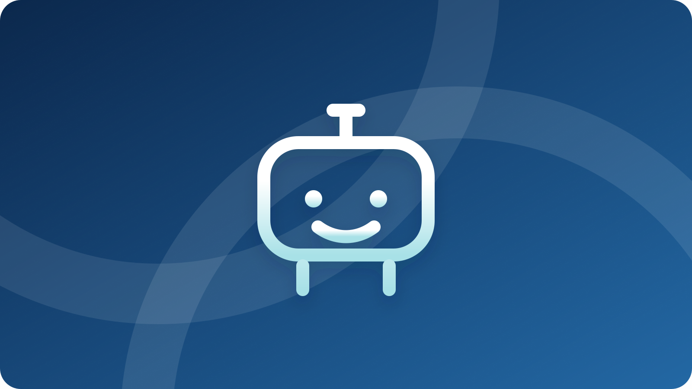

# 議事録をAIで効率化する方法｜自動作成の確認ポイント | AI顧問室

> この資料は、リポジトリ内の自社SEO記事を再利用できるように構造化した参照用転記です。競合ページの本文・画像・CSSは含めません。

## SEOメタデータ

- title: 議事録をAIで効率化する方法｜自動作成の確認ポイント | AI顧問室
- description: 議事録AI・自動作成ツールの使い方を解説。文字起こし、要約、決定事項抽出、人の確認、共有までの流れと、誤変換や情報管理を防ぐ確認ポイントを紹介します。
- canonical: `https://ai-komon.bivrost.co.jp/articles/gijiroku-ai/`
- published: `2026-07-12`
- modified: `2026-07-12`
- source HTML: [`articles/gijiroku-ai/index.html`](../../../../articles/gijiroku-ai/index.html)
- source SHA-256: `0bb7e7ba8226ae938d490944f89ed3ee1188183798375f0f5fa964592eae8907`

## ページ構造と計測用シグナル

- 日本語文字数（article本文）: `2411`
- H1: `1` / H2: `9` / H3: `3`
- table: `1` / details FAQ: `3`
- internal links: `5` / external links: `4`
- JSON-LD: `Article, BreadcrumbList, FAQPage`

### 見出し一覧

- H1: 議事録をAIで効率化する方法｜自動作成の確認ポイント
- H2: 議事録AIで任せられる作業はどこまで？
- H2: 議事録AIの品質を保つ5段階とは？
- H2: AIの議事録で人が確認すべき項目は？
- H2: 議事録AIの情報管理で何を確認する？
- H2: 議事録AIを無料で試す手順は？
- H2: AI導入の相談はサービスから
- H2: よくある質問
- H2: まとめ
- H2: 参考にした公式情報
- H3: 文字起こし
- H3: 人が確認
- H3: 共有・更新

## ページクローム

- **footer:** AI顧問室 / 無料ツール / プライバシーポリシー
- **breadcrumb:** AI顧問室 / 無料ツール / 議事録をAIで効率化する方法

## 装飾・レイアウトの再利用台帳

| class | element count | purpose/sample |
| --- | ---: | --- |
| `answer` | `div`×1 | 先に結論： 議事録AIは「文字起こし → 要約 → 決定事項抽出 → 人の確認 → 共有」の5段階で使うと、速さと正確さを両立しやすくなります。まずは 無料の議事録テンプレート で残す項目を決め、次に 議事録AI体験デモ で自動整理の範囲を確認するのがおすすめです。 |
| `button` | `a`×1 | AI顧問室のサービスを見る |
| `dek` | `p`×1 | 議事録AIは、会議の文字起こしや要約を速くする道具です。ただし、AIの出力をそのまま正式記録にするのではなく、人が決定事項とToDoを確認する工程まで設計して初めて、業務で安全に使えます。 |
| `eyebrow` | `p`×1 | AI MEETING MINUTES / PRACTICAL GUIDE |
| `hero` | `img`×1 | (textなし / visual-only) |
| `key-points` | `div`×1 | この記事の要点 文字起こし・要約・決定事項・人の確認・共有を別工程にする 固有名詞・数字・否定表現・担当者・期限は人が確定する 機密情報の入力範囲と正式記録へ移す責任者を決める |
| `meta` | `p`×1 | 公開日: 2026年7月12日 \| AI顧問室 編集部 |
| `pipeline-note` | `div`×1 | 実務のコツ： 5段階のうち「人の確認」を省略しないこと。確認者と共有先を決めておくと、AIの誤変換がそのまま社内標準になるのを防げます。 |
| `related` | `div`×1 | 議事録の書き方 決定事項とToDoが残る基本の型 AI導入リスク診断 入力・保存・権限の確認項目 議事録AI体験デモ 文字起こしから整理する例 |
| `service-cta` | `div`×1 | AI導入の相談はサービスから AIに任せる業務の選定から、実装、社内ルール、現場への定着までを一気通貫で支援します。自社でどこから始めるか、サービス内容を確認してください。 AI顧問室のサービスを見る |
| `sources` | `section`×1 | 参考にした公式情報 IPA「AIの利活用、AIによるDXの推進」 （2025年6月16日更新、2026年7月12日閲覧） 経済産業省「AI事業者ガイドライン検討会」 （2026年3月31日更新、2026年7月12日閲覧） IPA「テキスト生成AIの導入・運用ガイドライン」 （2024年7月31日更新、2026年7月12日閲覧） Microsoft Learn「Data, privacy, and security for intelli |
| `step` | `div`×3 | 01 / TRANSCRIBE 文字起こし 音声から候補を作る。 |
| `steps` | `div`×1 | 01 / TRANSCRIBE 文字起こし 音声から候補を作る。 02 / CHECK 人が確認 固有名詞と決定事項を確定する。 03 / SHARE 共有・更新 正式記録へ戻し、次の行動を残す。 |
| `table-scroll` | `div`×1 | 工程 AIに任せること 人が確認すること 1. 文字起こし 音声をテキストに変換 話者名、専門用語、数字 2. 要約 話題ごとの短い整理 重要な条件や反対意見の抜け 3. 決定事項抽出 結論らしい文を候補化 本当に合意した内容か 4. 人の確認 確認用の見出しや一覧を作る 担当者、期限、保留事項 5. 共有 指定フォーマットへ整形 権限、宛先、保存期間 |
| `toc` | `div`×1 | この記事の目次 議事録AIで任せられる作業 品質管理の5段階 人が確認すべき項目 情報管理と導入前の確認 小さく試す手順 |
| `tool-cta` | `div`×1 | AI導入の相談はサービスから AIに任せる業務の選定から、実装、社内ルール、現場への定着までを一気通貫で支援します。自社でどこから始めるか、サービス内容を確認してください。 AI顧問室のサービスを見る |

### Inline CSS（原文）

```css
:root { --ink:#18222d; --muted:#667482; --line:#dfe6ed; --brand:#1769aa; --navy:#0b2447; --gold:#b88a2a; --soft:#f4f7fa; }
    * { box-sizing:border-box; } html { overflow-x:hidden; } body { margin:0; color:var(--ink); background:#fff; font-family:system-ui,-apple-system,BlinkMacSystemFont,"Noto Sans JP",sans-serif; line-height:1.9; overflow-wrap:anywhere; } img { display:block; max-width:100%; height:auto; }
    main { width:min(980px,calc(100% - 32px)); margin:auto; } a { color:var(--brand); } .breadcrumb { display:flex; flex-wrap:wrap; gap:.15rem .35rem; padding-top:24px; color:var(--muted); font-size:.88rem; } .breadcrumb a { color:inherit; }
    article { padding-bottom:64px; } .eyebrow { margin:54px 0 10px; color:var(--gold); font-weight:800; letter-spacing:.08em; font-size:.85rem; } h1 { max-width:820px; margin:0; font-size:clamp(2rem,5vw,4rem); line-height:1.2; letter-spacing:-.04em; } .dek { max-width:760px; color:var(--muted); font-size:1.15rem; margin:18px 0 28px; } .meta { color:var(--muted); font-size:.85rem; }
    .hero { width:100%; height:auto; object-fit:contain; border-radius:22px; margin:34px 0 12px; } figure { width:100%; max-width:100%; margin:34px 0; } figure img { width:100%; height:auto; object-fit:contain; border-radius:18px; } figcaption { color:var(--muted); font-size:.84rem; text-align:center; }
    .answer { margin:34px 0; padding:24px; border-left:5px solid var(--gold); background:var(--soft); border-radius:0 16px 16px 0; } .answer strong { color:var(--navy); }
    .toc { margin:34px 0; padding:22px 26px; border:1px solid var(--line); border-radius:16px; background:#fff; } .toc strong { display:block; margin-bottom:8px; } .toc ol { margin:0; padding-left:22px; }
    h2 { margin:58px 0 14px; padding-top:10px; font-size:1.75rem; line-height:1.35; } h3 { margin:34px 0 8px; font-size:1.2rem; } p { margin:14px 0; } ul,ol { padding-left:1.5em; } li { margin:7px 0; }
    .pipeline-note { margin:20px 0; padding:16px 18px; border:1px solid #ead9ae; border-radius:14px; background:#fffaf0; } .pipeline-note strong { color:#8c6516; }
    .table-scroll { width:100%; overflow-x:auto; margin:22px 0; -webkit-overflow-scrolling:touch; } table { width:100%; min-width:680px; border-collapse:collapse; margin:0; font-size:.95rem; } th,td { border:1px solid var(--line); padding:12px; text-align:left; vertical-align:top; } th { background:var(--soft); }
    .tool-cta { margin:42px 0; padding:26px; color:#fff; background:var(--navy); border-radius:20px; } .tool-cta h2 { margin-top:0; } .tool-cta p { color:#d9e5f0; } .button { display:inline-block; max-width:100%; padding:12px 20px; border-radius:999px; background:#fff; color:var(--navy); text-decoration:none; font-weight:800; text-align:center; }
    details { border-bottom:1px solid var(--line); padding:14px 0; } summary { cursor:pointer; font-weight:800; } .related { display:grid; grid-template-columns:repeat(3,1fr); gap:12px; margin-top:20px; } .related a { border:1px solid var(--line); border-radius:14px; padding:16px; text-decoration:none; } .related strong,.related span { display:block; } .related span { color:var(--muted); font-size:.88rem; margin-top:4px; }
    .sources { margin-top:42px; padding:22px; border:1px solid var(--line); border-radius:16px; background:var(--soft); font-size:.9rem; } .sources h2 { margin-top:0; font-size:1.3rem; } footer { padding:24px 0 48px; border-top:1px solid var(--line); color:var(--muted); font-size:.88rem; }
    @media (max-width:720px) { main { width:min(980px,calc(100% - 24px)); } .breadcrumb { padding-top:16px; } .eyebrow { margin-top:38px; } h1 { font-size:clamp(1.95rem,9vw,2.25rem); } .dek { font-size:1rem; line-height:1.8; } .hero { border-radius:14px; margin-top:26px; } figure { margin:26px 0; } figure img { border-radius:14px; } .answer,.toc,.tool-cta,.sources { padding:18px; } h2 { margin-top:46px; font-size:1.5rem; } .related { grid-template-columns:1fr; } table { font-size:.86rem; } th,td { padding:9px; } }
    @media (max-width:420px) { .meta { line-height:1.7; } .answer { border-left-width:4px; } .tool-cta .button { display:block; width:100%; } }
```


## 図解・画像

### 会議中にノートパソコンとタスクカードを確認する様子


- source: `../../assets/articles/gijiroku-ai/gijiroku-ai-hero.webp`
- dimensions: `1672×941`
- caption: 記事テーマを示すシンプルなカバー画像。
- sha256: `2b5a429febd806a11818b81b3e86e1b7609ed354baa7e846c02582d909f6ddaa`

### 議事録をAIで効率化する方法｜自動作成の確認ポイントのシンプルな記事サムネイル



- source: `gijiroku-ai-thumbnail.svg`
- dimensions: `unknown`
- caption: 記事テーマを示すシンプルなカバー画像。
- sha256: `38f2a141cdd5d398568b7a61daee494c30a6f62a719d4c4b995c1a3d9e9b4c08`

## 構造化データ（JSON-LD原文）

```json
[
  {
    "@context": "https://schema.org",
    "@type": "Article",
    "headline": "議事録をAIで効率化する方法｜自動作成の確認ポイント",
    "description": "議事録AI・自動作成ツールの使い方を解説。文字起こし、要約、決定事項抽出、人の確認、共有までの流れと、誤変換や情報管理を防ぐ確認ポイントを紹介します。",
    "image": "https://ai-komon.bivrost.co.jp/articles/gijiroku-ai/gijiroku-ai-thumbnail.svg",
    "datePublished": "2026-07-12",
    "dateModified": "2026-07-12",
    "author": {
      "@type": "Organization",
      "name": "AI顧問室"
    },
    "publisher": {
      "@type": "Organization",
      "name": "AI顧問室"
    },
    "mainEntityOfPage": "https://ai-komon.bivrost.co.jp/articles/gijiroku-ai/"
  },
  {
    "@context": "https://schema.org",
    "@type": "BreadcrumbList",
    "itemListElement": [
      {
        "@type": "ListItem",
        "position": 1,
        "name": "AI顧問室",
        "item": "https://ai-komon.bivrost.co.jp/"
      },
      {
        "@type": "ListItem",
        "position": 2,
        "name": "無料ツール",
        "item": "https://ai-komon.bivrost.co.jp/tools/"
      },
      {
        "@type": "ListItem",
        "position": 3,
        "name": "議事録をAIで効率化する方法",
        "item": "https://ai-komon.bivrost.co.jp/articles/gijiroku-ai/"
      }
    ]
  },
  {
    "@context": "https://schema.org",
    "@type": "FAQPage",
    "mainEntity": [
      {
        "@type": "Question",
        "name": "議事録AIは完全自動で使えますか？",
        "acceptedAnswer": {
          "@type": "Answer",
          "text": "完全自動の正式記録にするのは避けます。AIに文字起こしや要約の下書きを任せ、固有名詞、数字、決定事項、担当者、期限を人が確認してから共有します。"
        }
      },
      {
        "@type": "Question",
        "name": "議事録をAIに入力してはいけない情報は？",
        "acceptedAnswer": {
          "@type": "Answer",
          "text": "個人情報、顧客の機密情報、契約前の情報などは、利用サービスの保存・学習条件を確認するまで入力しない運用が安全です。社内の情報分類と承認者を先に決めます。"
        }
      },
      {
        "@type": "Question",
        "name": "無料で議事録AIを試す方法は？",
        "acceptedAnswer": {
          "@type": "Answer",
          "text": "まずは会議名、決定事項、保留事項、ToDoを入力するテンプレートで整理の型を確認し、その後に文字起こしからの自動整理デモを試すと、必要な機能を切り分けられます。"
        }
      }
    ]
  }
]
```

## 全文の文字起こし（装飾付き可読版）

AI MEETING MINUTES / PRACTICAL GUIDE

# 議事録をAIで効率化する方法｜自動作成の確認ポイント

議事録AIは、会議の文字起こしや要約を速くする道具です。ただし、AIの出力をそのまま正式記録にするのではなく、人が決定事項とToDoを確認する工程まで設計して初めて、業務で安全に使えます。

公開日: 2026年7月12日　|　AI顧問室 編集部


**先に結論：**議事録AIは「文字起こし → 要約 → 決定事項抽出 → 人の確認 → 共有」の5段階で使うと、速さと正確さを両立しやすくなります。まずは[無料の議事録テンプレート](/tools/gijiroku-template/)で残す項目を決め、次に[議事録AI体験デモ](/demo-minutes.html)で自動整理の範囲を確認するのがおすすめです。

**この記事の要点**

- 文字起こし・要約・決定事項・人の確認・共有を別工程にする
- 固有名詞・数字・否定表現・担当者・期限は人が確定する
- 機密情報の入力範囲と正式記録へ移す責任者を決める

**この記事の目次**

1. [議事録AIで任せられる作業](#what)
2. [品質管理の5段階](#pipeline)
3. [人が確認すべき項目](#human-check)
4. [情報管理と導入前の確認](#security)
5. [小さく試す手順](#start)

## 議事録AIで任せられる作業はどこまで？

2025年6月更新のIPA「AIの利活用、AIによるDXの推進」では、具体的なAI導入パターンの一つとして「会議録作成・要約作成」が挙げられています。AI議事録は、録音や入力から情報を整理する用途には向いていますが、合意の事実を最終判断する担当者の代わりにはなりません。

任せやすいのは、長い発言を短くまとめること、話題を分類すること、候補となる決定事項やToDoを抜き出すことです。逆に、否定表現、固有名詞、金額、期限、誰が発言したかは、誤りが業務に直結しやすいため確認対象にします。

議事録AIを選ぶときは、要約の賢さだけを比べないでください。出力を「確認しやすい形」で返せるか、担当者と期限を分けて表示できるかが、現場での定着を左右します。

## 議事録AIの品質を保つ5段階とは？

AI議事録は、一度の生成で完成させるより、処理を5段階に分ける方が確認漏れを見つけやすくなります。2026年3月31日時点で経済産業省の検討会ページにはAI事業者ガイドライン第1.2版が掲載されており、AIを使う側もリスクを認識して対策を行う考え方が示されています。


記事テーマを示すシンプルなカバー画像。

**01 / TRANSCRIBE**

### 文字起こし

音声から候補を作る。

**02 / CHECK**

### 人が確認

固有名詞と決定事項を確定する。

**03 / SHARE**

### 共有・更新

正式記録へ戻し、次の行動を残す。

**実務のコツ：**5段階のうち「人の確認」を省略しないこと。確認者と共有先を決めておくと、AIの誤変換がそのまま社内標準になるのを防げます。

| 工程 | AIに任せること | 人が確認すること |
| --- | --- | --- |
| 1. 文字起こし | 音声をテキストに変換 | 話者名、専門用語、数字 |
| 2. 要約 | 話題ごとの短い整理 | 重要な条件や反対意見の抜け |
| 3. 決定事項抽出 | 結論らしい文を候補化 | 本当に合意した内容か |
| 4. 人の確認 | 確認用の見出しや一覧を作る | 担当者、期限、保留事項 |
| 5. 共有 | 指定フォーマットへ整形 | 権限、宛先、保存期間 |

## AIの議事録で人が確認すべき項目は？

議事録の品質は、文章が自然かどうかではなく、次の行動が間違いなく伝わるかで判断します。特に「決まったこと」と「提案されたこと」は、AIが似た文体でまとめると区別しにくくなります。会議終了後に、確認者が4つの項目を順に見ます。

- **決定事項：**合意した内容だけが入っているか
- **保留事項：**追加確認が必要な論点が残っているか
- **担当者：**誰のタスクかが一意になっているか
- **期限：**日付や次の確認タイミングが書かれているか

「確認します」「検討します」のような表現は、そのままではタスクになりません。担当者と期限が決まっていない場合は、未確定として議事録に残します。無理に埋めるより、保留を明示した方が後からの認識違いを減らせます。

## 議事録AIの情報管理で何を確認する？

2024年7月31日更新のIPA「テキスト生成AIの導入・運用ガイドライン」は、導入、運用、リスク管理を分けて整理しています。議事録AIでも、入力する情報、保存場所、閲覧権限、削除方法、事故時の連絡先を先に決めると、ツール選定の基準が明確になります。

保存場所はサービスによって異なります。たとえばMicrosoft Teamsの公式説明では、文字起こしを有効にした会議のデータが主催者のExchange OnlineやOneDriveに保存されるケースが説明されています。これは全サービスに当てはまる話ではないため、導入候補の利用規約と管理者設定を確認してください。

社外秘の資料や個人情報を扱う会議は、いきなり本番データで試さないこと。まず匿名化したサンプルで、保存期間、学習利用の有無、共有範囲、削除操作を確認します。判断に迷う項目は[AI導入リスク・社内ルール診断](/tools/ai-risk-check/)で洗い出せます。

## 議事録AIを無料で試す手順は？

最初から全会議を自動化する必要はありません。2025年6月更新のIPAページが示すように、会議録作成はAI活用の一例です。小さな会議を一つ選び、作成時間と確認時間を分けて測ると、自社に必要な機能と不要な機能が見えてきます。

1. 機密性の低い社内会議を一つ選ぶ
2. 残したい項目をテンプレートで固定する
3. AIの下書きと人の確認にかかった時間を記録する
4. 誤変換の種類を3回分だけメモする
5. 改善後のルールと共有先を決める

## AI導入の相談はサービスから

AIに任せる業務の選定から、実装、社内ルール、現場への定着までを一気通貫で支援します。自社でどこから始めるか、サービス内容を確認してください。

[AI顧問室のサービスを見る](../../#service)

## よくある質問

議事録AIは完全自動で使えますか？

完全自動の正式記録にするのは避けます。AIに文字起こしや要約の下書きを任せ、固有名詞、数字、決定事項、担当者、期限を人が確認してから共有します。

議事録をAIに入力してはいけない情報は？

個人情報、顧客の機密情報、契約前の情報などは、利用サービスの保存・学習条件を確認するまで入力しない運用が安全です。社内の情報分類と承認者を先に決めます。

無料で議事録AIを試す方法は？

まずは会議名、決定事項、保留事項、ToDoを入力するテンプレートで整理の型を確認し、その後に[議事録AI体験デモ](/demo-minutes.html)を試すと、必要な機能を切り分けられます。

## まとめ

議事録AIは、会議を自動で判断する仕組みではありません。文字起こしや要約の下書きを速く作り、決定事項とToDoを人が確認するための補助役です。まずは低リスクの会議で工程を分け、誤りの傾向と確認時間を測ってください。

[**議事録の書き方**決定事項とToDoが残る基本の型](/articles/gijiroku-template/)[**AI導入リスク診断**入力・保存・権限の確認項目](/tools/ai-risk-check/)[**議事録AI体験デモ**文字起こしから整理する例](/demo-minutes.html)

## 参考にした公式情報

1. [IPA「AIの利活用、AIによるDXの推進」](https://www.ipa.go.jp/digital/ai/transformation.html)（2025年6月16日更新、2026年7月12日閲覧）
2. [経済産業省「AI事業者ガイドライン検討会」](https://www.meti.go.jp/shingikai/mono_info_service/ai_shakai_jisso/)（2026年3月31日更新、2026年7月12日閲覧）
3. [IPA「テキスト生成AIの導入・運用ガイドライン」](https://www.ipa.go.jp/jinzai/ics/core_human_resource/final_project/2024/generative-ai-guideline.html)（2024年7月31日更新、2026年7月12日閲覧）
4. [Microsoft Learn「Data, privacy, and security for intelligent recap in Teams Premium」](https://learn.microsoft.com/en-us/microsoftteams/privacy/intelligent-recap)（2026年7月12日閲覧）

## 参照用リンク一覧

- #human-check
- #pipeline
- #security
- #start
- #what
- ../../#service
- /articles/gijiroku-template/
- /demo-minutes.html
- /tools/ai-risk-check/
- /tools/gijiroku-template/
- https://learn.microsoft.com/en-us/microsoftteams/privacy/intelligent-recap
- https://www.ipa.go.jp/digital/ai/transformation.html
- https://www.ipa.go.jp/jinzai/ics/core_human_resource/final_project/2024/generative-ai-guideline.html
- https://www.meti.go.jp/shingikai/mono_info_service/ai_shakai_jisso/
