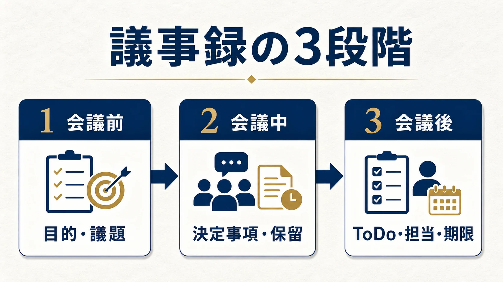

# 議事録の書き方｜決定事項とToDoが残るテンプレート | AI顧問室

> この資料は、リポジトリ内の自社SEO記事を再利用できるように構造化した参照用転記です。競合ページの本文・画像・CSSは含めません。

## SEOメタデータ

- title: 議事録の書き方｜決定事項とToDoが残るテンプレート | AI顧問室
- description: 議事録の書き方を、会議前・会議中・会議後の3段階で解説。決定事項、保留事項、担当者、期限を残せる無料テンプレートも使えます。
- canonical: `https://ai-komon.bivrost.co.jp/articles/gijiroku-template/`
- published: `2026-07-12`
- modified: `2026-07-12`
- source HTML: [`articles/gijiroku-template/index.html`](../../../../articles/gijiroku-template/index.html)
- source SHA-256: `b90b1ba76210267d0051df5b13ff864711a0d95f0b9d7d1070751b5371063b02`

## ページ構造と計測用シグナル

- 日本語文字数（article本文）: `2158`
- H1: `1` / H2: `9` / H3: `6`
- table: `2` / details FAQ: `3`
- internal links: `4` / external links: `2`
- JSON-LD: `Article, BreadcrumbList`

### 見出し一覧

- H1: 議事録の書き方｜決定事項とToDoが残るテンプレート
- H2: 議事録の役割は「発言の記録」ではなく「次の行動の共有」
- H2: 議事録の書き方は3段階で考える
- H2: そのまま使える議事録の項目
- H2: 共有前の5分レビューで誤解を防ぐ
- H2: AI導入の相談はサービスから
- H2: 議事録でよくある4つの失敗
- H2: 議事録をAIで効率化するときの確認点
- H2: よくある質問
- H2: 次に読む・使う
- H3: 目的・議題を決める
- H3: 決定・保留を分ける
- H3: ToDoを配る
- H3: 1. 会議前に「目的」と「議題」を置く
- H3: 2. 会議中は「決定事項」と「保留事項」を分ける
- H3: 3. 会議後は「ToDo・担当者・期限」をセットにする

## ページクローム

- **footer:** AI顧問室 / 無料ツール / プライバシーポリシー
- **breadcrumb:** AI顧問室 / 無料ツール / 議事録の書き方

## 装飾・レイアウトの再利用台帳

| class | element count | purpose/sample |
| --- | ---: | --- |
| `answer` | `div`×1 | 先に結論： 議事録は「目的・議題」「決定事項・保留事項」「ToDo・担当者・期限」の3段階で作ると、読み返した人が次の行動に移りやすくなります。入力だけで形にしたい場合は、 無料の議事録テンプレート・ToDo整理ツール を使えます。 |
| `button` | `a`×1 | AI顧問室のサービスを見る |
| `dek` | `p`×1 | 議事録は、会話を全部記録するためのものではありません。会議が終わったあとに「何が決まり、誰が、いつまでに動くのか」を確認できる状態にするための記録です。 |
| `eyebrow` | `p`×1 | MEETING MINUTES / PRACTICAL GUIDE |
| `hero` | `img`×1 | (textなし / visual-only) |
| `key-points` | `div`×1 | この記事の要点 議事録を目的・決定事項・保留・ToDo・担当者・期限に分ける 発言の全文ではなく、次の行動が分かる記録を残す 会議後に人が決定事項と期限を確認してから共有する |
| `meta` | `p`×1 | 公開日: 2026年7月12日 \| AI顧問室 編集部 |
| `related` | `div`×1 | 議事録テンプレート 入力してMarkdown議事録を作成 AI導入リスク診断 AI利用前の確認項目を整理 議事録AIデモ 文字起こしから整理する例を見る |
| `service-cta` | `div`×1 | AI導入の相談はサービスから AIに任せる業務の選定から、実装、社内ルール、現場への定着までを一気通貫で支援します。自社でどこから始めるか、サービス内容を確認してください。 AI顧問室のサービスを見る |
| `sources` | `div`×1 | 確認した一次情報 IPA「AIの利活用、AIによるDXの推進」 （2026年7月12日確認） 個人情報保護委員会「生成AIサービスの利用に関する注意喚起」 （2026年7月12日確認） |
| `step` | `div`×3 | 01 / 会議前 目的・議題を決める 何を決める会議なのか、話す順番は何かを先に置きます。 |
| `steps` | `div`×1 | 01 / 会議前 目的・議題を決める 何を決める会議なのか、話す順番は何かを先に置きます。 02 / 会議中 決定・保留を分ける 結論が出たことと、追加確認が必要なことを混ぜません。 03 / 会議後 ToDoを配る 担当者と期限が決まって初めて、議事録が行動につながります。 |
| `table-scroll` | `div`×2 | 項目 書く内容 記入例 会議名 会議の目的が分かる名前 営業定例会 日時・参加者 開催日、参加者、欠席者 2026/7/12、田中・佐藤 議題 話し合うテーマ 次月の新規提案について 決定事項 合意した内容 新しい提案書を7月から使う 保留・確認事項 追加確認が必要な内容 価格表の最新版を確認 ToDo 担当者・作業・期限 田中｜提案書作成｜7/18 |
| `toc` | `div`×1 | この記事の目次 議事録の役割 書き方の3段階 そのまま使える項目 よくある失敗 AIで効率化するときの確認点 |
| `tool-cta` | `div`×1 | AI導入の相談はサービスから AIに任せる業務の選定から、実装、社内ルール、現場への定着までを一気通貫で支援します。自社でどこから始めるか、サービス内容を確認してください。 AI顧問室のサービスを見る |

### Inline CSS（原文）

```css
:root { --ink:#18222d; --muted:#667482; --line:#dfe6ed; --brand:#1769aa; --navy:#0b2447; --gold:#b88a2a; --soft:#f4f7fa; }
    * { box-sizing:border-box; } html { overflow-x:hidden; } body { margin:0; color:var(--ink); background:#fff; font-family:system-ui,-apple-system,BlinkMacSystemFont,"Noto Sans JP",sans-serif; line-height:1.9; overflow-wrap:anywhere; } img { display:block; max-width:100%; height:auto; }
    main { width:min(980px,calc(100% - 32px)); margin:auto; } a { color:var(--brand); } .breadcrumb { display:flex; flex-wrap:wrap; gap:.15rem .35rem; padding-top:24px; color:var(--muted); font-size:.88rem; } .breadcrumb a { color:inherit; }
    article { padding-bottom:64px; } .eyebrow { margin:54px 0 10px; color:var(--gold); font-weight:800; letter-spacing:.08em; font-size:.85rem; } h1 { max-width:820px; margin:0; font-size:clamp(2rem,5vw,4rem); line-height:1.2; letter-spacing:-.04em; } .dek { max-width:760px; color:var(--muted); font-size:1.15rem; margin:18px 0 28px; } .meta { color:var(--muted); font-size:.85rem; }
    .hero { width:100%; height:auto; object-fit:contain; border-radius:22px; margin:34px 0 12px; } figure { width:100%; max-width:100%; margin:34px 0; } figure img { width:100%; height:auto; object-fit:contain; border-radius:18px; } figcaption { color:var(--muted); font-size:.84rem; text-align:center; }
    .answer { margin:34px 0; padding:24px; border-left:5px solid var(--gold); background:var(--soft); border-radius:0 16px 16px 0; } .answer strong { color:var(--navy); }
    .toc { margin:34px 0; padding:22px 26px; border:1px solid var(--line); border-radius:16px; background:#fff; } .toc strong { display:block; margin-bottom:8px; } .toc ol { margin:0; padding-left:22px; }
    h2 { margin:58px 0 14px; padding-top:10px; font-size:1.75rem; line-height:1.35; } h3 { margin:34px 0 8px; font-size:1.2rem; } p { margin:14px 0; } ul,ol { padding-left:1.5em; } li { margin:7px 0; }
    .steps { display:grid; grid-template-columns:repeat(3,1fr); gap:12px; margin:24px 0; } .step { border:1px solid var(--line); border-radius:16px; padding:18px; background:#fff; } .step b { display:block; color:var(--gold); font-size:1.25rem; } .step h3 { margin:4px 0; }
    .table-scroll { width:100%; overflow-x:auto; margin:22px 0; -webkit-overflow-scrolling:touch; } table { width:100%; min-width:650px; border-collapse:collapse; margin:0; font-size:.95rem; } th,td { border:1px solid var(--line); padding:12px; text-align:left; vertical-align:top; } th { background:var(--soft); }
    .tool-cta { margin:42px 0; padding:26px; color:#fff; background:var(--navy); border-radius:20px; } .tool-cta h2 { margin-top:0; } .tool-cta p { color:#d9e5f0; } .button { display:inline-block; max-width:100%; padding:12px 20px; border-radius:999px; background:#fff; color:var(--navy); text-decoration:none; font-weight:800; text-align:center; }
    details { border-bottom:1px solid var(--line); padding:14px 0; } summary { cursor:pointer; font-weight:800; } .related { display:grid; grid-template-columns:repeat(3,1fr); gap:12px; margin-top:20px; } .related a { border:1px solid var(--line); border-radius:14px; padding:16px; text-decoration:none; } .related strong,.related span { display:block; } .related span { color:var(--muted); font-size:.88rem; margin-top:4px; }
    footer { padding:24px 0 48px; border-top:1px solid var(--line); color:var(--muted); font-size:.88rem; } @media (max-width:720px) { main { width:min(980px,calc(100% - 24px)); } .breadcrumb { padding-top:16px; } .eyebrow { margin-top:38px; } .steps,.related { grid-template-columns:1fr; } h1 { font-size:clamp(1.95rem,9vw,2.25rem); } .dek { font-size:1rem; line-height:1.8; } .hero { border-radius:14px; margin-top:26px; } figure { margin:26px 0; } figure img { border-radius:14px; } .answer,.toc,.tool-cta { padding:18px; } h2 { margin-top:46px; font-size:1.5rem; } table { font-size:.86rem; } th,td { padding:9px; } }
    @media (max-width:420px) { .meta { line-height:1.7; } .answer { border-left-width:4px; } .tool-cta .button { display:block; width:100%; } }
```


## 図解・画像

### 会議の議事録をノートとノートパソコンで整理している様子


- source: `../../assets/articles/gijiroku-template/meeting-editorial.webp`
- dimensions: `1672×941`
- caption: 議事録を「会議前・会議中・会議後」に分けると、決定事項とToDoが残りやすくなります。
- sha256: `7d5e8cd71c1da454f32fd88a0e9a34119c9addeb6709e5db9c5b053a80a5c081`

### 議事録を会議前・会議中・会議後の3段階で整理する図解



- source: `../../assets/articles/gijiroku-template/gijiroku-3-steps.webp`
- dimensions: `1672×941`
- caption: 議事録を「会議前・会議中・会議後」に分けると、決定事項とToDoが残りやすくなります。
- sha256: `73a9d8705f8174a6d6327a2270a704ac66989330751c3415f0cebd3d288479f7`

## 構造化データ（JSON-LD原文）

```json
[
  {
    "@context": "https://schema.org",
    "@type": "Article",
    "headline": "議事録の書き方｜決定事項とToDoが残るテンプレート",
    "description": "議事録の書き方を、会議前・会議中・会議後の3段階で解説。決定事項、保留事項、担当者、期限を残せる無料テンプレートも使えます。",
    "image": "https://ai-komon.bivrost.co.jp/articles/gijiroku-template/gijiroku-template-thumbnail.svg",
    "datePublished": "2026-07-12",
    "dateModified": "2026-07-12",
    "author": {
      "@type": "Organization",
      "name": "AI顧問室"
    },
    "publisher": {
      "@type": "Organization",
      "name": "AI顧問室"
    },
    "mainEntityOfPage": "https://ai-komon.bivrost.co.jp/articles/gijiroku-template/"
  },
  {
    "@context": "https://schema.org",
    "@type": "BreadcrumbList",
    "itemListElement": [
      {
        "@type": "ListItem",
        "position": 1,
        "name": "AI顧問室",
        "item": "https://ai-komon.bivrost.co.jp/"
      },
      {
        "@type": "ListItem",
        "position": 2,
        "name": "無料ツール",
        "item": "https://ai-komon.bivrost.co.jp/tools/"
      },
      {
        "@type": "ListItem",
        "position": 3,
        "name": "議事録の書き方",
        "item": "https://ai-komon.bivrost.co.jp/articles/gijiroku-template/"
      }
    ]
  }
]
```

## 全文の文字起こし（装飾付き可読版）

MEETING MINUTES / PRACTICAL GUIDE

# 議事録の書き方｜決定事項とToDoが残るテンプレート

議事録は、会話を全部記録するためのものではありません。会議が終わったあとに「何が決まり、誰が、いつまでに動くのか」を確認できる状態にするための記録です。

公開日: 2026年7月12日　|　AI顧問室 編集部


**先に結論：**議事録は「目的・議題」「決定事項・保留事項」「ToDo・担当者・期限」の3段階で作ると、読み返した人が次の行動に移りやすくなります。入力だけで形にしたい場合は、[無料の議事録テンプレート・ToDo整理ツール](/tools/gijiroku-template/)を使えます。

**この記事の要点**

- 議事録を目的・決定事項・保留・ToDo・担当者・期限に分ける
- 発言の全文ではなく、次の行動が分かる記録を残す
- 会議後に人が決定事項と期限を確認してから共有する

**この記事の目次**

1. [議事録の役割](#definition)
2. [書き方の3段階](#three-steps)
3. [そのまま使える項目](#template)
4. [よくある失敗](#mistakes)
5. [AIで効率化するときの確認点](#ai)

## 議事録の役割は「発言の記録」ではなく「次の行動の共有」

議事録を書くとき、会議中の発言を一言ずつ残そうとすると、作成者の負担が大きくなります。しかも、発言が多い議事録ほど、重要な決定事項が埋もれがちです。

実務で役に立つ議事録は、欠席者が読んでも判断できる記録です。最低限、次の4点が分かるようにします。

- 何のための会議だったか
- 何が決まったか、何が決まっていないか
- 誰が担当するか
- いつまでに何をするか

## 議事録の書き方は3段階で考える

議事録の項目を会議の時間軸に沿って分けると、記入漏れを減らせます。


議事録を「会議前・会議中・会議後」に分けると、決定事項とToDoが残りやすくなります。

**01 / 会議前**

### 目的・議題を決める

何を決める会議なのか、話す順番は何かを先に置きます。

**02 / 会議中**

### 決定・保留を分ける

結論が出たことと、追加確認が必要なことを混ぜません。

**03 / 会議後**

### ToDoを配る

担当者と期限が決まって初めて、議事録が行動につながります。

### 1. 会議前に「目的」と「議題」を置く

タイトルだけでなく、「この会議が終わると何が決まっているべきか」を1文で書きます。議題は、話したいテーマを箇条書きにすると、会議後の整理もしやすくなります。

### 2. 会議中は「決定事項」と「保留事項」を分ける

決定事項には、合意した内容を短く書きます。反対に、結論が出なかったことは保留事項として残します。保留事項を消してしまうと、次回の会議で同じ議論を繰り返す原因になります。

### 3. 会議後は「ToDo・担当者・期限」をセットにする

「確認する」「検討する」だけでは、誰の仕事か分かりません。**担当者｜やること｜期限**の形にすると、そのままタスク管理へ移せます。

## そのまま使える議事録の項目

| 項目 | 書く内容 | 記入例 |
| --- | --- | --- |
| 会議名 | 会議の目的が分かる名前 | 営業定例会 |
| 日時・参加者 | 開催日、参加者、欠席者 | 2026/7/12、田中・佐藤 |
| 議題 | 話し合うテーマ | 次月の新規提案について |
| 決定事項 | 合意した内容 | 新しい提案書を7月から使う |
| 保留・確認事項 | 追加確認が必要な内容 | 価格表の最新版を確認 |
| ToDo | 担当者・作業・期限 | 田中｜提案書作成｜7/18 |

## 共有前の5分レビューで誤解を防ぐ

議事録は作成した時点では下書きです。会議の参加者に共有する前に、決定事項とToDoだけを5分で見直すと、誤った担当者や期限のままタスクが配られるリスクを下げられます。レビュー担当を毎回決め、修正点がなければ確認済みとして記録します。

| 確認項目 | 見る内容 | 問題があったとき |
| --- | --- | --- |
| 決定事項 | 結論と前提条件が一致しているか | 発言者または意思決定者へ確認 |
| ToDo | 担当者・作業・期限が一つずつあるか | 担当者を会議参加者に戻して確定 |
| 保留事項 | 次に確認する人とタイミングがあるか | 次回議題か個別タスクへ移す |
| 機密情報 | 共有範囲に不要な情報がないか | 該当箇所を削除し権限を再確認 |

## AI導入の相談はサービスから

AIに任せる業務の選定から、実装、社内ルール、現場への定着までを一気通貫で支援します。自社でどこから始めるか、サービス内容を確認してください。

[AI顧問室のサービスを見る](../../#service)

## 議事録でよくある4つの失敗

1. **発言をそのまま全部書く：**重要な決定が見つけにくくなります。
2. **決定と保留が混ざる：**決まったことを誤解する原因になります。
3. **担当者が書かれていない：**「誰かがやる仕事」になり、実行されません。
4. **期限がない：**次の会議まで先送りされます。

## 議事録をAIで効率化するときの確認点

文字起こしや要約をAIに任せると、議事録の下書きは速くなります。ただし、固有名詞、数字、否定表現、決定事項の取り違えがないかは人が確認してください。

特に社外秘の資料や個人情報を扱う会議では、どのサービスに何を送るか、保存・学習に使われるか、誰が最終確認するかを先に決めます。AI導入前の論点は[AI導入リスク・社内ルール診断](/tools/ai-risk-check/)で整理できます。

AIの出力をそのまま正式記録にするのではなく、「AIが下書きし、人が決定事項とToDoを確認して共有する」という役割分担にすると、効率と品質のバランスを取りやすくなります。実際の変換イメージは[議事録AI体験デモ](/demo-minutes.html)で確認できます。

**確認した一次情報**

- [IPA「AIの利活用、AIによるDXの推進」](https://www.ipa.go.jp/digital/ai/transformation.html)（2026年7月12日確認）
- [個人情報保護委員会「生成AIサービスの利用に関する注意喚起」](https://www.ppc.go.jp/news/careful_information/230602_AI_utilize_alert/)（2026年7月12日確認）

## よくある質問

議事録は会議中に完成させるべきですか？

会議中に全体を完成させる必要はありません。会議中は決定事項と保留事項を拾い、終了後にToDo・担当者・期限を整えると負担を抑えられます。

議事録に発言者名はすべて必要ですか？

すべての発言者名を残す必要はありません。意思決定に関係する提案者、担当者、確認が必要な人が分かる程度に整理します。

議事録をAIに作らせるときの注意点は？

誤りの確認者を決め、機密情報・個人情報の入力範囲とサービスの保存条件を確認してください。AIの出力は正式な記録にする前に人が確認します。

## 次に読む・使う

[**議事録テンプレート**入力してMarkdown議事録を作成](/tools/gijiroku-template/)[**AI導入リスク診断**AI利用前の確認項目を整理](/tools/ai-risk-check/)[**議事録AIデモ**文字起こしから整理する例を見る](/demo-minutes.html)

## 参照用リンク一覧

- #ai
- #definition
- #mistakes
- #template
- #three-steps
- ../../#service
- /demo-minutes.html
- /tools/ai-risk-check/
- /tools/gijiroku-template/
- https://www.ipa.go.jp/digital/ai/transformation.html
- https://www.ppc.go.jp/news/careful_information/230602_AI_utilize_alert/
