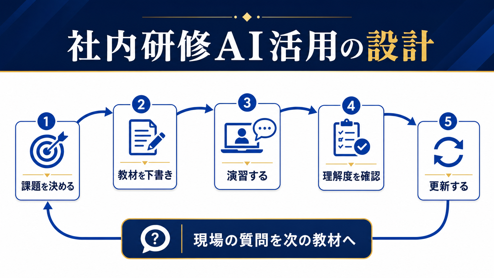

# 社内研修をAIで効率化する方法｜教材作成から定着までの設計 | AI顧問室

> この資料は、リポジトリ内の自社SEO記事を再利用できるように構造化した参照用転記です。競合ページの本文・画像・CSSは含めません。

## SEOメタデータ

- title: 社内研修をAIで効率化する方法｜教材作成から定着までの設計 | AI顧問室
- description: 社内研修をAIで効率化する方法を、対象者の課題整理、教材の下書き、演習、理解度確認、更新運用に分けて解説。AI研修を一度きりで終わらせない設計を紹介します。
- canonical: `https://ai-komon.bivrost.co.jp/articles/internal-ai-training/`
- published: `2026-07-13`
- modified: `2026-07-13`
- source HTML: [`articles/internal-ai-training/index.html`](../../../../articles/internal-ai-training/index.html)
- source SHA-256: `25267e809ed75968ca87d16a5e2f3f59c08fb220037ba7da76a63860a77b1782`

## ページ構造と計測用シグナル

- 日本語文字数（article本文）: `2408`
- H1: `1` / H2: `9` / H3: `3`
- table: `3` / details FAQ: `3`
- internal links: `5` / external links: `3`
- JSON-LD: `Article`

### 見出し一覧

- H1: 社内研修をAIで効率化する方法｜教材作成から定着までの設計
- H2: 研修テーマは「AIを学ぶ」ではなく業務の困りごとから決める
- H2: AIは教材の下書きに使い、社内の正解は人が決める
- H2: 研修の中心は、実際の業務を使った演習に置く
- H2: 研修後の質問を、教材と業務手順へ戻す
- H2: 講師はAIの説明者ではなく、業務との接続役になる
- H2: 管理者は「試す時間」と「相談先」を用意する
- H2: AI導入の相談はサービスから
- H2: よくある質問
- H2: 次に読む・使う
- H3: 材料を選ぶ
- H3: 下書きする
- H3: 確定する

## ページクローム

- **footer:** AI顧問室 / 無料ツール / プライバシーポリシー
- **breadcrumb:** AI顧問室 / AI導入 / 社内研修とAI

## 装飾・レイアウトの再利用台帳

| class | element count | purpose/sample |
| --- | ---: | --- |
| `answer` | `div`×1 | 先に結論： 社内研修へのAI活用は、教材の下書き、受講者別の演習問題、質問の分類、理解度確認、教材の更新に分けると効果を測りやすくなります。AIに研修設計を丸投げせず、自社の業務基準と人が確認すべき判断を教材へ入れてください。 |
| `button` | `a`×1 | AI顧問室のサービスを見る |
| `dek` | `p`×1 | AI研修は、スライドを作って受講させるだけでは定着しません。現場の課題を決め、教材を下書きし、実際の業務で演習し、質問やつまずきを次の教材へ戻す流れを作ります。 |
| `eyebrow` | `p`×1 | PEOPLE / INTERNAL AI TRAINING |
| `hero-badges` | `div`×1 | 課題設定 教材 演習 更新 |
| `hero-kicker` | `span`×1 | AI KOMONSHITSU / INTERNAL TRAINING |
| `hero-title` | `span`×1 | 研修を、受講イベントから業務改善へ。 |
| `hero-visual` | `div`×1 | AI KOMONSHITSU / INTERNAL TRAINING 研修を、受講イベントから業務改善へ。 課題設定 教材 演習 更新 |
| `key-points` | `div`×1 | この記事の要点 研修テーマはAIそのものではなく、現場の業務課題から決める 教材はAIで速く下書きし、社内用語・判断基準・禁止事項は人が確定する 受講率より、業務で試した回数・質問・再現できた結果を見る |
| `meta` | `p`×1 | 公開日: 2026年7月13日 \| AI顧問室 編集部 |
| `note` | `div`×1 | 成果の見方： 受講人数や満足度は入口の指標です。業務で試した回数、作業時間、修正回数、確認漏れ、質問の種類を追うと、研修が業務へ定着したかを判断しやすくなります。 |
| `related` | `div`×1 | 業務マニュアルの作り方 判断基準と例外を共有する 社内FAQの作り方 質問を更新資産にする AI導入の進め方 30日で小さく試す |
| `service-cta` | `div`×1 | AI導入の相談はサービスから AIに任せる業務の選定から、実装、社内ルール、現場への定着までを一気通貫で支援します。自社でどこから始めるか、サービス内容を確認してください。 AI顧問室のサービスを見る |
| `sources` | `div`×1 | 確認した一次情報 中小企業大学校「はじめて学ぶ生成AI活用の基本」 （2026-07-13確認） IPA「AIの利活用、AIによるDXの推進」 （2026-07-13確認） 経済産業省「AI事業者ガイドライン」 （2026-07-13確認） |
| `step` | `div`×3 | 01 / SOURCE 材料を選ぶ 現行の手順と実際の例を揃える。 |
| `steps` | `div`×1 | 01 / SOURCE 材料を選ぶ 現行の手順と実際の例を揃える。 02 / DRAFT 下書きする 章立て・問題・要約を作る。 03 / REVIEW 確定する 担当者が正しさと禁止事項を見る。 |
| `table-scroll` | `div`×3 | 研修テーマ 受講後の到達点 測定する行動 文書作成 既存情報から下書きを作れる 初稿までの時間・修正回数 会議準備 論点と確認事項を整理できる 準備時間・抜け漏れ 問い合わせ対応 質問を分類し回答案を作れる 分類精度・確認時間 ナレッジ共有 手順を質問と回答へ変換できる 更新数・再質問数 |
| `toc` | `div`×1 | この記事の目次 研修テーマの決め方 AIで教材を作る範囲 演習と理解度確認 研修を更新する仕組み 情報管理と講師の役割 管理者が用意するもの |
| `tool-cta` | `div`×1 | AI導入の相談はサービスから AIに任せる業務の選定から、実装、社内ルール、現場への定着までを一気通貫で支援します。自社でどこから始めるか、サービス内容を確認してください。 AI顧問室のサービスを見る |

### 外部 stylesheet

- `../../assets/articles/article.css?v=20260713-responsive`


## 図解・画像

### 社内研修を課題設定、教材下書き、演習、理解度確認、更新の5段階で改善する循環図解



- source: `../../assets/articles/diagrams/internal-ai-training-diagram.png`
- dimensions: `1672×941`
- caption: 研修後に現場で出た質問を次の教材へ戻すと、学習と業務改善がつながる。
- sha256: `66a31c1161e51e217e304f89a58f7e7f122986a3a21ebf49be4564d393642d91`

## 構造化データ（JSON-LD原文）

```json
[
  {
    "@context": "https://schema.org",
    "@type": "Article",
    "headline": "社内研修をAIで効率化する方法｜教材作成から定着までの設計",
    "description": "社内研修を課題整理、教材、演習、理解度確認、更新に分け、AIの使いどころを解説します。",
    "image": "https://ai-komon.bivrost.co.jp/assets/ogp.png",
    "datePublished": "2026-07-13",
    "dateModified": "2026-07-13",
    "author": {
      "@type": "Organization",
      "name": "AI顧問室"
    },
    "publisher": {
      "@type": "Organization",
      "name": "AI顧問室"
    },
    "mainEntityOfPage": "https://ai-komon.bivrost.co.jp/articles/internal-ai-training/"
  }
]
```

## 全文の文字起こし（装飾付き可読版）

PEOPLE / INTERNAL AI TRAINING

# 社内研修をAIで効率化する方法｜教材作成から定着までの設計

AI研修は、スライドを作って受講させるだけでは定着しません。現場の課題を決め、教材を下書きし、実際の業務で演習し、質問やつまずきを次の教材へ戻す流れを作ります。

公開日: 2026年7月13日　|　AI顧問室 編集部

AI KOMONSHITSU / INTERNAL TRAINING研修を、受講イベントから業務改善へ。

課題設定教材演習更新

**先に結論：**社内研修へのAI活用は、教材の下書き、受講者別の演習問題、質問の分類、理解度確認、教材の更新に分けると効果を測りやすくなります。AIに研修設計を丸投げせず、自社の業務基準と人が確認すべき判断を教材へ入れてください。


研修後に現場で出た質問を次の教材へ戻すと、学習と業務改善がつながる。

**この記事の要点**

- 研修テーマはAIそのものではなく、現場の業務課題から決める
- 教材はAIで速く下書きし、社内用語・判断基準・禁止事項は人が確定する
- 受講率より、業務で試した回数・質問・再現できた結果を見る

**この記事の目次**

1. [研修テーマの決め方](#purpose)
2. [AIで教材を作る範囲](#material)
3. [演習と理解度確認](#practice)
4. [研修を更新する仕組み](#operate)
5. [情報管理と講師の役割](#safe)
6. [管理者が用意するもの](#manager)

## 研修テーマは「AIを学ぶ」ではなく業務の困りごとから決める

「生成AIを使えるようにする」というテーマだけでは、受講後の行動が曖昧になります。メールの下書き、会議準備、文書の要約、問い合わせ分類など、現場で繰り返される業務を一つ選び、研修後に何ができれば成功かを決めます。中小企業大学校の研修でも、基礎知識だけでなく自社業務の棚卸しと活用アイデアの検討が組み合わされています。

| 研修テーマ | 受講後の到達点 | 測定する行動 |
| --- | --- | --- |
| 文書作成 | 既存情報から下書きを作れる | 初稿までの時間・修正回数 |
| 会議準備 | 論点と確認事項を整理できる | 準備時間・抜け漏れ |
| 問い合わせ対応 | 質問を分類し回答案を作れる | 分類精度・確認時間 |
| ナレッジ共有 | 手順を質問と回答へ変換できる | 更新数・再質問数 |

## AIは教材の下書きに使い、社内の正解は人が決める

既存のマニュアル、業務フロー、よくある質問を材料に、研修の章立て、演習問題、確認テスト、受講者向けの要約を作ることはAIの得意な領域です。ただし、古い手順や誤った社内用語が混ざると、そのまま教材へ広がります。教材の原本、確認者、版、更新日を明記し、公開前に現場責任者が確認します。

**01 / SOURCE**

### 材料を選ぶ

現行の手順と実際の例を揃える。

**02 / DRAFT**

### 下書きする

章立て・問題・要約を作る。

**03 / REVIEW**

### 確定する

担当者が正しさと禁止事項を見る。

個人情報、顧客データ、評価情報、未公開の経営情報を外部AIへ入力する場合は、サービス条件と社内ルールを確認します。入力を必要最小限にし、匿名化できない内容は別の方法で扱います。[生成AIの社内利用ルール](/articles/generative-ai-internal-rules/)も先に確認してください。

## 研修の中心は、実際の業務を使った演習に置く

講義を聞いて「分かった」と感じても、業務で再現できるとは限りません。研修では、受講者の実際の業務に近いサンプルを用意し、目的、材料、条件、確認方法を自分で入力してもらいます。完成した出力をそのまま使うのではなく、誤りを探して直す演習まで含めます。

1. **小さな課題を選ぶ：**30分以内に結果を確認できる業務にする。
2. **入力前に考える：**機密情報や個人情報が含まれないか確認する。
3. **比較する：**AIを使わない場合と使った場合の時間・品質を比べる。
4. **質問を残す：**分からなかった言葉や例外を次の教材候補にする。

## 研修後の質問を、教材と業務手順へ戻す

研修の定着を妨げるのは、受講者の意欲だけではなく、業務に戻ったときの例外や確認先の不明確さです。質問を「操作」「入力してよい情報」「出力の確認」「業務ルール」「ツールの不具合」に分類し、回答を社内FAQやマニュアルへ戻します。質問が減ったかだけでなく、同じ質問が再発していないかを見ます。

| 記録 | 残す内容 | 更新先 |
| --- | --- | --- |
| 質問 | どこで迷ったか | FAQ・教材 |
| 出力例 | 良い例・直した例 | 演習サンプル |
| 判断基準 | 人が確認した項目 | 業務マニュアル |
| ルール変更 | 入力禁止・承認者 | 社内ルール |

## 講師はAIの説明者ではなく、業務との接続役になる

講師がツールの機能だけを説明すると、サービスが変わったとき研修も使えなくなります。目的、材料、条件、確認、業務への戻し方を教え、AIが苦手な事実確認や判断を明確にします。研修資料には「AIの出力は下書き」「重要な情報は原文確認」「迷ったら誰へ相談するか」を書いてください。

**成果の見方：**受講人数や満足度は入口の指標です。業務で試した回数、作業時間、修正回数、確認漏れ、質問の種類を追うと、研修が業務へ定着したかを判断しやすくなります。

## 管理者は「試す時間」と「相談先」を用意する

研修後に現場が使わない理由は、知識不足だけではありません。通常業務の中で試す時間がない、失敗したときの相談先が分からない、良い使い方が評価されない、といった運用上の壁があります。管理者は研修日だけでなく、試行期間、対象業務、確認者、質問を受ける窓口を決めます。

| 管理者が決めること | 具体例 |
| --- | --- |
| 試行時間 | 週1回、30分だけ対象業務で試す |
| 相談先 | 入力可否・出力確認・ツール不具合を分ける |
| 評価方法 | 削減時間だけでなく、確認と学びを記録する |
| 終了条件 | 効果がない、リスクが高い場合は元の手順へ戻す |

研修を増やす前に、質問を受け止める場所と業務側の手順を整えることが、定着への近道です。受講者が迷ったときに一人で判断しなくて済む状態まで設計して、研修の成果とします。

## AI導入の相談はサービスから

AIに任せる業務の選定から、実装、社内ルール、現場への定着までを一気通貫で支援します。自社でどこから始めるか、サービス内容を確認してください。

[AI顧問室のサービスを見る](../../#service)

**確認した一次情報**

- [中小企業大学校「はじめて学ぶ生成AI活用の基本」](https://www.smrj.go.jp/institute/kansai/training/sme/2026/KA262100.html)（2026-07-13確認）
- [IPA「AIの利活用、AIによるDXの推進」](https://www.ipa.go.jp/digital/ai/transformation.html)（2026-07-13確認）
- [経済産業省「AI事業者ガイドライン」](https://www.meti.go.jp/shingikai/mono_info_service/ai_shakai_jisso/)（2026-07-13確認）

## よくある質問

社内研修の教材をAIだけで作れますか？

下書きや演習案の作成には使えますが、社内の正解、古い手順、禁止事項、個人情報の扱いは人が確認して確定します。

全社員を対象にした方がよいですか？

最初は業務と確認基準が近い小さなチームから始め、結果と質問を見て対象を広げます。全社展開を先にすると、業務ごとの違いを吸収しにくくなります。

研修の効果はどう測りますか？

受講率だけでなく、業務で試した回数、作業時間、修正回数、確認漏れ、同じ質問の再発を組み合わせて見ます。

## 次に読む・使う

[**業務マニュアルの作り方**判断基準と例外を共有する](/articles/business-manual-howto/)[**社内FAQの作り方**質問を更新資産にする](/articles/internal-faq-howto/)[**AI導入の進め方**30日で小さく試す](/articles/ai-introduction-roadmap/)

## 参照用リンク一覧

- #manager
- #material
- #operate
- #practice
- #purpose
- #safe
- ../../#service
- /articles/ai-introduction-roadmap/
- /articles/business-manual-howto/
- /articles/generative-ai-internal-rules/
- /articles/internal-faq-howto/
- https://www.ipa.go.jp/digital/ai/transformation.html
- https://www.meti.go.jp/shingikai/mono_info_service/ai_shakai_jisso/
- https://www.smrj.go.jp/institute/kansai/training/sme/2026/KA262100.html
