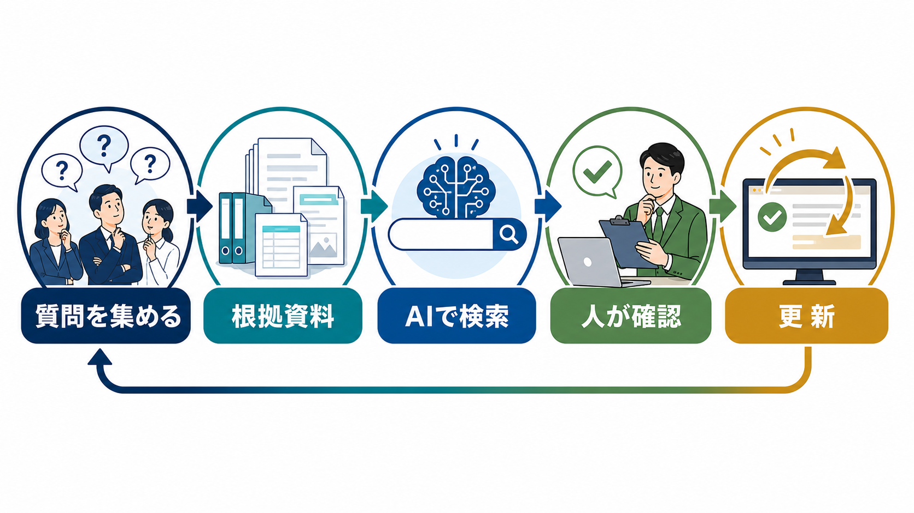

# 社内FAQの作り方｜質問を集めてAIで更新し続ける方法 | AI顧問室

> この資料は、リポジトリ内の自社SEO記事を再利用できるように構造化した参照用転記です。競合ページの本文・画像・CSSは含めません。

## SEOメタデータ

- title: 社内FAQの作り方｜質問を集めてAIで更新し続ける方法 | AI顧問室
- description: 社内FAQの作り方を、質問の集め方、回答の型、AIの使い方、権限管理、更新運用まで解説。同じ問い合わせを減らす設計を紹介します。
- canonical: `https://ai-komon.bivrost.co.jp/articles/internal-faq-howto/`
- published: `2026-07-13`
- modified: `2026-07-13`
- source HTML: [`articles/internal-faq-howto/index.html`](../../../../articles/internal-faq-howto/index.html)
- source SHA-256: `edb4faa2c0c4acea26f0bfacf4adc6b707b474c269aa0fd42a84dde66cb9d973`

## ページ構造と計測用シグナル

- 日本語文字数（article本文）: `2249`
- H1: `1` / H2: `10` / H3: `3`
- table: `3` / details FAQ: `3`
- internal links: `6` / external links: `3`
- JSON-LD: `Article, FAQPage`

### 見出し一覧

- H1: 社内FAQの作り方｜質問を集めてAIで更新し続ける方法
- H2: 社内FAQは、思いつきではなく問い合わせ履歴から始める
- H2: 回答は「結論・条件・手順・問い合わせ先」で書く
- H2: AIは質問の分類と回答候補の作成に使う
- H2: FAQの回答範囲は、部署と権限で分ける
- H2: 未解決質問と古い回答を更新トリガーにする
- H2: 社内FAQの公開前チェック
- H2: FAQカードを一件ずつ管理する
- H2: AI導入の相談はサービスから
- H2: よくある質問
- H2: 次に読む・使う
- H3: 結論
- H3: 条件
- H3: 根拠

## ページクローム

- **footer:** AI顧問室 / 無料ツール / プライバシーポリシー
- **breadcrumb:** AI顧問室 / AI活用事例 / 社内FAQの作り方

## 装飾・レイアウトの再利用台帳

| class | element count | purpose/sample |
| --- | ---: | --- |
| `answer` | `div`×1 | 先に結論： 社内FAQは「質問を集める → 回答の根拠を決める → 短く答える → 更新日を管理する」の順で作ります。最初から全社の疑問を網羅せず、総務・情シス・人事などへ繰り返し届く定型質問から始めてください。 |
| `button` | `a`×1 | AI顧問室のサービスを見る |
| `dek` | `p`×1 | 社内FAQは、質問と答えを並べるだけでは使われません。実際の問い合わせを集め、答えの根拠と更新者を決め、AIは検索や下書きの補助に置くと、現場の自己解決へつなげやすくなります。 |
| `eyebrow` | `p`×1 | KNOWLEDGE / INTERNAL FAQ |
| `hero-badges` | `div`×1 | 質問収集 根拠資料 回答確認 更新 |
| `hero-kicker` | `span`×1 | AI KOMONSHITSU / INTERNAL FAQ |
| `hero-title` | `span`×1 | 同じ質問を、知識の入口へ変える。 |
| `hero-visual` | `div`×1 | AI KOMONSHITSU / INTERNAL FAQ 同じ質問を、知識の入口へ変える。 質問収集 根拠資料 回答確認 更新 |
| `key-points` | `div`×1 | この記事の要点 質問履歴から頻度の高いものを集め、結論・条件・根拠・窓口で答える AIは分類と回答候補に置き、根拠資料と更新日を人が確認する 未解決質問、古い回答、制度変更を更新トリガーにする |
| `meta` | `p`×1 | 公開日: 2026年7月13日 \| AI顧問室 編集部 |
| `related` | `div`×1 | 業務マニュアルの作り方 FAQの根拠となる手順を整える AI導入の進め方 小さく試して定着させる デモ一覧 問い合わせ対応の工程を見る |
| `service-cta` | `div`×1 | AI導入の相談はサービスから AIに任せる業務の選定から、実装、社内ルール、現場への定着までを一気通貫で支援します。自社でどこから始めるか、サービス内容を確認してください。 AI顧問室のサービスを見る |
| `sources` | `div`×1 | 確認した一次情報 IPA「AIの利活用、AIによるDXの推進」 （2026-07-13確認） 経済産業省「AI事業者ガイドライン」 （2026-07-13確認） 個人情報保護委員会「生成AIサービスの利用に関する注意喚起」 （2026-07-13確認） |
| `step` | `div`×3 | 01 / ANSWER 結論 まず何をすればよいかを書く。 |
| `steps` | `div`×1 | 01 / ANSWER 結論 まず何をすればよいかを書く。 02 / CONDITION 条件 対象者、期限、例外を分ける。 03 / SOURCE 根拠 規程・手順書・担当窓口へ戻す。 |
| `table-scroll` | `div`×3 | 質問の集め方 見るポイント FAQ化の優先度 メール・チャット 同じ質問が何度も出るか 高 担当者への聞き取り 特定の人しか答えられないか 高 検索ログ 検索しても答えに届いていないか 中 アンケート 言語化されていない困りごとか 中 |
| `toc` | `div`×1 | この記事の目次 質問を集める方法 答えが伝わるFAQの型 AIを使う範囲 権限と情報管理 更新と改善の回し方 |
| `tool-cta` | `div`×1 | AI導入の相談はサービスから AIに任せる業務の選定から、実装、社内ルール、現場への定着までを一気通貫で支援します。自社でどこから始めるか、サービス内容を確認してください。 AI顧問室のサービスを見る |

### 外部 stylesheet

- `../../assets/articles/article.css?v=20260713-responsive`


## 図解・画像

### 社内の繰り返し質問を根拠資料と確認を通じてFAQへ整理し、AIが検索を補助する流れの図解



- source: `../../assets/articles/diagrams/internal-faq-howto-diagram.png`
- dimensions: `1672×941`
- caption: 社内FAQは、実際の質問と根拠資料を結び、AIの回答候補を人が確認して育てる。
- sha256: `02aa5db9d798d9c3401f995a02818e76f9c83d6e2fc65a11cebd4a963390e2e7`

## 構造化データ（JSON-LD原文）

```json
[
  {
    "@context": "https://schema.org",
    "@type": "Article",
    "headline": "社内FAQの作り方｜質問を集めてAIで更新し続ける方法",
    "description": "社内FAQの作り方を、質問収集、回答設計、AI活用、権限管理、更新運用まで解説します。",
    "image": "https://ai-komon.bivrost.co.jp/assets/ogp.png",
    "datePublished": "2026-07-13",
    "dateModified": "2026-07-13",
    "author": {
      "@type": "Organization",
      "name": "AI顧問室"
    },
    "publisher": {
      "@type": "Organization",
      "name": "AI顧問室"
    },
    "mainEntityOfPage": "https://ai-komon.bivrost.co.jp/articles/internal-faq-howto/"
  },
  {
    "@context": "https://schema.org",
    "@type": "FAQPage",
    "mainEntity": [
      {
        "@type": "Question",
        "name": "社内FAQは何から作ればよいですか？",
        "acceptedAnswer": {
          "@type": "Answer",
          "text": "担当部署へ繰り返し届く質問を、問い合わせ履歴やチャットから集めます。最初は頻度が高く、答えが規程や手順で決まっている質問に絞ります。"
        }
      },
      {
        "@type": "Question",
        "name": "社内FAQをAIに回答させても大丈夫ですか？",
        "acceptedAnswer": {
          "@type": "Answer",
          "text": "AIを回答候補の作成や検索補助に使うことはできます。ただし、根拠資料、更新日、回答の対象者を確認し、重要な手続きは人へ戻す経路を残します。"
        }
      },
      {
        "@type": "Question",
        "name": "社内FAQが使われない原因は何ですか？",
        "acceptedAnswer": {
          "@type": "Answer",
          "text": "質問の言葉と見出しが合わない、答えが古い、誰が更新するか不明などが原因です。利用ログと未解決質問を見て、検索語と回答を更新します。"
        }
      }
    ]
  }
]
```

## 全文の文字起こし（装飾付き可読版）

KNOWLEDGE / INTERNAL FAQ

# 社内FAQの作り方｜質問を集めてAIで更新し続ける方法

社内FAQは、質問と答えを並べるだけでは使われません。実際の問い合わせを集め、答えの根拠と更新者を決め、AIは検索や下書きの補助に置くと、現場の自己解決へつなげやすくなります。

公開日: 2026年7月13日　|　AI顧問室 編集部

AI KOMONSHITSU / INTERNAL FAQ同じ質問を、知識の入口へ変える。

質問収集根拠資料回答確認更新

**先に結論：**社内FAQは「質問を集める → 回答の根拠を決める → 短く答える → 更新日を管理する」の順で作ります。最初から全社の疑問を網羅せず、総務・情シス・人事などへ繰り返し届く定型質問から始めてください。

**この記事の要点**

- 質問履歴から頻度の高いものを集め、結論・条件・根拠・窓口で答える
- AIは分類と回答候補に置き、根拠資料と更新日を人が確認する
- 未解決質問、古い回答、制度変更を更新トリガーにする


社内FAQは、実際の質問と根拠資料を結び、AIの回答候補を人が確認して育てる。

**この記事の目次**

1. [質問を集める方法](#collect)
2. [答えが伝わるFAQの型](#format)
3. [AIを使う範囲](#ai)
4. [権限と情報管理](#permission)
5. [更新と改善の回し方](#operate)

## 社内FAQは、思いつきではなく問い合わせ履歴から始める

作成者が想像した質問だけを並べると、現場の言葉とずれます。メール、チャット、口頭で受けた質問を集め、同じ内容をまとめます。中小企業では、就業規則、経費精算、アカウント申請、営業資料の場所など、答えが既存資料にある質問から始めると設計しやすくなります。

| 質問の集め方 | 見るポイント | FAQ化の優先度 |
| --- | --- | --- |
| メール・チャット | 同じ質問が何度も出るか | 高 |
| 担当者への聞き取り | 特定の人しか答えられないか | 高 |
| 検索ログ | 検索しても答えに届いていないか | 中 |
| アンケート | 言語化されていない困りごとか | 中 |

## 回答は「結論・条件・手順・問い合わせ先」で書く

FAQの回答は、長い規程の要約ではなく、読者が次に取る行動を示します。最初の一文で結論を答え、対象者や期限などの条件を置き、手順と例外、分からないときの問い合わせ先を続けます。根拠資料の名前と更新日も残します。

**01 / ANSWER**

### 結論

まず何をすればよいかを書く。

**02 / CONDITION**

### 条件

対象者、期限、例外を分ける。

**03 / SOURCE**

### 根拠

規程・手順書・担当窓口へ戻す。

## AIは質問の分類と回答候補の作成に使う

AIは、似た質問のグループ化、質問文の言い換え、既存資料からの回答候補作成に向きます。回答の正しさを確定する役割まで任せると、制度変更や例外条件を見落とします。社内FAQでは、根拠となる資料を提示できない回答は公開しない運用にします。

AIへ資料を渡す場合は、個人情報、契約情報、認証情報を含むか確認してください。入力範囲やサービス条件は[AI導入のリスク](/articles/ai-introduction-risk/)と[生成AIの社内利用ルール](/articles/generative-ai-internal-rules/)に照らします。

## FAQの回答範囲は、部署と権限で分ける

全社員に見せる情報と、人事・経理・管理者だけが見る情報を同じFAQに置くと、検索の便利さが情報管理の弱点になります。公開範囲、閲覧権限、元資料の保管場所を決め、AIが回答してよい質問と担当者へ引き継ぐ質問を分類します。

| 分類 | 例 | 回答の扱い |
| --- | --- | --- |
| 全社員向け | 勤怠、備品、一般的な申請手順 | FAQで回答 |
| 部署限定 | 営業資料、案件手順、採用運用 | 権限付きで回答 |
| 個別確認 | 給与、評価、個人情報を含む相談 | 担当者へエスカレーション |
| 回答禁止 | 認証情報、秘密情報、未承認の判断 | AIへ入力・回答させない |

## 未解決質問と古い回答を更新トリガーにする

FAQは公開後の利用状況で育てます。回答にたどり着けなかった質問、担当者へ戻った質問、同じ質問が再発した質問を集めます。制度やシステムが変わったときは、関連する回答をまとめて見直し、更新日と責任者を変えます。

1. **利用者が検索する：**質問文と近い言葉で探せるよう、表記ゆれを残す。
2. **回答を読む：**結論、条件、根拠、問い合わせ先を確認する。
3. **解決できなければ戻す：**担当部署と未解決理由を記録する。
4. **更新する：**回答、検索語、根拠資料、更新日を直す。

## 社内FAQの公開前チェック

FAQを増やす前に、1件の回答が安全に使えるかを確認します。件数ではなく、利用者が迷わず行動できることを優先します。

- 質問文が現場の言葉で書かれているか
- 回答の冒頭で結論が分かるか
- 対象者、期限、例外、問い合わせ先があるか
- 根拠資料と更新日が残っているか
- 権限外の情報が混ざっていないか

## FAQカードを一件ずつ管理する

FAQの更新単位は「ページ全体」ではなく、質問と回答の1カードです。カードごとに責任者、根拠資料、更新日、公開範囲を持たせると、制度変更が起きたときに影響範囲を追いやすくなります。AIで候補文を作る場合も、根拠資料のリンクがないカードは公開待ちにしてください。

| 管理項目 | 記録する内容 | 更新トリガー |
| --- | --- | --- |
| 責任者 | 回答を確定する部署・担当 | 異動・担当変更 |
| 根拠資料 | 規程名、URL、版または更新日 | 規程・サービス変更 |
| 公開範囲 | 全社、部署限定、個別対応 | 権限設計の変更 |
| 未解決理由 | 根拠不足、例外、問い合わせ先 | 同じ質問の再発 |

## AI導入の相談はサービスから

AIに任せる業務の選定から、実装、社内ルール、現場への定着までを一気通貫で支援します。自社でどこから始めるか、サービス内容を確認してください。

[AI顧問室のサービスを見る](../../#service)

**確認した一次情報**

- [IPA「AIの利活用、AIによるDXの推進」](https://www.ipa.go.jp/digital/ai/transformation.html)（2026-07-13確認）
- [経済産業省「AI事業者ガイドライン」](https://www.meti.go.jp/shingikai/mono_info_service/ai_shakai_jisso/)（2026-07-13確認）
- [個人情報保護委員会「生成AIサービスの利用に関する注意喚起」](https://www.ppc.go.jp/news/careful_information/230602_AI_utilize_alert/)（2026-07-13確認）

## よくある質問

Excelで社内FAQを作ってもよいですか？

小さく始めるなら可能です。質問、回答、根拠資料、更新日、担当者、公開範囲を列で管理し、検索しやすい名前を付けます。利用者が増えたら権限と履歴を管理できる場所へ移します。

FAQの回答をAIに自動送信できますか？

社内の定型質問でも、制度変更や個別事情があるため、最初は回答候補の提示に留めます。根拠資料と更新日を確認し、個人情報や判断が必要な質問は担当者へ戻してください。

質問が少ない会社でもFAQは必要ですか？

質問が少なくても、特定の人だけが答えられる状態なら効果があります。まずは入社、経費、アカウント、顧客対応など、引き継ぎ時に困る質問を少数から整えます。

## 次に読む・使う

[**業務マニュアルの作り方**FAQの根拠となる手順を整える](/articles/business-manual-howto/)[**AI導入の進め方**小さく試して定着させる](/articles/ai-introduction-roadmap/)[**デモ一覧**問い合わせ対応の工程を見る](/demos.html)

## 参照用リンク一覧

- #ai
- #collect
- #format
- #operate
- #permission
- ../../#service
- /articles/ai-introduction-risk/
- /articles/ai-introduction-roadmap/
- /articles/business-manual-howto/
- /articles/generative-ai-internal-rules/
- /demos.html
- https://www.ipa.go.jp/digital/ai/transformation.html
- https://www.meti.go.jp/shingikai/mono_info_service/ai_shakai_jisso/
- https://www.ppc.go.jp/news/careful_information/230602_AI_utilize_alert/
