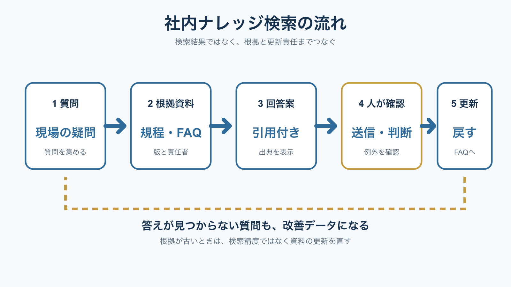

# 社内ナレッジ検索に生成AIを使う方法｜FAQと根拠資料をつなぐ | AI顧問室

> この資料は、リポジトリ内の自社SEO記事を再利用できるように構造化した参照用転記です。競合ページの本文・画像・CSSは含めません。

## SEOメタデータ

- title: 社内ナレッジ検索に生成AIを使う方法｜FAQと根拠資料をつなぐ | AI顧問室
- description: 社内ナレッジ検索に生成AIを使う方法を解説。FAQ・規程・手順書を整理し、根拠表示、人の確認、更新責任まで含めて小さく始める設計を紹介します。
- canonical: `https://ai-komon.bivrost.co.jp/articles/internal-knowledge-search/`
- published: `2026-07-26`
- modified: `2026-07-26`
- source HTML: [`articles/internal-knowledge-search/index.html`](../../../../articles/internal-knowledge-search/index.html)
- source SHA-256: `dca490790f97ff0ab8b237d8bc81e38d194ff5351162d4cc45663feb798e4b17`

## ページ構造と計測用シグナル

- 日本語文字数（article本文）: `2357`
- H1: `1` / H2: `8` / H3: `3`
- table: `1` / details FAQ: `3`
- internal links: `4` / external links: `3`
- JSON-LD: `Article, BreadcrumbList`

### 見出し一覧

- H1: 社内ナレッジ検索に生成AIを使う方法｜FAQと根拠資料をつなぐ
- H2: 社内ナレッジ検索は、答えより根拠を返す
- H2: 根拠資料は、タイトルより版と責任者をそろえる
- H2: 回答には、出典・不確実性・確認者を残す
- H2: 答えられない質問を、FAQの更新に使う
- H2: 最初は1業務・20問から試す
- H2: AI導入の相談はサービスから
- H2: よくある質問
- H2: 次に読む・使う
- H3: どの資料か
- H3: 答えられるか
- H3: 誰が見るか

## ページクローム

- **footer:** AI顧問室｜業務に合わせたAI活用と定着を支援します。
- **breadcrumb:** AI顧問室 / 社内FAQの作り方 / 社内ナレッジ検索に生成AIを使う方法

## 装飾・レイアウトの再利用台帳

| class | element count | purpose/sample |
| --- | ---: | --- |
| `answer` | `div`×1 | 先に結論： 生成AIを社内検索に使うときは、まず資料の版・責任者・公開範囲を整え、回答候補に根拠を添え、人が確認してから業務へ戻します。答えが見つからない質問も、FAQや手順書を更新する材料として記録します。 |
| `button` | `a`×1 | AI顧問室のサービスを見る |
| `dek` | `p`×1 | 社内ナレッジ検索は、AIに答えを作らせるだけでは定着しません。質問、根拠資料、回答候補、人の確認、更新の5段階をつなぐと、現場が迷ったときに戻れる検索基盤になります。 |
| `eyebrow` | `p`×1 | KNOWLEDGE / INTERNAL SEARCH |
| `key-points` | `div`×1 | この記事の要点 AI検索の品質はモデルより、根拠資料の整理に左右される。 回答には出典・更新日・確認者を表示する。 質問ログをFAQ更新へ戻すと、検索基盤が育つ。 |
| `meta` | `p`×1 | 公開日: 2026年7月26日 \| AI顧問室 編集部 |
| `note` | `p`×2 | 独自の見方： 社内検索のKPIは、回答数だけでは足りません。「根拠へ到達できた質問の割合」「人が訂正した回答」「資料の更新につながった質問」を記録すると、検索の改善点が見えるようになります。 |
| `related` | `div`×1 | 社内FAQの作り方 質問と根拠を更新する 生成AIの社内利用ルール 入力と権限を分類する AI導入のリスク 出力・契約・運用を確認する |
| `service-cta` | `div`×1 | AI導入の相談はサービスから AIに任せる業務の選定から、実装、社内ルール、現場への定着までを一気通貫で支援します。自社でどこから始めるか、サービス内容を確認してください。 AI顧問室のサービスを見る |
| `sources` | `div`×1 | 出典・確認日 IPA「テキスト生成AIの導入・運用ガイドライン」 、2026年7月26日確認。 経済産業省「AI事業者ガイドライン（第1.2版）」 、2026年7月26日確認。 個人情報保護委員会「生成AIサービスの利用に関する注意喚起等について」 、2026年7月26日確認。 |
| `step` | `div`×3 | 出典 どの資料か 資料名、見出し、更新日を表示する。 |
| `steps` | `div`×1 | 出典 どの資料か 資料名、見出し、更新日を表示する。 不明 答えられるか 根拠がなければ「不明」と返す。 確認 誰が見るか 業務責任者が例外と適用範囲を見る。 |
| `table-scroll` | `div`×1 | 項目 登録する内容 未整理のときのリスク 資料名 業務名・手順名・質問カテゴリ 似た資料を混同する 版・更新日 適用開始日、廃止日、改訂者 古い手順を返す 根拠 規程、契約、公式手順、決定記録 回答を検証できない 権限 部署、役割、閲覧範囲 見せてはいけない情報を返す |
| `toc` | `div`×1 | この記事の目次 社内検索とチャットの違い 根拠資料を整える方法 回答に確認工程を入れる 質問ログを更新へ戻す 小さく始める手順 |
| `tool-cta` | `div`×1 | AI導入の相談はサービスから AIに任せる業務の選定から、実装、社内ルール、現場への定着までを一気通貫で支援します。自社でどこから始めるか、サービス内容を確認してください。 AI顧問室のサービスを見る |

### 外部 stylesheet

- `../../assets/articles/article.css?v=20260726-seo`


## 図解・画像

### 社内ナレッジ検索を質問、根拠資料、回答案、人の確認、更新の5段階で示した図解



- source: `../../assets/articles/diagrams/internal-knowledge-search-diagram.png`
- dimensions: `1600×900`
- caption: 社内ナレッジ検索は、回答を出して終わりではなく、根拠と更新責任へ戻る循環として設計する。
- sha256: `b6f8910e181dec8eb8763123dc08a4675818f4cc1b3f6d66bda8be8aa52153b4`

## 構造化データ（JSON-LD原文）

```json
[
  {
    "@context": "https://schema.org",
    "@type": "Article",
    "headline": "社内ナレッジ検索に生成AIを使う方法｜FAQと根拠資料をつなぐ",
    "description": "社内ナレッジ検索に生成AIを使う方法を、資料整理、根拠表示、人の確認、更新の流れで解説します。",
    "image": "https://ai-komon.bivrost.co.jp/assets/ogp.png",
    "datePublished": "2026-07-26",
    "dateModified": "2026-07-26",
    "author": {
      "@type": "Organization",
      "name": "AI顧問室"
    },
    "publisher": {
      "@type": "Organization",
      "name": "AI顧問室"
    },
    "mainEntityOfPage": "https://ai-komon.bivrost.co.jp/articles/internal-knowledge-search/"
  },
  {
    "@context": "https://schema.org",
    "@type": "BreadcrumbList",
    "itemListElement": [
      {
        "@type": "ListItem",
        "position": 1,
        "name": "AI顧問室",
        "item": "https://ai-komon.bivrost.co.jp/"
      },
      {
        "@type": "ListItem",
        "position": 2,
        "name": "社内FAQの作り方",
        "item": "https://ai-komon.bivrost.co.jp/articles/internal-faq-howto/"
      },
      {
        "@type": "ListItem",
        "position": 3,
        "name": "社内ナレッジ検索に生成AIを使う方法",
        "item": "https://ai-komon.bivrost.co.jp/articles/internal-knowledge-search/"
      }
    ]
  }
]
```

## 全文の文字起こし（装飾付き可読版）

KNOWLEDGE / INTERNAL SEARCH

# 社内ナレッジ検索に生成AIを使う方法｜FAQと根拠資料をつなぐ

社内ナレッジ検索は、AIに答えを作らせるだけでは定着しません。質問、根拠資料、回答候補、人の確認、更新の5段階をつなぐと、現場が迷ったときに戻れる検索基盤になります。

公開日: 2026年7月26日　|　AI顧問室 編集部


社内ナレッジ検索は、回答を出して終わりではなく、根拠と更新責任へ戻る循環として設計する。

**先に結論：**生成AIを社内検索に使うときは、まず資料の版・責任者・公開範囲を整え、回答候補に根拠を添え、人が確認してから業務へ戻します。答えが見つからない質問も、FAQや手順書を更新する材料として記録します。

**この記事の要点**

- AI検索の品質はモデルより、根拠資料の整理に左右される。
- 回答には出典・更新日・確認者を表示する。
- 質問ログをFAQ更新へ戻すと、検索基盤が育つ。

**この記事の目次**

1. [社内検索とチャットの違い](#difference)
2. [根拠資料を整える方法](#source)
3. [回答に確認工程を入れる](#answer)
4. [質問ログを更新へ戻す](#update)
5. [小さく始める手順](#start)

## 社内ナレッジ検索は、答えより根拠を返す

IPA「テキスト生成AIの導入・運用ガイドライン」は、組織で生成AIを運用する際に、導入、運用、リスク管理を分けて検討する構成です。社内検索でも、回答文の自然さより、どの資料を根拠にしたかを追えることが重要になります。

一般的なチャットは会話の続きを作ることが得意ですが、社内ナレッジ検索では「社内の最新版は何か」「誰が確認したか」「自分に見せてよい情報か」が問われます。検索結果に根拠のない断定が混ざると、便利さより確認の負担が増えます。

**独自の見方：**社内検索のKPIは、回答数だけでは足りません。「根拠へ到達できた質問の割合」「人が訂正した回答」「資料の更新につながった質問」を記録すると、検索の改善点が見えるようになります。

## 根拠資料は、タイトルより版と責任者をそろえる

検索対象へ資料を追加する前に、資料の種類、適用範囲、更新日、責任者、公開範囲を整理します。古い手順書と新しい手順書が同じ名前で保存されていると、AIがどちらを使うべきか判断できません。まずは対象業務を1つに絞ります。

| 項目 | 登録する内容 | 未整理のときのリスク |
| --- | --- | --- |
| 資料名 | 業務名・手順名・質問カテゴリ | 似た資料を混同する |
| 版・更新日 | 適用開始日、廃止日、改訂者 | 古い手順を返す |
| 根拠 | 規程、契約、公式手順、決定記録 | 回答を検証できない |
| 権限 | 部署、役割、閲覧範囲 | 見せてはいけない情報を返す |

根拠は、長い資料をそのまま渡すだけでなく、見出しと短い要約を付けて検索しやすくします。要約が原文の代わりになるわけではありません。回答には根拠資料へのリンクや資料名を添え、重要な判断は原文へ戻れるようにします。

経済産業省の「AI事業者ガイドライン（第1.2版）」は、AIの出力について精度やリスク要因を確認して利用する考え方を示しています。社内検索も、資料の信頼性と出力の確認を別の工程として設計します。

## 回答には、出典・不確実性・確認者を残す

AIが回答を返したら、送信や業務処理の前に、根拠資料と照合します。回答が短くても、適用範囲や例外が抜けている可能性があります。特に人事、契約、顧客対応、個人情報に関わる質問は、回答候補をそのまま最終判断に使いません。

**出典**

### どの資料か

資料名、見出し、更新日を表示する。

**不明**

### 答えられるか

根拠がなければ「不明」と返す。

**確認**

### 誰が見るか

業務責任者が例外と適用範囲を見る。

個人情報保護委員会は、生成AIサービスの利用規約やプライバシーポリシーを確認し、入力する情報の内容を踏まえて利用を判断するよう注意喚起しています。検索基盤へ資料を登録する前に、個人情報・機密情報・権限の扱いを決めます。

## 答えられない質問を、FAQの更新に使う

検索で答えられなかった質問を失敗として捨てると、同じ問い合わせが繰り返されます。質問文、担当部署、必要だった根拠、回答を確定した人、FAQへ反映した日を記録します。質問ログは、資料の不足と現場の言葉の両方を教えてくれます。

**実務での観察：**手順書の正式名称ではなく、現場が実際に入力した質問から検索語を増やすと、使われるFAQへ近づきます。質問ログをそのまま公開せず、個人名や案件情報を除いて改善用データにします。

更新の責任者がいない資料は、検索対象から外すか、回答に「確認が必要」と表示します。検索の便利さを優先して、古い資料を自動的に最新版として扱わないことが安全な運用につながります。

## 最初は1業務・20問から試す

社内全体の文書を一度に検索対象へ入れるのではなく、問い合わせが多く、根拠資料が比較的そろっている業務を1つ選びます。質問を20問ほど集め、回答の正確さ、根拠へ戻れるか、確認時間、答えられない質問を記録します。

1. 対象業務と利用者を決める。
2. 資料の版、責任者、権限を一覧にする。
3. 代表質問で回答と出典の表示を試す。
4. 人の確認と停止条件を決める。
5. 質問ログをFAQと手順書の更新へ戻す。

詳しいFAQの作り方は[社内FAQの作り方](/articles/internal-faq-howto/)で、入力情報や権限の確認は[生成AIの社内利用ルール](/articles/generative-ai-internal-rules/)で整理しています。検索を導入する前に、資料の所有者と更新日を決めることが先です。

## AI導入の相談はサービスから

AIに任せる業務の選定から、実装、社内ルール、現場への定着までを一気通貫で支援します。自社でどこから始めるか、サービス内容を確認してください。

[AI顧問室のサービスを見る](../../#service)

## よくある質問

社内資料を全部AIへ登録すれば便利になりますか？

資料が多いほど便利になるとは限りません。版、責任者、権限、更新日が整理されていない資料は、古い回答や誤った回答を返す原因になります。まずは1業務に絞ります。

AIの回答に出典を付ける必要はありますか？

社内の判断に使うなら、出典へ戻れる状態が必要です。資料名、見出し、更新日、リンクを表示し、重要な判断は担当者が原文と照合します。

答えられない質問はどう扱いますか？

質問、必要な資料、確定した回答者を記録し、FAQや手順書の更新候補にします。答えがない状態で推測させず、「確認が必要」と返す設計を残します。

## 次に読む・使う

[**社内FAQの作り方**質問と根拠を更新する](/articles/internal-faq-howto/)[**生成AIの社内利用ルール**入力と権限を分類する](/articles/generative-ai-internal-rules/)[**AI導入のリスク**出力・契約・運用を確認する](/articles/ai-introduction-risk/)

**出典・確認日**

- [IPA「テキスト生成AIの導入・運用ガイドライン」](https://www.ipa.go.jp/jinzai/ics/core_human_resource/final_project/2024/generative-ai-guideline.html)、2026年7月26日確認。
- [経済産業省「AI事業者ガイドライン（第1.2版）」](https://www.meti.go.jp/shingikai/mono_info_service/ai_shakai_jisso/20260331_report.html)、2026年7月26日確認。
- [個人情報保護委員会「生成AIサービスの利用に関する注意喚起等について」](https://www.ppc.go.jp/news/careful_information/230602_AI_utilize_alert/)、2026年7月26日確認。

## 参照用リンク一覧

- #answer
- #difference
- #source
- #start
- #update
- ../../#service
- /articles/ai-introduction-risk/
- /articles/generative-ai-internal-rules/
- /articles/internal-faq-howto/
- https://www.ipa.go.jp/jinzai/ics/core_human_resource/final_project/2024/generative-ai-guideline.html
- https://www.meti.go.jp/shingikai/mono_info_service/ai_shakai_jisso/20260331_report.html
- https://www.ppc.go.jp/news/careful_information/230602_AI_utilize_alert/
