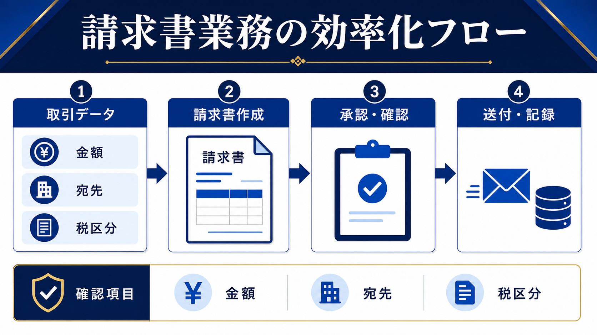

# 請求書作成を効率化する方法｜作成・確認・送付・記録をつなげる | AI顧問室

> この資料は、リポジトリ内の自社SEO記事を再利用できるように構造化した参照用転記です。競合ページの本文・画像・CSSは含めません。

## SEOメタデータ

- title: 請求書作成を効率化する方法｜作成・確認・送付・記録をつなげる | AI顧問室
- description: 請求書作成を効率化する方法を、取引データの整理、請求書作成、承認、送付、入金記録に分けて解説。AIや自動化を入れる前に確認すべき項目を整理します。
- canonical: `https://ai-komon.bivrost.co.jp/articles/invoice-efficiency/`
- published: `2026-07-13`
- modified: `2026-07-13`
- source HTML: [`articles/invoice-efficiency/index.html`](../../../../articles/invoice-efficiency/index.html)
- source SHA-256: `6b5655f375f0e33a2c39319aea7955e5009c4410b8c1905b6c0b725c2ab331ed`

## ページ構造と計測用シグナル

- 日本語文字数（article本文）: `2415`
- H1: `1` / H2: `9` / H3: `3`
- table: `2` / details FAQ: `3`
- internal links: `5` / external links: `3`
- JSON-LD: `Article`

### 見出し一覧

- H1: 請求書作成を効率化する方法｜作成・確認・送付・記録をつなげる
- H2: 請求書作成のボトルネックは、転記と確認の分断
- H2: 自動化の前に、取引データの入力ルールを決める
- H2: 金額・宛先・税区分・対象期間を確認する
- H2: AI・自動化は転記、文面、ステータス更新から入れる
- H2: 作成時間だけでなく、再作成と入金確認を測る
- H2: 不一致が出たら、自動化を止めて元データへ戻す
- H2: AI導入の相談はサービスから
- H2: よくある質問
- H2: 次に読む・使う
- H3: 集める
- H3: 揃える
- H3: 確定する

## ページクローム

- **footer:** AI顧問室 / 無料ツール / プライバシーポリシー
- **breadcrumb:** AI顧問室 / 業務効率化 / 請求書作成の効率化

## 装飾・レイアウトの再利用台帳

| class | element count | purpose/sample |
| --- | ---: | --- |
| `answer` | `div`×1 | 先に結論： 請求書作成は、①取引データを一か所に集める、②請求書を作る、③金額・宛先・税区分を確認する、④送付と入金状況を記録する、の4段階で見直します。AIや自動化は転記・定型文・台帳更新の補助に使い、金額と送付先の最終確認は人が行います。 |
| `button` | `a`×1 | AI顧問室のサービスを見る |
| `dek` | `p`×1 | 請求書の効率化は、PDFを早く作るだけでは終わりません。取引条件を正しく集め、金額と宛先を確認し、送付と入金記録までつなげると、月末の手戻りを減らせます。 |
| `eyebrow` | `p`×1 | BACK OFFICE / INVOICE OPERATIONS |
| `hero-badges` | `div`×1 | 取引データ 作成 承認 送付 |
| `hero-kicker` | `span`×1 | AI KOMONSHITSU / INVOICE OPERATIONS |
| `hero-title` | `span`×1 | 発行だけでなく、確認と記録まで整える。 |
| `hero-visual` | `div`×1 | AI KOMONSHITSU / INVOICE OPERATIONS 発行だけでなく、確認と記録まで整える。 取引データ 作成 承認 送付 |
| `key-points` | `div`×1 | この記事の要点 最初に統一するのは請求書のデザインより、元データと項目の持ち方 金額・宛先・税区分・対象期間は自動作成後に必ず照合する 作成時間だけでなく、差し戻し・再送・入金確認まで測る |
| `meta` | `p`×1 | 公開日: 2026年7月13日 \| AI顧問室 編集部 |
| `note` | `div`×1 | 制度面の注意： インボイス制度、電子帳簿保存法、取引先との個別条件は、最新の公的情報と自社の経理・税務担当者に照合します。AIに制度適合性の最終判断を任せません。 |
| `related` | `div`×1 | 見積書作成の時間を減らす方法 見積工程の工数を測る AI導入の費用対効果 導入前後の指標を決める AI導入のリスク 入力情報と権限を確認する |
| `service-cta` | `div`×1 | AI導入の相談はサービスから AIに任せる業務の選定から、実装、社内ルール、現場への定着までを一気通貫で支援します。自社でどこから始めるか、サービス内容を確認してください。 AI顧問室のサービスを見る |
| `sources` | `div`×1 | 確認した一次情報 IPA「AIの利活用、AIによるDXの推進」 （2026-07-13確認） 個人情報保護委員会「生成AIサービスの利用に関する注意喚起」 （2026-07-13確認） 経済産業省「AI事業者ガイドライン」 （2026-07-13確認） |
| `step` | `div`×3 | 01 / COLLECT 集める 受注・納品・契約条件を揃える。 |
| `steps` | `div`×1 | 01 / COLLECT 集める 受注・納品・契約条件を揃える。 02 / STANDARD 揃える 取引先名、税区分、期限を統一する。 03 / LOCK 確定する 担当者が請求対象を承認する。 |
| `table-scroll` | `div`×2 | 工程 起きやすい詰まり 見直すポイント 取引条件 営業メモと契約条件が違う 確定データの所有者 作成 毎回同じ項目を転記する 項目名・単価・期間の標準化 確認 担当者が目視で探す 確認欄と承認者の固定 送付・記録 送付済みや入金状況が追えない ステータスと期限の一元管理 |
| `toc` | `div`×1 | この記事の目次 どこで時間がかかるか 先に取引データを揃える 請求書の確認項目 AI・自動化を入れる場所 効果の測り方 失敗時に戻す方法 |
| `tool-cta` | `div`×1 | AI導入の相談はサービスから AIに任せる業務の選定から、実装、社内ルール、現場への定着までを一気通貫で支援します。自社でどこから始めるか、サービス内容を確認してください。 AI顧問室のサービスを見る |

### 外部 stylesheet

- `../../assets/articles/article.css?v=20260713-responsive`


## 図解・画像

### 請求書業務を取引データ、請求書作成、承認確認、送付記録の4段階に分けた効率化フロー図解



- source: `../../assets/articles/diagrams/invoice-efficiency-diagram.png`
- dimensions: `1672×941`
- caption: 請求書の効率化は、作成単体ではなく確認・送付・記録までの流れで測る。
- sha256: `8fd5d451be1ee748a5d7893fd17f2acc923059a7aab60efb9a9fce6e60a50b2a`

## 構造化データ（JSON-LD原文）

```json
[
  {
    "@context": "https://schema.org",
    "@type": "Article",
    "headline": "請求書作成を効率化する方法｜作成・確認・送付・記録をつなげる",
    "description": "請求書業務を取引データ、作成、確認、送付、記録に分け、効率化の手順を解説します。",
    "image": "https://ai-komon.bivrost.co.jp/assets/ogp.png",
    "datePublished": "2026-07-13",
    "dateModified": "2026-07-13",
    "author": {
      "@type": "Organization",
      "name": "AI顧問室"
    },
    "publisher": {
      "@type": "Organization",
      "name": "AI顧問室"
    },
    "mainEntityOfPage": "https://ai-komon.bivrost.co.jp/articles/invoice-efficiency/"
  }
]
```

## 全文の文字起こし（装飾付き可読版）

BACK OFFICE / INVOICE OPERATIONS

# 請求書作成を効率化する方法｜作成・確認・送付・記録をつなげる

請求書の効率化は、PDFを早く作るだけでは終わりません。取引条件を正しく集め、金額と宛先を確認し、送付と入金記録までつなげると、月末の手戻りを減らせます。

公開日: 2026年7月13日　|　AI顧問室 編集部

AI KOMONSHITSU / INVOICE OPERATIONS発行だけでなく、確認と記録まで整える。

取引データ作成承認送付

**先に結論：**請求書作成は、①取引データを一か所に集める、②請求書を作る、③金額・宛先・税区分を確認する、④送付と入金状況を記録する、の4段階で見直します。AIや自動化は転記・定型文・台帳更新の補助に使い、金額と送付先の最終確認は人が行います。


請求書の効率化は、作成単体ではなく確認・送付・記録までの流れで測る。

**この記事の要点**

- 最初に統一するのは請求書のデザインより、元データと項目の持ち方
- 金額・宛先・税区分・対象期間は自動作成後に必ず照合する
- 作成時間だけでなく、差し戻し・再送・入金確認まで測る

**この記事の目次**

1. [どこで時間がかかるか](#bottleneck)
2. [先に取引データを揃える](#data)
3. [請求書の確認項目](#check)
4. [AI・自動化を入れる場所](#automation)
5. [効果の測り方](#measure)
6. [失敗時に戻す方法](#failure)

## 請求書作成のボトルネックは、転記と確認の分断

請求書の作成が遅い会社では、営業の受注情報、納品実績、単価表、宛先情報が別々に管理されていることがあります。その状態で自動化すると、誤った元データを速く帳票へ反映するだけになりかねません。最初に、どの情報がどこにあり、誰が確定するかを見える化します。

| 工程 | 起きやすい詰まり | 見直すポイント |
| --- | --- | --- |
| 取引条件 | 営業メモと契約条件が違う | 確定データの所有者 |
| 作成 | 毎回同じ項目を転記する | 項目名・単価・期間の標準化 |
| 確認 | 担当者が目視で探す | 確認欄と承認者の固定 |
| 送付・記録 | 送付済みや入金状況が追えない | ステータスと期限の一元管理 |

## 自動化の前に、取引データの入力ルールを決める

請求書の元になる情報は、取引先名、請求先住所、対象期間、品目、数量、単価、税区分、支払期限、担当者です。表記揺れや空欄があると、AIやテンプレートの出力も安定しません。入力者、確定日、変更履歴を決め、請求書へ反映する前の「確定済み」状態を作ります。

**01 / COLLECT**

### 集める

受注・納品・契約条件を揃える。

**02 / STANDARD**

### 揃える

取引先名、税区分、期限を統一する。

**03 / LOCK**

### 確定する

担当者が請求対象を承認する。

請求書のひな型を整えることも有効ですが、ひな型は入力データの正しさを保証しません。項目ごとの出典と確認者を残しておくと、差し戻しの原因を追えます。

## 金額・宛先・税区分・対象期間を確認する

自動生成した請求書は、見た目が整っていても内容が正しいとは限りません。特に、前月の金額が残っている、税込・税抜が混ざる、宛先が旧住所のまま、対象期間がずれている、といったミスは送付後の訂正につながります。

1. **金額：**数量、単価、割引、税計算を元データと照合する。
2. **宛先：**会社名、部署名、担当者、送付先アドレスを確認する。
3. **税区分：**取引内容や社内の経理ルールに沿っているか見る。
4. **対象期間：**納品・役務提供の期間と請求月が一致するか確認する。
5. **承認：**誰がいつ確認したかを記録してから送付する。

**制度面の注意：**インボイス制度、電子帳簿保存法、取引先との個別条件は、最新の公的情報と自社の経理・税務担当者に照合します。AIに制度適合性の最終判断を任せません。

## AI・自動化は転記、文面、ステータス更新から入れる

AIは、取引データを請求書の項目へ整理する、送付メールの下書きを作る、未入力欄を洗い出す、送付後のステータスを更新する、といった補助に使えます。銀行口座や会計ソフトとの連携を含める場合は、権限、ログ、失敗時の戻し方を先に決めてください。

顧客情報や請求金額を外部AIへ渡す場合は、サービスの利用条件と社内の情報分類を確認します。入力を匿名化できないなら、社内環境や別の方法を検討し、判断に迷うデータは送らないことが安全です。[生成AIの社内利用ルール](/articles/generative-ai-internal-rules/)も合わせて確認してください。

## 作成時間だけでなく、再作成と入金確認を測る

効率化の効果は、請求書1枚の作成時間だけでは判断しません。月間の請求件数、作成・確認・送付・入金確認の時間、差し戻し件数、再送件数、入金遅れの発見日を導入前後で記録します。想定値と実測値を分け、1か月程度の小さな範囲で比べます。

| 指標 | 記録方法 | 改善の見方 |
| --- | --- | --- |
| 作成時間 | 確定データから完成まで | 転記と整形が短くなったか |
| 確認時間 | 承認依頼から完了まで | 確認箇所が見つけやすいか |
| 差し戻し | 理由別に件数を記録 | 元データとルールを直せるか |
| 入金確認 | 入金状況の更新日 | 未入金の発見が遅れていないか |

## 不一致が出たら、自動化を止めて元データへ戻す

請求書の効率化で怖いのは、ミスが見つからないまま送付されることです。金額、宛先、対象期間、税区分のいずれかが元データと一致しない場合は、送付せずに保留します。担当者が元データを確定し、修正理由を記録してから再作成します。

1. **止める：**不一致の請求書を送付待ちに戻す。
2. **分ける：**入力ミス、ひな型の問題、連携の問題を分類する。
3. **直す：**原因を元データ・計算式・確認手順のどこかで修正する。
4. **再確認：**同じ条件で別の担当者が照合する。

自動化後に確認件数が増えた場合も、機能を足す前に入力欄と承認者を見直します。請求書の完成を早めることより、訂正や再送を減らし、取引先との信頼を守れることを優先します。

## AI導入の相談はサービスから

AIに任せる業務の選定から、実装、社内ルール、現場への定着までを一気通貫で支援します。自社でどこから始めるか、サービス内容を確認してください。

[AI顧問室のサービスを見る](../../#service)

**確認した一次情報**

- [IPA「AIの利活用、AIによるDXの推進」](https://www.ipa.go.jp/digital/ai/transformation.html)（2026-07-13確認）
- [個人情報保護委員会「生成AIサービスの利用に関する注意喚起」](https://www.ppc.go.jp/news/careful_information/230602_AI_utilize_alert/)（2026-07-13確認）
- [経済産業省「AI事業者ガイドライン」](https://www.meti.go.jp/shingikai/mono_info_service/ai_shakai_jisso/)（2026-07-13確認）

## よくある質問

請求書をAIに作らせれば確認は不要ですか？

不要にはなりません。金額、宛先、税区分、対象期間、送付先は、元データと照合して人が承認します。

Excel管理からすぐシステム化すべきですか？

まず項目と確認手順を揃え、件数や差し戻しの原因を把握してから判断します。仕組みを変えても入力ルールが曖昧なら、問題が移動するだけです。

請求書の効果測定は何から始めますか？

1か月分の件数、作成時間、確認時間、差し戻し、再送、入金確認にかかった時間を記録し、導入後と同じ条件で比べます。

## 次に読む・使う

[**見積書作成の時間を減らす方法**見積工程の工数を測る](/articles/estimate-time-reduction/)[**AI導入の費用対効果**導入前後の指標を決める](/articles/ai-roi/)[**AI導入のリスク**入力情報と権限を確認する](/articles/ai-introduction-risk/)

## 参照用リンク一覧

- #automation
- #bottleneck
- #check
- #data
- #failure
- #measure
- ../../#service
- /articles/ai-introduction-risk/
- /articles/ai-roi/
- /articles/estimate-time-reduction/
- /articles/generative-ai-internal-rules/
- https://www.ipa.go.jp/digital/ai/transformation.html
- https://www.meti.go.jp/shingikai/mono_info_service/ai_shakai_jisso/
- https://www.ppc.go.jp/news/careful_information/230602_AI_utilize_alert/
