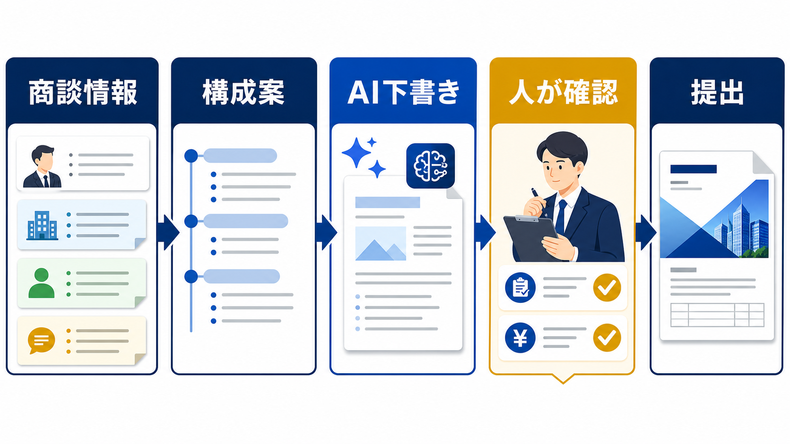

# 提案書をAIで作成する方法｜営業の下書きと確認を分ける | AI顧問室

> この資料は、リポジトリ内の自社SEO記事を再利用できるように構造化した参照用転記です。競合ページの本文・画像・CSSは含めません。

## SEOメタデータ

- title: 提案書をAIで作成する方法｜営業の下書きと確認を分ける | AI顧問室
- description: 提案書をAIで作成する方法を、情報整理、構成案、下書き、事実確認、顧客向け編集の順に解説。営業で任せる範囲と注意点を整理します。
- canonical: `https://ai-komon.bivrost.co.jp/articles/proposal-ai/`
- published: `2026-07-13`
- modified: `2026-07-13`
- source HTML: [`articles/proposal-ai/index.html`](../../../../articles/proposal-ai/index.html)
- source SHA-256: `abb1fb23cffe2adb886e1c5ec823815e45f8dafe65376fbfbe5a267315589294`

## ページ構造と計測用シグナル

- 日本語文字数（article本文）: `2183`
- H1: `1` / H2: `9` / H3: `3`
- table: `2` / details FAQ: `3`
- internal links: `6` / external links: `3`
- JSON-LD: `Article, FAQPage`

### 見出し一覧

- H1: 提案書をAIで作成する方法｜営業の下書きと確認を分ける
- H2: 提案書作成は、AIと人の担当を分ける
- H2: AIへ渡す前に、商談情報を事実と仮説へ分ける
- H2: 構成案を先に作り、文章は後から整える
- H2: 提出前は、数字・条件・顧客固有性を確認する
- H2: よい提案書の型をチームで再利用する
- H2: 提案書をAIで作成する前のチェック
- H2: AI導入の相談はサービスから
- H2: よくある質問
- H2: 次に読む・使う
- H3: 事実
- H3: 仮説
- H3: 確認事項

## ページクローム

- **footer:** AI顧問室 / 無料ツール / プライバシーポリシー
- **breadcrumb:** AI顧問室 / 営業効率化 / 提案書をAIで作成する方法

## 装飾・レイアウトの再利用台帳

| class | element count | purpose/sample |
| --- | ---: | --- |
| `answer` | `div`×1 | 先に結論： 提案書は「商談情報の整理 → 顧客課題の構造化 → 構成案 → 下書き → 事実・条件の確認 → 顧客向け編集」に分けると、AIを安全に使えます。金額、納期、実績、契約条件、顧客への約束は人が確定してください。 |
| `button` | `a`×1 | AI顧問室のサービスを見る |
| `dek` | `p`×1 | 提案書作成でAIを使うなら、顧客理解と責任ある判断を残しながら、情報整理と下書きを短くするのが基本です。営業担当者の経験を置き換えるのではなく、確認しやすい原稿へ整えます。 |
| `eyebrow` | `p`×1 | SALES / PROPOSAL WORKFLOW |
| `hero-badges` | `div`×1 | 情報整理 構成 確認 提出 |
| `hero-kicker` | `span`×1 | AI KOMONSHITSU / PROPOSAL FLOW |
| `hero-title` | `span`×1 | 提案の質を、下書きの速さだけで測らない。 |
| `hero-visual` | `div`×1 | AI KOMONSHITSU / PROPOSAL FLOW 提案の質を、下書きの速さだけで測らない。 情報整理 構成 確認 提出 |
| `key-points` | `div`×1 | この記事の要点 商談情報・顧客条件・提案構成・下書き・提出前確認を分ける AIには構成と下書きを任せ、価格・納期・約束は人が確定する 提出後の修正と失注理由を次のテンプレート改善へ戻す |
| `meta` | `p`×1 | 公開日: 2026年7月13日 \| AI顧問室 編集部 |
| `related` | `div`×1 | AI導入の進め方 小さな試行で確認工程を作る 見積書作成の時間を減らす 数字と承認の確認を分ける AI導入のメリット 効果を導入前後で測る |
| `service-cta` | `div`×1 | AI導入の相談はサービスから AIに任せる業務の選定から、実装、社内ルール、現場への定着までを一気通貫で支援します。自社でどこから始めるか、サービス内容を確認してください。 AI顧問室のサービスを見る |
| `sources` | `div`×1 | 確認した一次情報 IPA「AIの利活用、AIによるDXの推進」 （2026-07-13確認） 経済産業省「コンテンツ制作のための生成AI利活用ガイドブック」 （2026-07-13確認） 経済産業省「AI事業者ガイドライン」 （2026-07-13確認） |
| `step` | `div`×3 | 01 / FACT 事実 顧客が話した課題、条件、期限。 |
| `steps` | `div`×1 | 01 / FACT 事実 顧客が話した課題、条件、期限。 02 / HYPOTHESIS 仮説 営業が考える原因や提案の方向。 03 / CHECK 確認事項 次回商談や社内承認で確かめる内容。 |
| `table-scroll` | `div`×2 | 工程 AIの補助 人が持つ判断 情報整理 商談メモの分類・要約 事実と推測の区別 構成 課題・提案・効果の並び替え 顧客に合う優先順位 下書き 文章、見出し、比較表の草案 自社の提供範囲と表現 確認 表記ゆれ・抜けの候補出し 金額、納期、契約、約束 提出 送付文の下書き 最終承認と送信 |
| `toc` | `div`×1 | この記事の目次 AIへ任せる工程と任せない工程 入力情報を整える 構成案と下書きを作る 営業担当者が確認する項目 チームで再利用する方法 |
| `tool-cta` | `div`×1 | AI導入の相談はサービスから AIに任せる業務の選定から、実装、社内ルール、現場への定着までを一気通貫で支援します。自社でどこから始めるか、サービス内容を確認してください。 AI顧問室のサービスを見る |

### 外部 stylesheet

- `../../assets/articles/article.css?v=20260713-responsive`


## 図解・画像

### 商談情報を整理し、AIが提案書の構成と下書きを補助し、人が条件を確認して提出する流れの図解



- source: `../../assets/articles/diagrams/proposal-ai-diagram.png`
- dimensions: `1671×941`
- caption: 提案書作成では、AIを構成と下書きに置き、顧客条件と約束は人が確定する。
- sha256: `1c89ea05b46f3fe697e5115dfcb04526fb8a9f2e36c9066f893a002ffdc54c89`

## 構造化データ（JSON-LD原文）

```json
[
  {
    "@context": "https://schema.org",
    "@type": "Article",
    "headline": "提案書をAIで作成する方法｜営業の下書きと確認を分ける",
    "description": "提案書作成にAIを使う工程と、人が確認すべき情報を営業実務に沿って解説します。",
    "image": "https://ai-komon.bivrost.co.jp/assets/ogp.png",
    "datePublished": "2026-07-13",
    "dateModified": "2026-07-13",
    "author": {
      "@type": "Organization",
      "name": "AI顧問室"
    },
    "publisher": {
      "@type": "Organization",
      "name": "AI顧問室"
    },
    "mainEntityOfPage": "https://ai-komon.bivrost.co.jp/articles/proposal-ai/"
  },
  {
    "@context": "https://schema.org",
    "@type": "FAQPage",
    "mainEntity": [
      {
        "@type": "Question",
        "name": "提案書のどの工程にAIを使えますか？",
        "acceptedAnswer": {
          "@type": "Answer",
          "text": "商談メモの整理、課題の分類、構成案、文章の下書き、表現の言い換えに使えます。顧客の事実、金額、納期、契約条件、最終提案は人が確定します。"
        }
      },
      {
        "@type": "Question",
        "name": "提案書をAIに丸ごと作らせてもよいですか？",
        "acceptedAnswer": {
          "@type": "Answer",
          "text": "丸ごと任せると、顧客固有の条件や根拠のない表現が混ざります。入力、構成、下書き、確認、提出に分け、確認済みの情報だけで仕上げます。"
        }
      },
      {
        "@type": "Question",
        "name": "無料のAIで提案書を作成できますか？",
        "acceptedAnswer": {
          "@type": "Answer",
          "text": "下書き作成は可能な場合があります。ただし、入力データの扱い、保存、学習利用、社内の利用ルールを確認し、顧客情報を安易に入力しないことが前提です。"
        }
      }
    ]
  }
]
```

## 全文の文字起こし（装飾付き可読版）

SALES / PROPOSAL WORKFLOW

# 提案書をAIで作成する方法｜営業の下書きと確認を分ける

提案書作成でAIを使うなら、顧客理解と責任ある判断を残しながら、情報整理と下書きを短くするのが基本です。営業担当者の経験を置き換えるのではなく、確認しやすい原稿へ整えます。

公開日: 2026年7月13日　|　AI顧問室 編集部

AI KOMONSHITSU / PROPOSAL FLOW提案の質を、下書きの速さだけで測らない。

情報整理構成確認提出

**先に結論：**提案書は「商談情報の整理 → 顧客課題の構造化 → 構成案 → 下書き → 事実・条件の確認 → 顧客向け編集」に分けると、AIを安全に使えます。金額、納期、実績、契約条件、顧客への約束は人が確定してください。

**この記事の要点**

- 商談情報・顧客条件・提案構成・下書き・提出前確認を分ける
- AIには構成と下書きを任せ、価格・納期・約束は人が確定する
- 提出後の修正と失注理由を次のテンプレート改善へ戻す


提案書作成では、AIを構成と下書きに置き、顧客条件と約束は人が確定する。

**この記事の目次**

1. [AIへ任せる工程と任せない工程](#split)
2. [入力情報を整える](#input)
3. [構成案と下書きを作る](#draft)
4. [営業担当者が確認する項目](#check)
5. [チームで再利用する方法](#operate)

## 提案書作成は、AIと人の担当を分ける

提案書の全工程を一つの指示で自動化すると、どの情報が根拠で、どこが推測か分かりにくくなります。IPAはAI活用のパターンとして文書作成・確認を挙げていますが、営業で使うときは顧客固有の事実と社内の承認を分けて設計します。

| 工程 | AIの補助 | 人が持つ判断 |
| --- | --- | --- |
| 情報整理 | 商談メモの分類・要約 | 事実と推測の区別 |
| 構成 | 課題・提案・効果の並び替え | 顧客に合う優先順位 |
| 下書き | 文章、見出し、比較表の草案 | 自社の提供範囲と表現 |
| 確認 | 表記ゆれ・抜けの候補出し | 金額、納期、契約、約束 |
| 提出 | 送付文の下書き | 最終承認と送信 |

## AIへ渡す前に、商談情報を事実と仮説へ分ける

AIの出力品質は、入力する情報の整理に左右されます。顧客が発言した事実、営業が考えた仮説、自社で確認が必要な項目を分けます。特に、予算、導入時期、対象人数、既存システム、決裁者などは、空欄のまま推測で埋めないことが重要です。

**01 / FACT**

### 事実

顧客が話した課題、条件、期限。

**02 / HYPOTHESIS**

### 仮説

営業が考える原因や提案の方向。

**03 / CHECK**

### 確認事項

次回商談や社内承認で確かめる内容。

顧客名、個人情報、未公開の契約情報を入力する場合は、サービス条件と社内ルールを確認します。入力データの分類は[AI導入のリスク](/articles/ai-introduction-risk/)、利用可否は[生成AIの社内利用ルール](/articles/generative-ai-internal-rules/)に戻して判断します。

## 構成案を先に作り、文章は後から整える

いきなり完成原稿を作るより、「顧客の課題 → 放置した場合の影響 → 提案する方法 → 導入の進め方 → 費用・条件 → 次の確認」の構成を先に置きます。構成が顧客の意思決定順になっているかを営業担当者が確認してから、AIに下書きを依頼します。

AIへの指示には、対象読者、提案の目的、使ってよい情報、書いてはいけない情報、出力形式を含めます。「実績を追加する」ではなく「確認できない実績は書かない」と明記すると、根拠のない表現を減らせます。

## 提出前は、数字・条件・顧客固有性を確認する

提案書の確認は、誤字脱字だけでは足りません。顧客の現状と提案内容が対応しているか、事実の根拠があるか、契約や価格の条件と一致しているかを見ます。AIが整えた文章ほど自然に読めるため、確認項目を固定する方が安全です。

1. **顧客課題：**実際の発言や資料と一致しているか。
2. **提案範囲：**自社が提供できるものだけになっているか。
3. **数字：**金額、期間、人数、削減時間に根拠があるか。
4. **表現：**効果保証、誇張、誤解を招く比較がないか。
5. **次の行動：**誰がいつ何を確認するか明確か。

## よい提案書の型をチームで再利用する

提案書を毎回ゼロから作るのではなく、構成、確認表、表現の注意点をチームの型として残します。案件ごとの個別情報をテンプレートへ混ぜないよう、共通部分と案件固有部分を分けます。提出後の修正理由も記録すると、次の下書きの精度を上げられます。

| 共通テンプレート | 案件ごとの情報 | 再利用する学び |
| --- | --- | --- |
| 課題・提案・効果の構成 | 顧客の課題と条件 | よくある質問と反論 |
| 数字の確認項目 | 見積・納期・体制 | 差し戻し理由 |
| 提出前チェック | 承認者・送付先 | 採用された表現 |

## 提案書をAIで作成する前のチェック

AIを使うか迷ったときは、提案書が定型化しやすい部分と、顧客固有の判断を分けます。次の項目が決まっていない案件は、まず営業担当者の整理から始めます。

- 提案の目的と読者が決まっているか
- 事実、仮説、未確認事項を分けているか
- 入力してよい顧客情報の範囲が明確か
- 金額、納期、実績を確認する担当者がいるか
- 提出前にAI出力を修正した履歴を残せるか

## AI導入の相談はサービスから

AIに任せる業務の選定から、実装、社内ルール、現場への定着までを一気通貫で支援します。自社でどこから始めるか、サービス内容を確認してください。

[AI顧問室のサービスを見る](../../#service)

**確認した一次情報**

- [IPA「AIの利活用、AIによるDXの推進」](https://www.ipa.go.jp/digital/ai/transformation.html)（2026-07-13確認）
- [経済産業省「コンテンツ制作のための生成AI利活用ガイドブック」](https://www.meti.go.jp/policy/mono_info_service/contents/aiguidebook.html)（2026-07-13確認）
- [経済産業省「AI事業者ガイドライン」](https://www.meti.go.jp/shingikai/mono_info_service/ai_shakai_jisso/)（2026-07-13確認）

## よくある質問

提案書の文章だけAIに整えてもらえますか？

可能です。ただし、顧客名や未公開情報を含める前に入力条件を確認します。文章を自然にするだけでなく、数字、表現、提案範囲を営業担当者が確認し、提出前の承認を残します。

AIが作った提案書の実績を使ってもよいですか？

自社で確認できる実績だけを使います。対象期間、顧客の許諾、数値の定義が不明な実績は掲載しません。想定例やサンプルは、実績と混ざらないように明記します。

提案書を毎回同じ構成にすると画一的になりませんか？

共通化するのは構成と確認項目で、顧客課題への接続は案件ごとに変えます。土台をそろえると、営業担当者は顧客理解と判断に時間を使いやすくなります。

## 次に読む・使う

[**AI導入の進め方**小さな試行で確認工程を作る](/articles/ai-introduction-roadmap/)[**見積書作成の時間を減らす**数字と承認の確認を分ける](/articles/estimate-time-reduction/)[**AI導入のメリット**効果を導入前後で測る](/articles/ai-introduction-benefits/)

## 参照用リンク一覧

- #check
- #draft
- #input
- #operate
- #split
- ../../#service
- /articles/ai-introduction-benefits/
- /articles/ai-introduction-risk/
- /articles/ai-introduction-roadmap/
- /articles/estimate-time-reduction/
- /articles/generative-ai-internal-rules/
- https://www.ipa.go.jp/digital/ai/transformation.html
- https://www.meti.go.jp/policy/mono_info_service/contents/aiguidebook.html
- https://www.meti.go.jp/shingikai/mono_info_service/ai_shakai_jisso/
