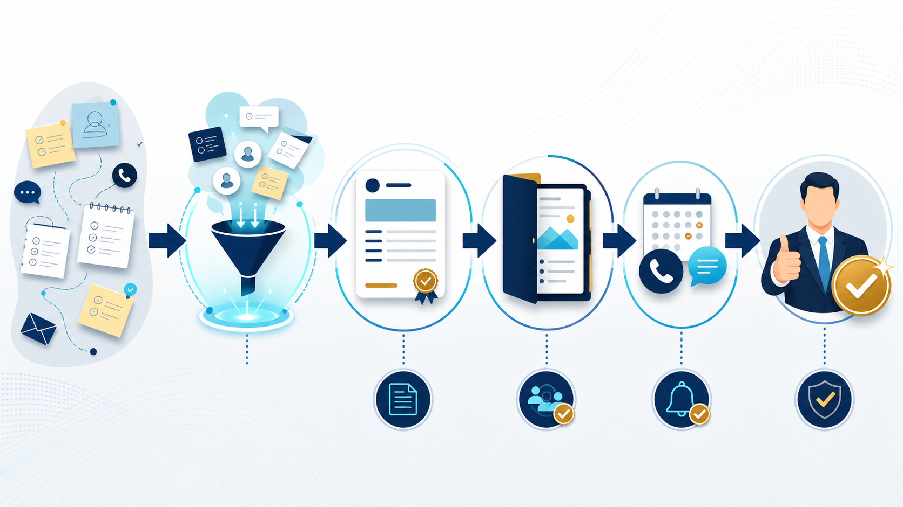

# 営業効率化の方法｜見積・提案・追客のどこからAI化するか | AI顧問室

> この資料は、リポジトリ内の自社SEO記事を再利用できるように構造化した参照用転記です。競合ページの本文・画像・CSSは含めません。

## SEOメタデータ

- title: 営業効率化の方法｜見積・提案・追客のどこからAI化するか | AI顧問室
- description: 営業効率化の方法を、見積・提案・追客・報告に分けて解説。AIや自動化を入れる前に、定型度と顧客接点のリスクで優先順位を決める方法を紹介します。
- canonical: `https://ai-komon.bivrost.co.jp/articles/sales-efficiency/`
- published: `2026-07-12`
- modified: `2026-07-12`
- source HTML: [`articles/sales-efficiency/index.html`](../../../../articles/sales-efficiency/index.html)
- source SHA-256: `08de21acdd0d800ea87cbb6d16e482ee7af6097efc355fdd2d6f58de8d437fc9`

## ページ構造と計測用シグナル

- 日本語文字数（article本文）: `2352`
- H1: `1` / H2: `12` / H3: `3`
- table: `3` / details FAQ: `2`
- internal links: `6` / external links: `2`
- JSON-LD: `Article, FAQPage`

### 見出し一覧

- H1: 営業効率化の方法｜見積・提案・追客のどこからAI化するか
- H2: 営業効率化は「顧客接点」と「社内作業」を分けて考える
- H2: 最初にAI化しやすい営業業務4つ
- H2: 現場で回る改善は4ステップで作る
- H2: 成果は受注率より先に「時間と漏れ」を測る
- H2: 営業現場での導入例を工程ごとに分ける
- H2: 追客を自動化しすぎないための境界
- H2: 営業責任者が見るべき改善指標
- H2: 営業担当者が使い続けられる引き継ぎ
- H2: 営業チームの週次レビューに入れる
- H2: AI導入の相談はサービスから
- H2: よくある質問
- H2: 次に読む・使う
- H3: 営業報告
- H3: 見積の下書き
- H3: 提案構成

## ページクローム

- **footer:** AI顧問室 / 無料ツール / プライバシーポリシー
- **breadcrumb:** AI顧問室 / 業務効率化のアイデア / 営業効率化

## 装飾・レイアウトの再利用台帳

| class | element count | purpose/sample |
| --- | ---: | --- |
| `answer` | `div`×1 | 先に結論： 営業効率化は、①社内報告・入力、②見積の転記、③提案書の下書き、④追客の候補整理の順で試すと、顧客への誤送信リスクを抑えやすくなります。受注率を先に約束せず、工数と対応漏れを測るのが基本です。 |
| `button` | `a`×1 | AI顧問室のサービスを見る |
| `dek` | `p`×1 | 営業効率化は、営業担当者の行動を一括で自動化することではありません。見積、提案、追客、報告を分け、顧客接点のリスクが低い工程から整えます。 |
| `eyebrow` | `p`×1 | SALES OPERATIONS / EFFICIENCY |
| `hero-badges` | `div`×1 | 見積 提案 追客 報告 |
| `hero-kicker` | `span`×1 | AI KOMONSHITSU / SALES EFFICIENCY |
| `hero-title` | `span`×1 | 顧客に向き合う時間を残すため、社内作業から整える。 |
| `hero-visual` | `div`×1 | AI KOMONSHITSU / SALES EFFICIENCY 顧客に向き合う時間を残すため、社内作業から整える。 見積 提案 追客 報告 |
| `key-points` | `div`×1 | この記事の要点 営業の受付・見積・提案・追客を工程ごとに棚卸しする 顧客向けの約束や送信は人の確認を残し、社内作業から効率化する 時間だけでなく、差し戻し・返信遅延・引き継ぎの欠落を測る |
| `meta` | `p`×1 | 公開日: 2026年7月12日 \| AI顧問室 編集部 |
| `related` | `div`×1 | 見積書作成の時間を減らす 営業工数を具体的に測る AI活用事例 営業・議事録・問い合わせを比較 見積書AIデモ 見積の整理イメージを見る |
| `service-cta` | `div`×1 | AI導入の相談はサービスから AIに任せる業務の選定から、実装、社内ルール、現場への定着までを一気通貫で支援します。自社でどこから始めるか、サービス内容を確認してください。 AI顧問室のサービスを見る |
| `sources` | `div`×1 | AI活用の背景を確認する資料 IPA AIの利活用、AIによるDXの推進 経済産業省 AI事業者ガイドライン検討会 |
| `step` | `div`×3 | 01 / REPORT 営業報告 商談メモから、決まった項目へ整理する。 |
| `steps` | `div`×1 | 01 / REPORT 営業報告 商談メモから、決まった項目へ整理する。 02 / QUOTE 見積の下書き 条件を拾い、確認用の案を作る。 03 / PROPOSAL 提案構成 顧客課題と素材を整理し、章立てを作る。 |
| `table-scroll` | `div`×3 | 工程 定型度 最初の改善案 営業報告 高い 入力項目を減らし、要約を補助 見積作成 高〜中 商品・単価の転記を整える 提案書 中 素材の整理と構成案を作る 追客 中 候補抽出と文面の下書き 顧客への送信 低〜中 人の承認を必須にする |
| `toc` | `div`×1 | この記事の目次 営業プロセスを分ける AI化の優先順位 現場で回る改善手順 成果の測り方 |
| `tool-cta` | `div`×1 | AI導入の相談はサービスから AIに任せる業務の選定から、実装、社内ルール、現場への定着までを一気通貫で支援します。自社でどこから始めるか、サービス内容を確認してください。 AI顧問室のサービスを見る |

### 外部 stylesheet

- `../../assets/articles/article.css?v=20260713-responsive`


## 図解・画像

### 営業メモを見積、提案、追客、確認の工程へ整理する営業効率化の図解



- source: `../../assets/articles/diagrams/sales-efficiency-diagram.png`
- dimensions: `1672×941`
- caption: 営業効率化は、顧客接点に近い作業ほど確認を残し、社内作業から整える。
- sha256: `7e7b3aab8c391103992f14d5c175a8c48c3588f65d8794c3c809bc8ea12f891c`

## 構造化データ（JSON-LD原文）

```json
[
  {
    "@context": "https://schema.org",
    "@type": "Article",
    "headline": "営業効率化の方法｜見積・提案・追客のどこからAI化するか",
    "description": "営業のどの工程を効率化するか、顧客接点のリスクを含めて整理します。",
    "image": "https://ai-komon.bivrost.co.jp/assets/ogp.png",
    "datePublished": "2026-07-12",
    "dateModified": "2026-07-12",
    "author": {
      "@type": "Organization",
      "name": "AI顧問室"
    },
    "publisher": {
      "@type": "Organization",
      "name": "AI顧問室"
    },
    "mainEntityOfPage": "https://ai-komon.bivrost.co.jp/articles/sales-efficiency/"
  },
  {
    "@context": "https://schema.org",
    "@type": "FAQPage",
    "mainEntity": [
      {
        "@type": "Question",
        "name": "営業効率化はどの業務から始めるべきですか？",
        "acceptedAnswer": {
          "@type": "Answer",
          "text": "最初は社内向けの報告、見積の転記、提案書の下書きなど、定型度が高く人が確認できる業務が向いています。顧客へ自動送信する工程は後回しにします。"
        }
      },
      {
        "@type": "Question",
        "name": "営業にAIを使うと売上が増えますか？",
        "acceptedAnswer": {
          "@type": "Answer",
          "text": "売上増加は保証できません。まずは見積作成や報告の時間、対応漏れ、再作業を測り、顧客との接点に使える時間が増えたかを確認します。"
        }
      }
    ]
  }
]
```

## 全文の文字起こし（装飾付き可読版）

SALES OPERATIONS / EFFICIENCY

# 営業効率化の方法｜見積・提案・追客のどこからAI化するか

営業効率化は、営業担当者の行動を一括で自動化することではありません。見積、提案、追客、報告を分け、顧客接点のリスクが低い工程から整えます。

公開日: 2026年7月12日　|　AI顧問室 編集部

AI KOMONSHITSU / SALES EFFICIENCY顧客に向き合う時間を残すため、社内作業から整える。

見積提案追客報告

**先に結論：**営業効率化は、①社内報告・入力、②見積の転記、③提案書の下書き、④追客の候補整理の順で試すと、顧客への誤送信リスクを抑えやすくなります。受注率を先に約束せず、工数と対応漏れを測るのが基本です。

**この記事の要点**

- 営業の受付・見積・提案・追客を工程ごとに棚卸しする
- 顧客向けの約束や送信は人の確認を残し、社内作業から効率化する
- 時間だけでなく、差し戻し・返信遅延・引き継ぎの欠落を測る


営業効率化は、顧客接点に近い作業ほど確認を残し、社内作業から整える。

**この記事の目次**

1. [営業プロセスを分ける](#map)
2. [AI化の優先順位](#priority)
3. [現場で回る改善手順](#workflow)
4. [成果の測り方](#measure)

## 営業効率化は「顧客接点」と「社内作業」を分けて考える

営業の工程を一つの業務として見ると、どこを改善すべきか分かりません。顧客へ直接届く文章や金額は確認の重さが高く、社内報告や下書きは比較的試しやすい領域です。定型度と顧客接点リスクの2軸で並べます。

| 工程 | 定型度 | 最初の改善案 |
| --- | --- | --- |
| 営業報告 | 高い | 入力項目を減らし、要約を補助 |
| 見積作成 | 高〜中 | 商品・単価の転記を整える |
| 提案書 | 中 | 素材の整理と構成案を作る |
| 追客 | 中 | 候補抽出と文面の下書き |
| 顧客への送信 | 低〜中 | 人の承認を必須にする |

## 最初にAI化しやすい営業業務4つ

**01 / REPORT**

### 営業報告

商談メモから、決まった項目へ整理する。

**02 / QUOTE**

### 見積の下書き

条件を拾い、確認用の案を作る。

**03 / PROPOSAL**

### 提案構成

顧客課題と素材を整理し、章立てを作る。

見積の工数が大きい場合は、[見積書作成の時間を減らす方法](/articles/estimate-time-reduction/)で現状を先に測ります。営業効率化のツールは、工程を変える前に入力形式をそろえると効果を確認しやすくなります。

## 現場で回る改善は4ステップで作る

1. **現状の手順を撮る：**画面、転記、確認、送信の順番を書き出す。
2. **不要な入力を減らす：**同じ情報を複数画面へ入れない。
3. **AIは下書きに置く：**顧客へ出す前に担当者が承認する。
4. **例外を記録する：**うまくいかなかった案件も手順へ戻す。

営業担当者に新しい入力を増やすだけでは、効率化になりません。既存の報告や見積の中から、重複する作業を一つ減らす設計にします。

## 成果は受注率より先に「時間と漏れ」を測る

営業効率化の初期評価では、売上や受注率だけを見ると外部要因が大きすぎます。1件あたりの作業時間、見積提出までの時間、未対応の件数、差し戻し回数を導入前後で比べます。改善した時間を顧客対応へ戻せたかも確認します。

AI導入全体の費用対効果まで判断する場合は、[AI導入の費用対効果](/articles/ai-roi/)で悲観・標準・楽観の3ケースを分けて試算します。

## 営業現場での導入例を工程ごとに分ける

営業担当者の負担を減らすときは、「AIに営業をさせる」と考えず、工程ごとの補助にします。商談後のメモ整理、見積条件の抜け確認、提案書の章立て、追客候補の抽出を分けると、どこで人の判断が必要かが明確になります。

| 工程 | AIに任せる補助 | 人が確定すること |
| --- | --- | --- |
| 商談後 | メモの要約・論点抽出 | 顧客の意向と次回アクション |
| 見積 | 条件の整理・下書き | 金額、納期、契約条件 |
| 提案 | 構成案と素材の整理 | 提案の妥当性と表現 |
| 追客 | 候補の抽出・文面案 | 送る相手、タイミング、内容 |

## 追客を自動化しすぎないための境界

追客は顧客との関係に直結するため、最初は候補抽出と文面の下書きまでに留めます。過去のやり取りだけで顧客の温度感を決めつけず、担当者が最新の状況を確認してから送信します。

営業報告の入力がそろっていない場合は、AIを追加する前に項目を減らします。入力を増やすだけの効率化は定着しません。まずは[工数シミュレーター](/tools/sales-estimate-roi/)で、どの工程が重いかを確認してください。

## 営業責任者が見るべき改善指標

営業効率化の効果は、担当者の感想だけでなく、チームの流れで確認します。見積提出までの時間、対応漏れ、差し戻し、顧客へ戻せた時間を週次で見て、AIを使った件数だけを成果にしないことが重要です。

| 指標 | 何が分かるか | 悪化したときの見直し |
| --- | --- | --- |
| 見積提出まで | 社内の待ち時間 | 承認・情報不足 |
| 差し戻し | 入力・条件の不備 | マスター・チェック項目 |
| 未対応件数 | 追客の漏れ | 候補抽出と担当割り当て |

## 営業担当者が使い続けられる引き継ぎ

営業担当者が変わっても同じ品質で使えるように、入力例、確認項目、顧客へ送ってはいけない出力例を残します。経験者だけが調整できるプロンプトや手順は、業務システムへ組み込む前に共有可能な書式へ変換します。

AI導入の費用対効果は、[ROIの試算](/articles/ai-roi/)で確認工数まで含めます。まずは[見積書AIデモ](/demo-quote.html)のような下書き工程から、営業の実務へ接続してください。

**AI活用の背景を確認する資料**

- [IPA AIの利活用、AIによるDXの推進](https://www.ipa.go.jp/digital/ai/transformation.html)
- [経済産業省 AI事業者ガイドライン検討会](https://www.meti.go.jp/shingikai/mono_info_service/ai_shakai_jisso/)

## 営業チームの週次レビューに入れる

営業効率化は、ツール導入の担当者だけで評価しません。営業、上長、見積や経理など、前後の工程を持つ人が、詰まりと改善を一緒に見ます。

- 商談メモの入力漏れ
- 見積条件の確認待ち
- 提案書の修正回数
- 追客の未対応件数
- 顧客対応へ戻せた時間

指標が悪化した場合は、AIの性能だけを責めず、入力形式や承認者、顧客情報の扱いを見直します。[見積工程](/articles/estimate-time-reduction/)を分けて改善すると、営業全体の負担が見えやすくなります。

## AI導入の相談はサービスから

AIに任せる業務の選定から、実装、社内ルール、現場への定着までを一気通貫で支援します。自社でどこから始めるか、サービス内容を確認してください。

[AI顧問室のサービスを見る](../../#service)

## よくある質問

営業担当者にAIを使わせるだけで効率化できますか？

ツールを渡すだけでは定着しません。使う工程、入力の型、確認者、成果の測り方を決め、既存の報告や見積の負担を一つ減らす設計が必要です。

顧客へのメールをAIに自動送信してもよいですか？

誤送信や条件違いのリスクがあるため、最初は下書きまでに留めます。宛先、金額、納期、固有名詞を人が確認する承認工程を残してください。

## 次に読む・使う

[**見積書作成の時間を減らす**営業工数を具体的に測る](/articles/estimate-time-reduction/)[**AI活用事例**営業・議事録・問い合わせを比較](/articles/ai-business-cases/)[**見積書AIデモ**見積の整理イメージを見る](/demo-quote.html)

## 参照用リンク一覧

- #map
- #measure
- #priority
- #workflow
- ../../#service
- /articles/ai-business-cases/
- /articles/ai-roi/
- /articles/estimate-time-reduction/
- /demo-quote.html
- /tools/sales-estimate-roi/
- https://www.ipa.go.jp/digital/ai/transformation.html
- https://www.meti.go.jp/shingikai/mono_info_service/ai_shakai_jisso/
